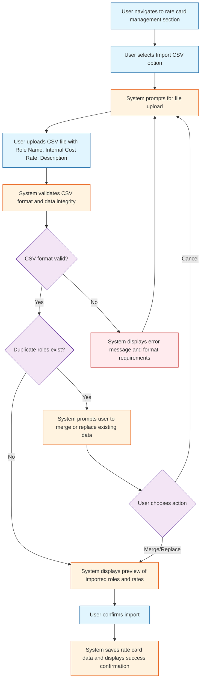
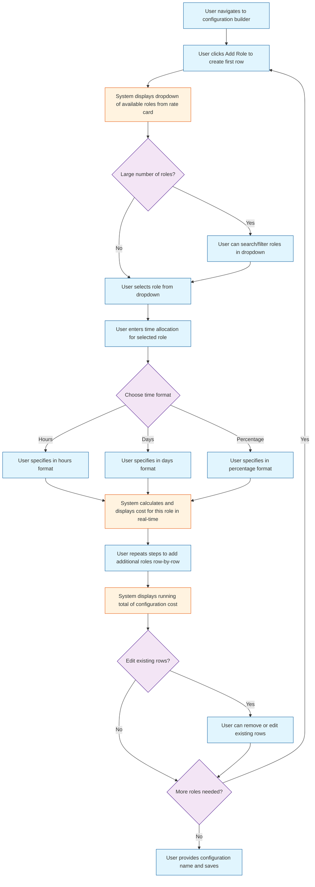
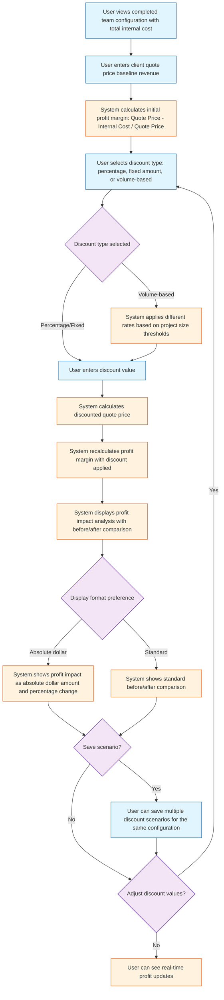
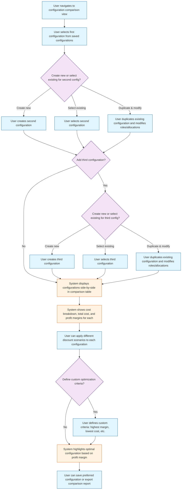
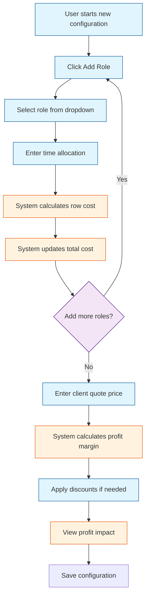
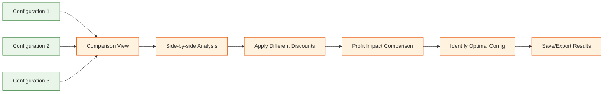
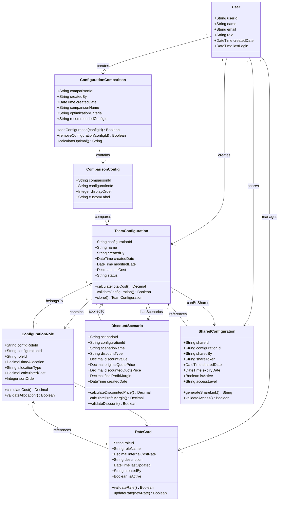

# Business & Functional Requirements

## 1. Purpose
This document defines the detailed business and functional requirements for Kaushalya, a cost calculation and profit analysis platform that enables service business owners and project managers to quickly generate team configuration costs, analyze EBITDA profit margins, and determine optimal client quotes through rapid scenario comparison.

## 2. Scope
- **In-Scope:**  
    - CSV-based rate card import and management system
    - Linear team configuration builder with role-by-role selection
    - Real-time cost calculation and EBITDA profit margin analysis
    - Client-side discount application with immediate profit impact visualization
    - Multi-configuration comparison (up to 3 configurations side-by-side)
    - Configuration saving and sharing capabilities
    - Basic discount types: percentage, fixed amount, volume-based
- **Out-of-Scope:**  
    - Overhead cost calculations (future backlog)
    - Integration with external accounting/project management systems
    - Time tracking or actual vs. estimated reporting
    - Advanced analytics or historical trend analysis
    - Multi-currency support (MVP limitation)
    - Template-based or drag-and-drop configuration builders

## 3. Stakeholders
- **Primary:** Service Business Owners (CEOs/Founders), Project Managers, Sales Teams
- **Secondary:** Engineering Leads, Delivery Managers, Finance Teams

## 4. Key Use Cases

### **Use Case UC-001: Import Rate Card Data**
**Description:** User imports CSV file containing role definitions and internal cost rates to establish baseline pricing data.  
**Actors:** Service Business Owner, Project Manager  
**Preconditions:** User has access to CSV file with role and rate data  
**Main Flow:**  

### **Use Case UC-002: Create Team Configuration**
**Description:** User builds a team configuration by selecting roles and specifying time allocations using a linear, table-based approach.  
**Actors:** Project Manager, Sales Team Member, Engineering Lead  
**Preconditions:** Rate card data has been imported and is available  
**Main Flow:**  

### **Use Case UC-003: Apply Discounts and Analyze Profit Impact**
**Description:** User applies various discount types to team configuration and sees immediate impact on profit margins.  
**Actors:** Sales Team Member, Project Manager, Service Business Owner  
**Preconditions:** Team configuration has been created with total cost calculated  
**Main Flow:**  

### **Use Case UC-004: Compare Multiple Configurations**
**Description:** User creates and compares up to 3 different team configurations side-by-side to optimize cost and profit.  
**Actors:** Project Manager, Service Business Owner, Engineering Lead  
**Preconditions:** At least one team configuration exists  
**Main Flow:**  

## 4b. Visual Flows

## 5. Functional Requirements

1. **FR-001:** System shall allow users to import CSV files containing role names, internal cost rates, and descriptions with validation for required columns and data formats.

2. **FR-002:** System shall provide a linear table-based interface for building team configurations where users add roles one row at a time.

3. **FR-003:** System shall calculate real-time cost totals as users add roles and specify time allocations for each team member.

4. **FR-004:** System shall support time allocation entry in multiple formats: hours, days, and percentage of total project time.

5. **FR-005:** System shall calculate EBITDA profit margins using the formula: (Client Quote Price - Total Internal Cost) / Client Quote Price * 100.

6. **FR-006:** System shall support three discount types: percentage discount, fixed amount discount, and volume-based discount tiers.

7. **FR-007:** System shall display real-time profit impact analysis showing before and after profit margins when discounts are applied.

8. **FR-008:** System shall enable side-by-side comparison of up to 3 team configurations with cost and profit margin visibility.

9. **FR-009:** System shall allow users to save team configurations with custom names for future reference and modification.

10. **FR-010:** System shall provide configuration sharing functionality to enable collaboration between team members.

11. **FR-011:** System shall validate that all required fields are completed before allowing configuration saves or comparisons.

12. **FR-012:** System shall maintain data persistence across user sessions for saved configurations and imported rate cards.

## 6. Acceptance Criteria

**FR-001:**  
- AC1: System accepts CSV files with headers: Role Name, Internal Cost Rate, Description
- AC2: System displays clear error messages for invalid file formats or missing required columns
- AC3: System prevents import of duplicate role names without user confirmation

**FR-002:**  
- AC1: Users can add unlimited roles to a configuration using "Add Role" button
- AC2: Each row displays role dropdown, time allocation field, and calculated cost
- AC3: Users can remove or edit existing rows before saving configuration

**FR-003:**  
- AC1: Cost calculations update immediately when users change time allocations
- AC2: Running total displays prominently and updates with each role addition/modification
- AC3: Individual row costs are visible and accurate based on rate card data

**FR-004:**  
- AC1: Time allocation accepts numeric input for hours (e.g., 40, 160)
- AC2: Time allocation accepts day-based input with configurable hours per day
- AC3: Time allocation accepts percentage input (e.g., 25%, 50%) with clear total percentage tracking

**FR-005:**  
- AC1: Profit margin calculation displays as percentage with 2 decimal precision
- AC2: Profit margin updates immediately when quote price or costs change
- AC3: System displays absolute profit amount alongside percentage

**FR-006:**  
- AC1: Percentage discounts apply to total quote price (e.g., 10% off total)
- AC2: Fixed amount discounts subtract specific dollar amounts from quote price
- AC3: Volume-based discounts apply different rates based on configurable project size thresholds

**FR-007:**  
- AC1: Before/after profit comparison displays side-by-side with clear visual differentiation
- AC2: Profit impact shows both absolute dollar change and percentage point change
- AC3: Visual indicators (colors, icons) highlight when discounts reduce margins below configurable thresholds

**FR-008:**  
- AC1: Comparison view displays all configurations in aligned columns for easy scanning
- AC2: Key metrics (total cost, profit margin, discounted price) are prominently highlighted
- AC3: Users can modify discount scenarios within comparison view and see real-time updates

**FR-009:**  
- AC1: Configuration names are user-definable and support alphanumeric characters and spaces
- AC2: Saved configurations retain all role selections, time allocations, and applied discounts
- AC3: Users can load saved configurations for editing or duplication

**FR-010:**  
- AC1: Users can generate shareable links or export configurations to common formats (PDF, Excel)
- AC2: Shared configurations display read-only view with all calculated results
- AC3: Export includes configuration details, cost breakdown, and profit analysis

## 7. Non-Functional Requirements
- **Performance:** Configuration cost calculations must complete within 200ms for configurations up to 20 roles
- **Usability:** New users should be able to create their first configuration within 5 minutes of CSV import
- **Reliability:** System must handle CSV files up to 1MB containing up to 500 role definitions
- **Accuracy:** All financial calculations must be accurate to 2 decimal places with proper rounding

## 8. Data Models & Entities

**Key Entity Descriptions:**
- **User:** System users who create and manage configurations
- **RateCard:** Master data containing role definitions and internal cost rates
- **TeamConfiguration:** Main entity representing a team setup with associated costs
- **ConfigurationRole:** Junction table linking configurations to roles with time allocations
- **DiscountScenario:** Different discount applications for the same configuration
- **SharedConfiguration:** Sharing mechanism for collaboration between users
- **ConfigurationComparison:** Container for comparing multiple configurations
- **ComparisonConfig:** Junction table for configurations being compared

## 9. Business Rules & Constraints
- **Rule 1:** Total time allocation percentages cannot exceed 100% per configuration when using percentage-based allocation
- **Rule 2:** Discount applications cannot result in negative profit margins without explicit user confirmation
- **Rule 3:** Volume-based discounts must have clearly defined project size thresholds and cannot overlap
- **Rule 4:** Internal cost rates must be positive values greater than zero
- **Rule 5:** Configuration comparisons are limited to 3 configurations maximum to maintain UI clarity

## 10. Assumptions & Dependencies
- **Assumptions:**  
  - Users have access to accurate internal cost rate data in CSV format
  - Project scope and time allocations can be reasonably estimated at configuration time
  - EBITDA calculation approach is sufficient for profit analysis (no overhead cost allocation needed initially)
- **Dependencies:**  
  - CSV file format standardization across different service business rate structures
  - User training on cost estimation and profit margin analysis concepts

## 11. Glossary
- **EBITDA Profit Margin:** (Revenue - Direct Costs) / Revenue, excluding overhead, interest, taxes, depreciation, and amortization
- **Internal Cost Rate:** The actual cost to the business for a specific role, including salary, benefits, and direct expenses
- **Client Quote Price:** The total amount proposed to the client for the project before any discounts
- **Volume-based Discount:** Discount rates that vary based on project size, duration, or total value thresholds
- **Configuration:** A complete team setup including all selected roles and their time allocations

## 12. Open Questions
- Should the system support fractional time allocations (e.g., 0.5 days, 1.25 hours)?
- What is the preferred method for handling rate card updates when configurations reference outdated rates?
- Should volume-based discount thresholds be configurable per user/organization or system-wide defaults?
- How should the system handle configurations that exceed realistic team size limits (e.g., 50+ roles)?