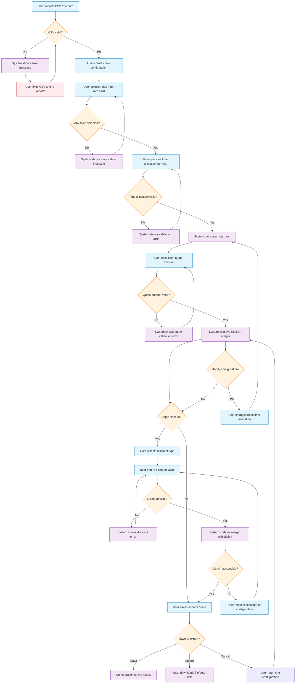
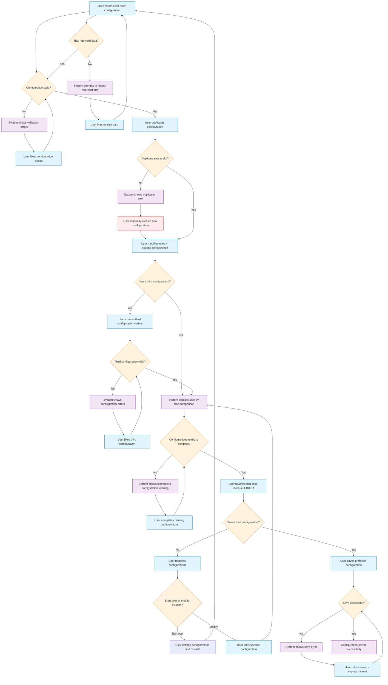
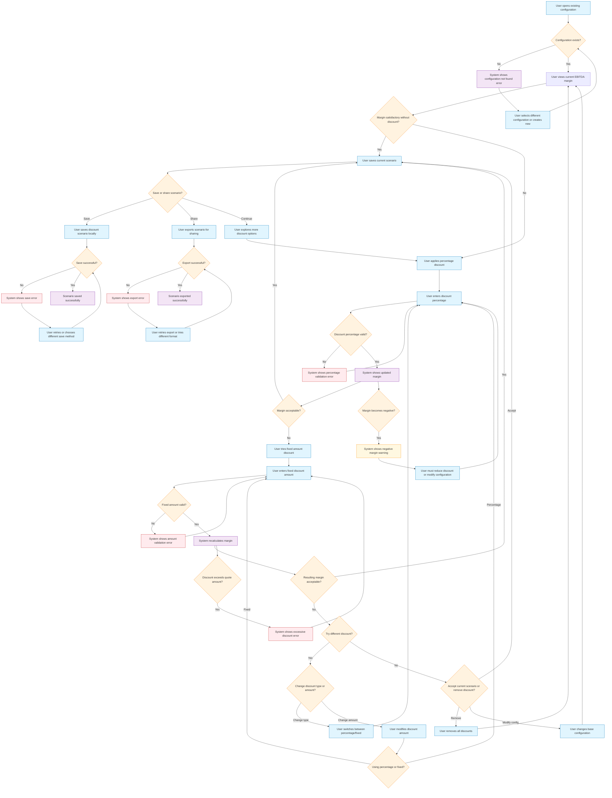
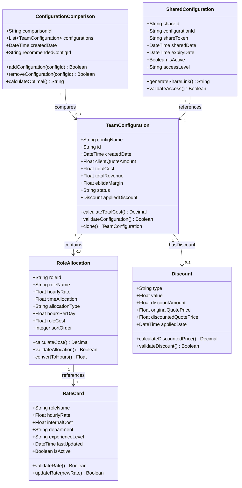

# Business & Functional Requirements

## 1. Purpose
This document defines the detailed business and functional requirements for Kaushalya, a service business cost estimation platform that enables rapid team configuration costing, EBITDA profit analysis, and optimal client quote generation through manual scenario comparison.

## 2. Scope
- **In-Scope:**  
    - CSV-based rate card import and management
    - Manual team configuration builder with role selection
    - Real-time cost calculation and EBITDA profit margin analysis
    - Multi-configuration comparison (up to 3 configurations)
    - Standard discount application (percentage and fixed amount)
    - Configuration saving and basic sharing via export/download
    - Visual comparison of total revenue, total cost, and EBITDA margins

- **Out-of-Scope:**  
    - Algorithmic team optimization or automated recommendations
    - Overhead cost calculations
    - Integration with external accounting or project management systems
    - Time tracking or actual vs. estimated reporting
    - User account management or real-time collaboration
    - Advanced analytics or historical trend analysis

## 3. Stakeholders
- **Primary:** Service Business Owners, Project Managers, Sales Teams
- **Secondary:** Engineering Leads, Delivery Managers, Finance Teams

## 4. Key Use Cases

### Use Case UC-001: Quick Quote Generation
**Description:** Service business owner needs to generate a client project quote rapidly (under 5 minutes) with accurate cost and profit margin calculations.  
**Actors:** Service Business Owner, Project Manager  
**Preconditions:** Rate card CSV has been imported into the system.  
**Main Flow:**

**Alternate Flows:**
- CSV import errors (invalid format, missing fields, incorrect data types)
- Empty role selection with appropriate user guidance
- Invalid time allocation values requiring correction
- Quote amount validation and error handling
- Discount validation preventing negative margins or invalid values
- Configuration modification during any stage of the process
- User cancellation and return to previous steps
- Export/save failures with retry options

### Use Case UC-002: Team Configuration Optimization
**Description:** Project manager needs to manually compare 2-3 different team setups to identify the most profitable configuration option.  
**Actors:** Project Manager, Engineering Lead  
**Preconditions:** Rate card is available and at least one configuration exists.  
**Main Flow:**

**Alternate Flows:**
- Configuration validation errors requiring user correction before comparison
- Duplication failures requiring manual configuration creation
- Incomplete configurations preventing meaningful comparison
- Missing rate card data blocking configuration creation
- Save/export failures with retry and alternative options
- User decision to start over vs. modify existing configurations
- Comparison of only 2 configurations when third is not needed
- System warnings for configurations with zero or negative margins

### Use Case UC-003: Discount Impact Analysis
**Description:** Sales team member needs to understand how different discount levels affect profit margins before client negotiations.  
**Actors:** Sales Team Member, Business Owner  
**Preconditions:** Base team configuration exists with initial quote amount.  
**Main Flow:**

**Alternate Flows:**
- Configuration not found errors requiring user navigation to valid configurations
- Invalid discount percentage entries requiring correction and validation
- Invalid fixed discount amounts exceeding quote value with appropriate error handling
- Negative margin warnings when discounts are too aggressive
- User switching between discount types during analysis
- Discount removal to return to original margins
- Base configuration modification when discount scenarios are unsatisfactory
- Save/export failures with retry mechanisms and alternative formats
- Continuous discount exploration allowing multiple scenario testing

## 5. Functional Requirements

1. **FR-001:** The system shall allow users to import CSV files containing rate card data with fields: Role Name, Hourly Rate, Internal Cost, Department/Category, Experience Level, with comprehensive validation for required columns, data formats, and duplicate role handling.

2. **FR-002:** The system shall provide a linear table-based configuration builder where users add roles one row at a time using "Add Role" functionality, with each row displaying role dropdown, time allocation field, and calculated cost.

3. **FR-003:** The system shall calculate and display real-time cost totals that update immediately as users add roles, modify time allocations, or change any configuration parameters.

4. **FR-004:** The system shall support time allocation entry in two formats: hours (numeric input) and days (with configurable hours-per-day conversion), with clear format indicators for user guidance.

5. **FR-005:** The system shall allow users to input client quote amounts and automatically calculate EBITDA profit margins using the formula: (Client Quote - Total Internal Cost) / Client Quote × 100.

6. **FR-006:** The system shall support percentage discounts and fixed amount discounts applied to the total quote amount, with real-time margin impact calculations.

7. **FR-007:** The system shall recalculate EBITDA margins immediately when discounts are applied, modified, or removed, showing before/after comparison.

8. **FR-008:** The system shall enable users to create and compare up to 3 team configurations simultaneously in a side-by-side comparison view.

9. **FR-009:** The system shall display side-by-side comparison showing total cost, total revenue, and EBITDA margin for each configuration with clear visual differentiation.

10. **FR-010:** The system shall allow users to save team configurations locally within the browser session with user-defined names.

11. **FR-011:** The system shall provide export functionality to download configurations as files or generate shareable links for basic collaboration.

12. **FR-012:** The system shall maintain configuration data during the user session without requiring user accounts, using browser local storage.

13. **FR-013:** The system shall validate CSV import data, handle duplicate role names with user confirmation, and display comprehensive error messages for invalid or missing required fields.

14. **FR-014:** The system shall allow users to remove or edit existing configuration rows before saving, with running totals updating automatically.

## 6. Acceptance Criteria

**FR-001 / UC-001:**  
    - AC1: System accepts CSV files with all required fields (Role Name, Hourly Rate, Internal Cost, Department, Experience Level)
    - AC2: System displays clear error messages for invalid file formats, missing required columns, or incorrect data types
    - AC3: System detects duplicate role names and prompts user to merge, replace, or cancel import
    - AC4: System validates data integrity (positive rates, numeric fields) before completing import
    - AC5: System displays preview of imported data before final confirmation

**FR-002 / UC-001:**  
    - AC1: Users can add unlimited roles to a configuration using prominent "Add Role" button
    - AC2: Each configuration row displays: role dropdown, time allocation field, calculated cost, and remove option
    - AC3: Role dropdown supports search/filtering when large number of roles are available
    - AC4: Users can remove or edit existing rows with immediate UI updates
    - AC5: Row order can be adjusted by users for better organization

**FR-003 / UC-001:**  
    - AC1: Individual row costs update immediately when time allocation changes (within 100ms)
    - AC2: Configuration total cost updates automatically with each role addition, modification, or removal
    - AC3: Running total displays prominently and is accurate to 2 decimal places
    - AC4: All calculations maintain precision throughout user interactions

**FR-004 / UC-001:**  
    - AC1: Time allocation accepts numeric input for hours (e.g., 40, 160, 8.5)
    - AC2: Time allocation accepts days input with configurable hours-per-day conversion (default: 8 hours/day)
    - AC3: System clearly indicates current input format (hours/days) with visual labels
    - AC4: Users can switch between hours and days format for individual roles
    - AC5: All calculations properly convert days to hours using configured conversion rate

**FR-005 / UC-001:**  
    - AC1: User can input client quote amount in currency format with validation
    - AC2: System calculates EBITDA margin as ((Revenue - Total Cost) / Revenue) × 100
    - AC3: EBITDA margin displays as percentage with 2 decimal places
    - AC4: System displays both absolute profit amount and percentage margin

**FR-006 / UC-003:**  
    - AC1: User can apply percentage discount (0-100%) with input validation
    - AC2: User can apply fixed amount discount in currency with validation
    - AC3: Only one discount type can be active at a time with clear UI indication
    - AC4: User can remove discounts to return to original quote amount

**FR-007 / UC-003:**  
    - AC1: EBITDA margin recalculates immediately when discount is applied (within 100ms)
    - AC2: System shows before/after margin comparison with visual differentiation
    - AC3: Discounted revenue calculation: Original quote - discount amount
    - AC4: Updated margin calculation uses discounted revenue in formula

**FR-008 / UC-002:**  
    - AC1: User can create up to 3 configurations in a single comparison session
    - AC2: Each configuration operates independently with separate calculations
    - AC3: User can duplicate existing configurations as starting point for new variants
    - AC4: Configuration comparison updates in real-time as individual configurations change

**FR-009 / UC-002:**  
    - AC1: Side-by-side comparison view displays all configurations in aligned columns
    - AC2: Key metrics prominently displayed: Total Cost, Total Revenue, EBITDA Margin
    - AC3: Comparison view highlights best/worst performing configurations
    - AC4: Users can modify individual configurations within comparison view

**FR-010:**  
    - AC1: Configurations persist during browser session using local storage
    - AC2: User can assign custom names to configurations (alphanumeric + spaces)
    - AC3: Saved configurations retain all role selections, time allocations, and applied discounts
    - AC4: Users can load, edit, and re-save existing configurations

**FR-011:**  
    - AC1: User can download configuration as structured file (JSON/CSV)
    - AC2: User can generate shareable link containing configuration data
    - AC3: Export includes complete configuration details, cost breakdown, and profit analysis
    - AC4: Shared links display read-only view with all calculated results

**FR-013:**  
    - AC1: CSV validation occurs before any data import with comprehensive error reporting
    - AC2: Duplicate role detection shows conflicting entries and resolution options
    - AC3: System provides specific error messages for each validation failure type
    - AC4: Import process can be cancelled at any validation step

**FR-014:**  
    - AC1: Users can remove configuration rows with single click and confirmation
    - AC2: Role dropdown updates exclude already-selected roles (optional duplicate prevention)
    - AC3: Configuration totals recalculate immediately upon row removal
    - AC4: Undo functionality available for accidental row deletions

## 7. Non-Functional Requirements
- **Performance:** Configuration cost calculations must complete within 100ms for configurations up to 20 roles
- **Usability:** New users should be able to create their first configuration within 5 minutes of CSV import  
- **Reliability:** System must handle CSV files up to 1MB containing up to 500 role definitions
- **Accuracy:** All financial calculations must be accurate to 2 decimal places with proper rounding
- **Responsiveness:** Real-time updates (cost totals, margin calculations) must respond within 100ms of user input
- **Data Persistence:** Browser local storage must reliably maintain session data across page refreshes
- **Compatibility:** System must function in modern browsers (Chrome, Firefox, Safari, Edge) without plugins

## 8. Data Models & Entities

## 9. Business Rules & Constraints

- Rule 1: Maximum of 3 configurations can be compared simultaneously to maintain UI clarity and performance
- Rule 2: EBITDA margin calculation must account for internal costs vs. hourly rates with precision to 2 decimal places
- Rule 3: Discounts cannot exceed 100% of quote amount or result in negative revenue without explicit user confirmation
- Rule 4: Time allocation must be positive numeric values with support for decimal precision (e.g., 8.5 hours)
- Rule 5: When using days format, hours-per-day conversion rate is configurable (default: 8 hours/day)
- Rule 6: All monetary calculations must be rounded to 2 decimal places using standard rounding rules
- Rule 7: CSV import must validate all data types and required fields before acceptance
- Rule 8: Duplicate role names in CSV import require explicit user resolution (merge/replace/cancel)
- Rule 9: Configuration total cost calculations must complete within 100ms for up to 20 roles
- Rule 10: Real-time updates must maintain calculation accuracy during rapid user input changes

## 10. Assumptions & Dependencies

- **Assumptions:** 
    - Users have access to accurate rate card data in CSV format
    - Internal costs in rate cards represent true business costs for EBITDA calculation
    - Users understand basic financial concepts (cost, revenue, profit margin)
    - Browser supports local storage for session persistence

- **Dependencies:** 
    - CSV parsing functionality
    - Client-side calculation engine
    - Browser local storage capabilities
    - File export/download browser APIs

## 11. Glossary

- **EBITDA Margin:** Earnings Before Interest, Taxes, Depreciation, and Amortization as percentage of revenue
- **Rate Card:** Standardized pricing sheet containing role costs and billing rates
- **Configuration:** Complete team setup with selected roles, time allocations, and cost calculations
- **Internal Cost:** True business cost for a role (salary, benefits, overhead allocation)
- **Hourly Rate:** Client billing rate for a specific role

## 12. Open Questions

- Should the system support multiple currency formats or assume single currency?
- What happens to saved configurations when browser data is cleared?
- Should there be validation limits on time allocation (e.g., max hours per role)?
- How should the system handle rate card updates after configurations are created?