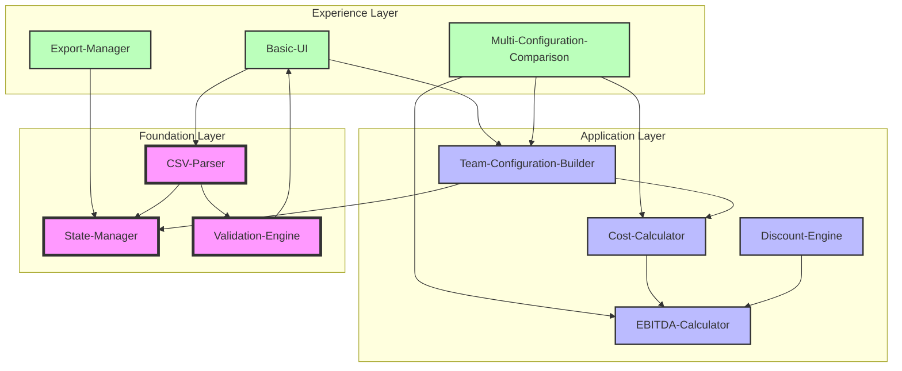
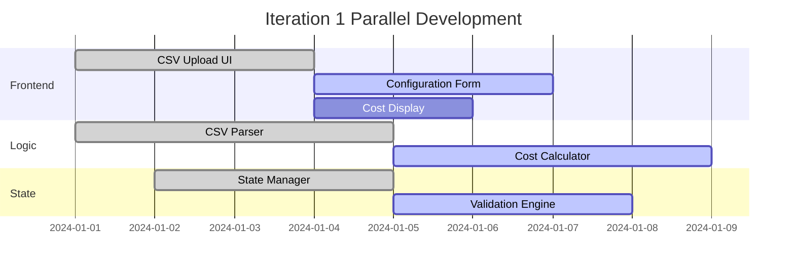
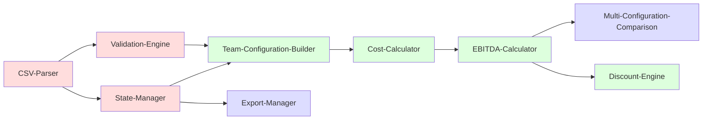
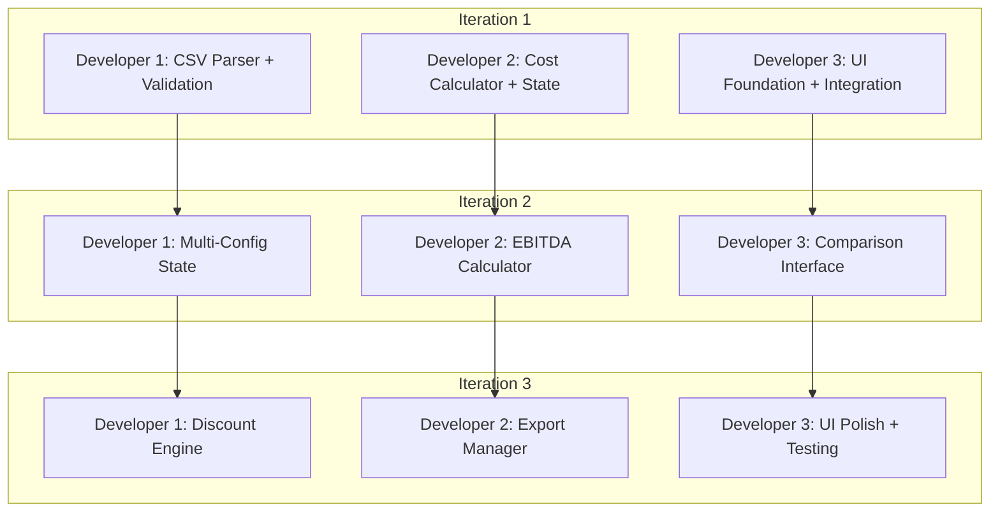
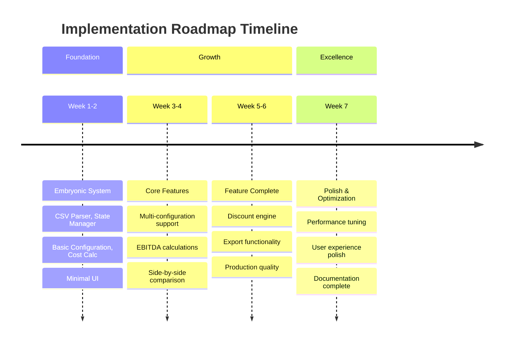

# Implementation Roadmap

## 1. Executive Summary
- **Philosophy:** Vertical slice development with continuous validation
- **Approach:** Organic growth across all system layers simultaneously
- **Delivery Model:** Hybrid iterative with 2-week sprints and weekly validation gates
- **Success Metrics:** Feature completeness, user task completion time, calculation accuracy

## 2. Development Principles

### Core Tenets
1. **Vertical Slicing:** Every iteration delivers working functionality across all layers
2. **Concurrent Growth:** CSV parsing, business logic, and interface evolve together
3. **Continuous Validation:** Each step includes feedback mechanisms proving value
4. **Dependency Awareness:** Sequence respects both technical and value dependencies
5. **Risk Mitigation:** High-risk elements validated early through thin slices

### Quality Attributes (Woven Throughout)
- **Performance:** Sub-second calculation response times for configurations up to 50 roles
- **Scalability:** Handle rate cards with 200+ roles without UI degradation
- **Security:** Client-side only, no data transmission beyond user's browser
- **Resilience:** Graceful error handling for malformed CSV data and invalid inputs

## 3. Component Architecture

### System Layers

### Component Definitions
- **CSV-Parser:** Transforms uploaded CSV files into standardized JavaScript objects
- **State-Manager:** In-memory storage for rate card data and active configurations
- **Validation-Engine:** Validates CSV structure, role data, and configuration inputs
- **Team-Configuration-Builder:** Interface for selecting roles and specifying time allocation
- **Cost-Calculator:** Real-time calculation of total project costs based on configurations
- **EBITDA-Calculator:** Profit margin analysis comparing costs to quote amounts
- **Discount-Engine:** Applies various discount types and shows profit impact
- **Multi-Configuration-Comparison:** Side-by-side comparison of up to 3 configurations
- **Export-Manager:** Download/share functionality for configurations and results

## 4. Implementation Iterations

### Iteration 1: Embryonic System (Foundation Slice)
**Duration:** 2 weeks
**Theme:** "First Sign of Life"

#### Vertical Slice Components
- **Foundation (Roots):** 
  - Minimal CSV-Parser (basic role/rate parsing)
  - Minimal State-Manager (hold parsed data in memory)
  - Basic validation for CSV structure
- **Application (Trunk):**
  - Minimal Team-Configuration-Builder (select roles, enter hours)
  - Minimal Cost-Calculator (multiply rate × hours, sum totals)
- **Experience (Leaves):**
  - Minimal Basic-UI (CSV upload + single configuration form + cost display)

#### What This Delivers
A working system where a user can upload a rate card CSV, create one team configuration, and see the total cost calculation in real-time.

#### Validation Gate
- ✅ User can upload CSV and see parsed roles/rates
- ✅ User can select roles and enter time allocation
- ✅ System calculates and displays total cost accurately
- ✅ Basic error handling for invalid CSV or input data
- ✅ Calculation responds within 500ms for up to 20 roles

#### Feedback Mechanisms
- Technical: CSV parsing success rate, calculation accuracy, response times
- Business: User can complete basic cost estimation workflow
- Risk: CSV format variations and calculation logic validated

#### Parallel Work Streams

---

### Iteration 2: Growth Phase (Core Feature Expansion)
**Duration:** 2 weeks
**Theme:** "Establishing Structure"

#### Vertical Slice Components
- **Foundation (Deeper Roots):**
  - Enhanced CSV-Parser (handle edge cases, multiple formats)
  - Extended State-Manager (manage multiple configurations)
  - Advanced Validation-Engine (input validation, business rules)
- **Application (Stronger Trunk):**
  - Enhanced Team-Configuration-Builder (configuration management)
  - Core Cost-Calculator (handle complex scenarios)
  - Basic EBITDA-Calculator (revenue vs cost analysis)
- **Experience (More Leaves):**
  - Enhanced Basic-UI (multi-configuration interface)
  - Basic Multi-Configuration-Comparison (side-by-side view)

#### What This Delivers
A functional system supporting multiple team configurations with side-by-side comparison and basic profit margin analysis.

#### Validation Gate
- ✅ User can create and manage up to 3 configurations simultaneously
- ✅ Side-by-side comparison shows costs, revenue, and EBITDA margins
- ✅ CSV parsing handles various rate card formats gracefully
- ✅ Performance maintained with 50+ roles and 3 configurations
- ✅ Input validation prevents invalid configurations

#### Feedback Mechanisms
- Technical: Multi-configuration performance, memory usage, error rates
- Business: Configuration comparison workflow completion rate
- User: Feedback on comparison interface usability
- Risk: Large dataset performance and complex CSV formats validated

---

### Iteration 3: Maturation (Feature Completeness)
**Duration:** 2 weeks
**Theme:** "Full Capability"

#### Vertical Slice Components
- **Foundation (Established Roots):**
  - Production-ready CSV-Parser (comprehensive error handling)
  - Optimized State-Manager (efficient data structures)
  - Complete Validation-Engine (comprehensive business rules)
- **Application (Mature Trunk):**
  - Complete Team-Configuration-Builder (full workflow support)
  - Optimized Cost-Calculator (performance optimizations)
  - Complete EBITDA-Calculator (comprehensive profit analysis)
  - Full Discount-Engine (percentage, fixed, complex discounts)
- **Experience (Full Canopy):**
  - Polished Basic-UI (intuitive, responsive design)
  - Complete Multi-Configuration-Comparison (enhanced visualization)
  - Full Export-Manager (multiple export formats)

#### What This Delivers
A complete, production-ready system with all planned features, optimized performance, and polished user experience.

#### Validation Gate
- ✅ All business requirements implemented and tested
- ✅ Discount engine handles all specified discount types
- ✅ Export functionality supports required formats
- ✅ Performance benchmarks met for maximum expected load
- ✅ User acceptance testing completed successfully

#### Feedback Mechanisms
- Technical: Full system performance testing, stress testing
- Business: Complete workflow validation with real scenarios
- User: Comprehensive usability testing and feedback incorporation
- Risk: Production readiness assessment

---

### Iteration 4: Excellence (Polish & Optimization)
**Duration:** 1 week
**Theme:** "Delight & Performance"

#### Focus Areas
- **Performance Optimization:** Sub-200ms response times, smooth interactions
- **User Experience Polish:** Micro-interactions, improved feedback, accessibility
- **Error Handling Enhancement:** Comprehensive error states and recovery
- **Documentation Completion:** User guides, technical documentation

#### What This Delivers
A polished, delightful user experience with excellent performance characteristics and comprehensive documentation.

## 5. Dependency Management

### Technical Dependencies

### Value Dependencies
- **Cost of Delay Analysis:**
  - CSV Import + Basic Calculation: $5000/week delay cost → Build first
  - Multi-Configuration Comparison: $3000/week delay cost → Build second
  - Discount Engine: $2000/week delay cost → Build third
  - Export Functionality: $1000/week delay cost → Build when convenient

## 6. Risk-Aware Sequencing

### High-Risk Elements (Validate Early)
- **Technical Risk [TR-001]:** CSV parsing complexity → Thin slice in Iteration 1
- **Performance Risk [PR-001]:** Real-time calculation speed → Load test in Iteration 2
- **Usability Risk [UR-001]:** Configuration comparison complexity → Prototype in Iteration 2

### Risk Mitigation Through Sequencing
- **CSV Format Variations:** Early validation with multiple real rate card formats
- **Calculation Performance:** Progressive performance testing with increasing complexity
- **User Interface Complexity:** Iterative usability testing and refinement

## 7. Parallel Development Strategy

### Team Allocation Model

### Synchronization Points
- Daily: Cross-component integration validation
- Mid-Sprint: Performance and usability checkpoints
- Sprint End: Full vertical slice validation

## 8. Continuous Validation Framework

### Build-Measure-Learn Cycles
For each iteration:
1. **Build:** Minimal viable slice with clear success criteria
2. **Measure:** Performance metrics, user task completion, error rates
3. **Learn:** Gather feedback from technical validation and user testing
4. **Pivot/Persevere:** Make data-driven decisions for next iteration

### Feedback Integration Points
- **Developer Feedback:** Daily integration testing, code reviews
- **Stakeholder Feedback:** Weekly demos with real rate card data
- **User Feedback:** Rapid prototyping with target users
- **System Feedback:** Performance monitoring, error tracking

## 9. Progressive Elaboration Schedule

### Broad Strokes (Iterations 1-2)
- Focus: Core functionality, basic workflows
- Detail Level: Essential features only
- Quality Bar: Functional correctness

### Adding Detail (Iteration 3)
- Focus: Complete feature set, edge cases
- Detail Level: Production-ready functionality
- Quality Bar: Performance + Reliability

### Final Refinement (Iteration 4)
- Focus: Polish, optimization, delight
- Detail Level: Exceptional user experience
- Quality Bar: Excellence in all aspects

## 10. Success Metrics

### Technical Health Indicators
- CSV Parse Success Rate: >95%
- Calculation Response Time: <500ms
- Error Recovery Rate: >90%
- Browser Compatibility: 95% coverage

### Business Value Indicators
- Quote Generation Time: <5 minutes per configuration
- Configuration Comparison Usage: >80% of sessions
- User Task Completion Rate: >90%
- Discount Impact Analysis Usage: >60% of configurations

### User Experience Indicators
- Time to First Successful Quote: <10 minutes
- Error Message Clarity Score: >8/10
- Interface Intuitiveness Rating: >8/10
- Overall Satisfaction Score: >8/10

## 11. Adaptive Planning

### When to Adjust the Roadmap
- CSV parsing reveals unexpected complexity requiring architecture changes
- Performance benchmarks not met requiring optimization focus
- User feedback indicates workflow issues requiring UX redesign
- Stakeholder priorities shift requiring feature resequencing

### How to Adjust
1. Preserve vertical slice integrity across all changes
2. Maintain validation gates and success criteria
3. Resequence based on new dependencies and priorities
4. Communicate changes with clear rationale and impact assessment

## 12. Delivery Timeline

## 13. Definition of Done (Per Iteration)

### Code Complete
- [ ] All layers implemented for the vertical slice
- [ ] Unit tests covering core calculations (>80% coverage)
- [ ] Integration tests for CSV parsing and state management
- [ ] Code reviewed and approved
- [ ] Performance benchmarks met

### Quality Validated
- [ ] CSV parsing handles test rate card formats
- [ ] Calculation accuracy verified with known test cases
- [ ] Error scenarios gracefully handled
- [ ] Cross-browser compatibility validated
- [ ] Accessibility guidelines followed

### Value Delivered
- [ ] User can complete intended workflow end-to-end
- [ ] Performance meets defined benchmarks
- [ ] Error handling provides clear user guidance
- [ ] Stakeholder acceptance received
- [ ] Documentation updated

## 14. Key Decisions Log

### Architectural Decisions
- **Decision:** Client-side only implementation with in-memory state
- **Rationale:** Simplifies deployment, ensures data privacy, meets MVP requirements
- **Trade-offs:** No persistence across sessions, limited to browser memory
- **Alternatives:** Server-based storage, local storage persistence

### Technology Decisions
- **Decision:** Session-based workflow without persistence
- **Rationale:** User preference for simplicity, export-focused workflow
- **Trade-offs:** Users must re-import CSV each session
- **Alternatives:** Browser storage, cloud storage integration

### Sequencing Decisions
- **Decision:** UI components in foundation layer from iteration 1
- **Rationale:** Essential for validating CSV parsing and providing user feedback
- **Trade-offs:** More complex initial iteration
- **Alternatives:** Backend-first approach with delayed UI

## 15. Component Integration Strategy

### CSV-Parser Integration
- Validates data structure before passing to State-Manager
- Provides detailed error feedback through Validation-Engine
- Supports incremental parsing for large rate cards

### State-Manager Integration
- Maintains referential integrity between rate card and configurations
- Provides reactive updates to UI components
- Optimizes memory usage for large datasets

### Calculation Engine Integration
- Cost-Calculator feeds directly into EBITDA-Calculator
- Real-time updates propagate through all dependent components
- Discount-Engine modifies calculations transparently

## 16. Testing Strategy

### Unit Testing
- CSV parsing with various rate card formats
- Cost calculation accuracy with edge cases
- EBITDA margin calculations with different scenarios
- Discount application logic validation

### Integration Testing
- End-to-end configuration creation workflow
- Multi-configuration comparison accuracy
- Export functionality with different data sets
- Error handling across component boundaries

### Performance Testing
- Large rate card import (200+ roles)
- Multi-configuration calculations (3 configs × 50 roles)
- Real-time calculation responsiveness
- Memory usage optimization validation

### User Acceptance Testing
- Complete quote generation workflow
- Configuration comparison and decision making
- Export and sharing functionality
- Error recovery scenarios

## 17. Deployment & Launch Strategy

### Development Environment
- Local development with hot reload
- Automated testing on commit
- Performance benchmarking on build
- Cross-browser testing automation

### Staging Environment
- Production-like environment for validation
- Real rate card data testing
- User acceptance testing platform
- Performance validation under load

### Production Deployment
- Static site deployment (GitHub Pages, Netlify, etc.)
- CDN optimization for global access
- Error monitoring and analytics
- User feedback collection mechanisms

This implementation roadmap provides a structured, risk-aware approach to building Kaushalya through vertical slicing and continuous validation, ensuring each iteration delivers working value while building toward the complete vision.