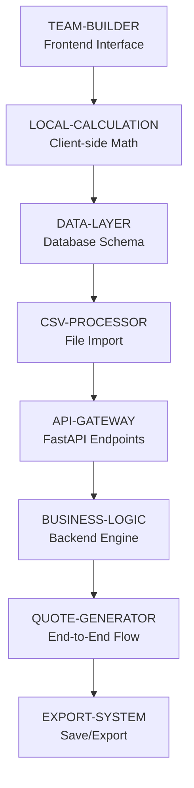

# Implementation Roadmap

## 1. Overview
- **Purpose:** Build sequence for Kaushalya cost estimation platform
- **Approach:** Dependency-driven component sequencing for solo developer
- **Milestones:** 4 key deliverable milestones
- **MVP Scope:** Quote Generator (CSV import + team configuration + EBITDA analysis + discount application)

## 2. Components

### Foundation Components (Build First)
- **TEAM-BUILDER:** SvelteKit interface for adding/editing team configuration rows with local cost calculations
- **LOCAL-CALCULATION:** Frontend calculation engine for real-time cost totals and basic profit margins

### Core Components (Build Second)  
- **DATA-LAYER:** PostgreSQL database schema and SQLModel models for rate cards and configurations
- **CSV-PROCESSOR:** Backend service for parsing, validating, and importing CSV rate card data

### Backend Components (Build Third)
- **API-GATEWAY:** FastAPI backend with endpoints for configuration management and calculations
- **BUSINESS-LOGIC:** Enhanced calculation engine for costs, EBITDA margins, and discount application

### Integration Components (Build Fourth)
- **QUOTE-GENERATOR:** Complete workflow integration from CSV import to final quote output
- **EXPORT-SYSTEM:** Configuration saving and basic export functionality

## 3. Build Sequence

## 4. Build Milestones

### Milestone 1: Interactive UI with Local Calculations
**Components:** TEAM-BUILDER, LOCAL-CALCULATION  
**What You Get:** Working frontend where you can add rows and see real-time cost totals  
**Why First:** Immediate visual feedback and core user interaction without backend complexity  
**Success Criteria:**
- ✅ SvelteKit application with Skeleton UI components
- ✅ Add/remove team member rows with role and time allocation fields
- ✅ Hardcoded rate data for common roles (Developer, Designer, PM, etc.)
- ✅ Real-time calculation of individual row costs and project total
- ✅ Basic profit margin calculation with configurable quote amount
- ✅ Responsive table design that works on different screen sizes
**Sequential Work:** TEAM-BUILDER first for structure, then LOCAL-CALCULATION for math

### Milestone 2: Data Foundation Ready
**Components:** DATA-LAYER, CSV-PROCESSOR  
**What You Get:** Backend data storage and CSV import functionality  
**Why Second:** Replace hardcoded rates with real CSV-imported data  
**Success Criteria:**
- ✅ PostgreSQL database with rate card and configuration tables
- ✅ SQLModel models for all data entities
- ✅ CSV upload endpoint accepting and validating rate card files
- ✅ Error handling for malformed CSV data
- ✅ Basic database CRUD operations working
**Sequential Work:** DATA-LAYER must be complete before CSV-PROCESSOR (needs schema)

### Milestone 3: Backend API Integration  
**Components:** API-GATEWAY, BUSINESS-LOGIC  
**What You Get:** Frontend connected to backend with enhanced calculations  
**Why Third:** Replace local data with database-driven calculations  
**Success Criteria:**
- ✅ FastAPI server with configuration management endpoints
- ✅ Frontend fetching rate data from API instead of hardcoded values
- ✅ Enhanced calculation engine with EBITDA margin analysis
- ✅ Discount application logic (percentage and fixed amount)
- ✅ API validation and error responses
- ✅ Frontend error handling for API failures
**Sequential Work:** API-GATEWAY provides structure, then BUSINESS-LOGIC implements calculations

### Milestone 4: Complete MVP Ready
**Components:** QUOTE-GENERATOR, EXPORT-SYSTEM  
**What You Get:** End-to-end quote generation workflow with save/export  
**Why Last:** Integrates all previous components into complete user workflow  
**Success Criteria:**
- ✅ Complete CSV import to quote generation workflow
- ✅ Configuration saving with database persistence
- ✅ Basic export functionality (JSON/CSV download)
- ✅ Error handling and user feedback throughout entire flow
- ✅ Performance optimization for calculations and UI updates
- ✅ Basic documentation and user guidance
**Sequential Work:** QUOTE-GENERATOR orchestrates workflow, then EXPORT-SYSTEM adds persistence

## 5. Sequential Development Plan

### Solo Developer Approach:
Since this is a **solo developer project**, all work must be **sequential** rather than parallel. The recommended build order prioritizes getting a working foundation before adding features.

### Phase-by-Phase Execution:

**Phase 1: Frontend Foundation (Week 1)**
1. Set up SvelteKit project with Skeleton UI components
2. Create team configuration table with add/remove row functionality
3. Implement local calculation engine for cost totals
4. Add hardcoded rate data for testing and immediate functionality

**Phase 2: Backend Foundation (Weeks 2-3)**
1. Set up PostgreSQL database and connection
2. Create SQLModel schemas for rate cards and configurations  
3. Build CSV upload and parsing functionality
4. Test data import and validation thoroughly

**Phase 3: API Development (Weeks 4-5)**
1. Set up FastAPI project structure with proper routing
2. Implement configuration management endpoints
3. Connect frontend to backend APIs replacing hardcoded data
4. Add enhanced calculation engine and discount logic

**Phase 4: Integration & Polish (Week 6)**
1. Implement complete user workflow from CSV to quote
2. Add configuration saving and export functionality
3. Performance testing and optimization
4. Error handling and user experience polish

### Development Dependencies:
- **Week 1:** Frontend work has no external dependencies - can start immediately
- **Week 2-3:** Backend foundation work independent of frontend
- **Week 4-5:** Requires completed database schema and CSV processing
- **Week 6:** Requires working frontend and backend for integration testing

### Critical Path Items:
1. **Frontend Table Interface** - Core user interaction, affects all subsequent UX decisions
2. **Local Calculation Logic** - Foundation for all cost computation logic
3. **Database Schema Design** - Affects backend API design and data flow
4. **Frontend-Backend Integration** - Required for complete user experience

## 6. Risk Mitigation for Solo Development

### Technical Risks:
- **Svelte Learning Curve:** Minimal risk since starting with frontend-first approach
- **Calculation Logic Complexity:** Building locally first helps validate logic before backend
- **Integration Complexity:** Frontend-first approach reduces integration risk

### Scope Management:
- **Feature Creep:** Focus on core table functionality and calculations in Phase 1
- **Perfect Polish:** Prioritize working calculations over perfect UI initially
- **Backend Optimization:** Keep backend simple until frontend requirements are clear

### Timeline Buffers:
- Add 20% buffer to Phase 1 for Svelte learning and calculation logic
- Plan for additional testing time in Phase 4 integration
- Consider Phase 1 as foundation sprint that affects all subsequent work