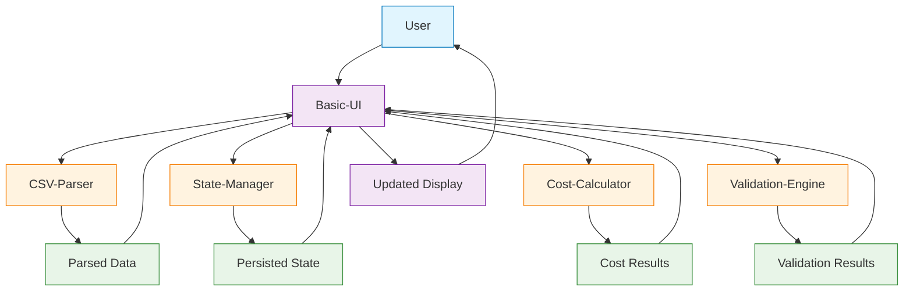

# Basic-UI Integration Guide

## Overview
The Basic-UI module serves as the primary user interface layer for Kaushalya's cost estimation platform. It provides the visual interface for CSV upload, role selection, and cost display functionality. This module integrates with foundation layer components and serves as the entry point for user interactions.

## Dependencies
Modules this Basic-UI module depends on:

### CSV-Parser (Foundation Layer)
**What it provides:** Transforms uploaded CSV files into standardized JavaScript objects
**How we use it:** Basic-UI calls CSV-Parser when users upload rate card files
**Integration points:**
- File content parsing and validation
- Error handling for malformed CSV data
- Role and rate data extraction

**Data Flow:**
```
User uploads CSV → Basic-UI → CSV-Parser → Parsed role data → Basic-UI displays roles
```

### State-Manager (Foundation Layer)
**What it provides:** In-memory storage for rate card data and active configurations
**How we use it:** Basic-UI stores and retrieves application state data
**Integration points:**
- Storing parsed role data
- Managing selected roles
- Persisting user configuration choices

**Data Flow:**
```
User selects roles → Basic-UI → State-Manager → Persisted selection → Basic-UI updates display
```

### Cost-Calculator (Application Layer)
**What it provides:** Real-time calculation of total project costs based on configurations
**How we use it:** Basic-UI triggers calculations when role selection changes
**Integration points:**
- Real-time cost computation
- Cost breakdown data
- Calculation result formatting

**Data Flow:**
```
Role selection changes → Basic-UI → Cost-Calculator → Total cost → Basic-UI displays cost
```

### Validation-Engine (Foundation Layer)
**What it provides:** Validates CSV structure, role data, and configuration inputs
**How we use it:** Basic-UI validates user inputs and file uploads
**Integration points:**
- CSV file structure validation
- Role data validation
- User input validation

**Data Flow:**
```
User input → Basic-UI → Validation-Engine → Validation result → Basic-UI shows feedback
```

## Dependents
Modules that depend on Basic-UI:

### Multi-Configuration-Comparison (Experience Layer) - Future Phase
**What we provide:** Base UI components and user interaction patterns
**How they use it:** Multi-Configuration-Comparison extends Basic-UI components for comparison views
**Integration points:**
- Shared UI components
- Event system for component communication
- Consistent visual design patterns

### Export-Manager (Experience Layer) - Future Phase
**What we provide:** Configuration data and user interface triggers
**How they use it:** Export-Manager uses Basic-UI state and adds export functionality
**Integration points:**
- Configuration data access
- Export trigger buttons
- User feedback integration

## Integration Points

### APIs
Basic-UI primarily integrates through method calls and event systems rather than REST/GraphQL endpoints since this is a client-side application.

**CSV-Parser Integration:**
```javascript
// Upload and parse CSV
const parseResult = await csvParser.parse(csvContent);
if (parseResult.success) {
    this.displayRoles(parseResult.data);
} else {
    this.showError(parseResult.error);
}
```

**State-Manager Integration:**
```javascript
// Store and retrieve data
stateManager.setRoles(roles);
stateManager.setSelectedRoles(selectedRoleIds);
const currentState = stateManager.getState();
```

**Cost-Calculator Integration:**
```javascript
// Calculate costs
const costResult = costCalculator.calculateTotal(selectedRoles);
this.updateCostDisplay(costResult.total);
```

### Events
**Published Events (Basic-UI emits):**
- `csv:uploaded` - CSV file successfully uploaded and validated
- `csv:parsed` - CSV parsing completed with role data
- `roles:selected` - User changed role selection
- `cost:calculated` - Cost calculation completed
- `ui:error` - User interface error occurred
- `ui:reset` - User requested application reset

**Subscribed Events (Basic-UI listens to):**
- `state:changed` - Application state updated
- `validation:error` - Validation failure occurred
- `calculation:complete` - Cost calculation finished
- `parser:error` - CSV parsing failed

**Event Schema:**
```javascript
// CSV uploaded event
{
    type: 'csv:uploaded',
    data: {
        fileName: string,
        fileSize: number,
        timestamp: Date
    }
}

// Roles selected event
{
    type: 'roles:selected',
    data: {
        selectedRoles: Role[],
        totalSelected: number,
        totalCost: number
    }
}

// UI error event
{
    type: 'ui:error',
    data: {
        errorType: string,
        message: string,
        component: string,
        timestamp: Date
    }
}
```

### Data Flow


## Testing Integration

### Unit Tests
**Module-specific functionality:**
- CSV upload component behavior
- Role selection logic
- Cost display formatting
- Error message handling

**Test Examples:**
```javascript
// CSV Upload Component Tests
describe('CSVUploadComponent', () => {
    it('should accept valid CSV files', () => {
        const file = new File(['name,rate\nDev,50'], 'test.csv', { type: 'text/csv' });
        const result = component.validateFile(file);
        expect(result.isValid).toBe(true);
    });
    
    it('should reject non-CSV files', () => {
        const file = new File(['content'], 'test.txt', { type: 'text/plain' });
        const result = component.validateFile(file);
        expect(result.isValid).toBe(false);
    });
});

// Role Selection Component Tests
describe('RoleSelectionComponent', () => {
    it('should track selected roles correctly', () => {
        component.selectRole('role-1');
        component.selectRole('role-2');
        expect(component.getSelectedRoles()).toHaveLength(2);
    });
});
```

### Integration Tests
**Cross-module communication:**
- CSV upload → parsing → role display flow
- Role selection → cost calculation → display update flow
- Error scenarios across module boundaries

**Test Examples:**
```javascript
// Integration Test
describe('Basic-UI Integration', () => {
    it('should complete full workflow', async () => {
        // Upload CSV
        const csvFile = createTestCSVFile();
        await basicUI.uploadCSV(csvFile);
        
        // Verify roles displayed
        expect(basicUI.getRoleCount()).toBeGreaterThan(0);
        
        // Select roles
        basicUI.selectRole('senior-dev');
        basicUI.selectRole('junior-dev');
        
        // Verify cost calculation
        expect(basicUI.getTotalCost()).toBeGreaterThan(0);
    });
});
```

### End-to-End Tests
**Full user scenarios involving Basic-UI:**
- Complete estimation workflow (upload → select → calculate)
- Error recovery scenarios
- Performance testing with large datasets

**Test Scenarios:**
```javascript
// E2E Test
describe('Cost Estimation Workflow', () => {
    it('user can complete estimation in under 2 minutes', async () => {
        const startTime = Date.now();
        
        // User uploads CSV
        await page.uploadFile('#fileInput', 'test-rate-card.csv');
        await page.waitForSelector('.role-list');
        
        // User selects roles
        await page.click('[data-role-id="dev-1"]');
        await page.click('[data-role-id="dev-2"]');
        
        // User sees cost
        const cost = await page.textContent('.total-cost');
        expect(cost).toMatch(/\$\d+\.\d{2}/);
        
        const duration = Date.now() - startTime;
        expect(duration).toBeLessThan(120000); // 2 minutes
    });
});
```

## Deployment Considerations

### Environment Variables
Basic-UI operates entirely client-side, so traditional environment variables are not applicable. However, configuration can be managed through:

**Build-time Configuration:**
```javascript
// config/app.config.js
const AppConfig = {
    maxFileSize: 5 * 1024 * 1024, // 5MB
    supportedFileTypes: ['.csv'],
    maxRoles: 200,
    calculationTimeout: 3000,
    debugMode: process.env.NODE_ENV === 'development'
};
```

**Feature Flags:**
```javascript
const FeatureFlags = {
    enableBulkSelection: true,
    enableRoleSearch: false, // Phase 2 feature
    enableExport: false, // Phase 3 feature
    enableMultiConfig: false // Phase 3 feature
};
```

### Database Migrations
Not applicable - Basic-UI is client-side only with no database requirements.

### Service Dependencies
**External services needed:**
- None for Phase 1 (client-side only application)

**Future considerations:**
- CDN for serving static assets
- Analytics service for usage tracking
- Error reporting service for production monitoring

### Performance Optimization
**Client-side optimizations:**
```javascript
// Lazy loading for large role lists
const RoleList = {
    virtualScrolling: true,
    chunkSize: 20,
    renderThreshold: 100
};

// Debounced calculations
const debouncedCalculate = debounce(calculateCost, 100);
```

**Asset optimization:**
- CSS minification and compression
- JavaScript bundling and tree-shaking
- Image optimization (if any)
- Browser caching strategies

### Browser Compatibility
**Supported browsers:**
- Chrome 90+
- Firefox 88+
- Safari 14+
- Edge 90+

**Polyfills required:**
```javascript
// Check for required features
if (!window.FileReader) {
    loadPolyfill('file-api-polyfill');
}
if (!CSS.supports('display', 'grid')) {
    loadPolyfill('css-grid-polyfill');
}
```

### Security Considerations
**Client-side security measures:**
- Input sanitization for CSV data
- XSS prevention in dynamic content
- File type validation
- Size limit enforcement

**Content Security Policy:**
```html
<meta http-equiv="Content-Security-Policy" 
      content="default-src 'self'; 
               script-src 'self' 'unsafe-inline'; 
               style-src 'self' 'unsafe-inline';">
```

### Monitoring and Logging
**Performance monitoring:**
```javascript
// Performance tracking
const PerformanceTracker = {
    trackUploadTime: (duration) => console.log(`Upload: ${duration}ms`),
    trackParseTime: (duration) => console.log(`Parse: ${duration}ms`),
    trackCalculationTime: (duration) => console.log(`Calc: ${duration}ms`)
};
```

**Error tracking:**
```javascript
// Error reporting
window.addEventListener('error', (event) => {
    if (AppConfig.debugMode) {
        console.error('UI Error:', event.error);
    }
    // In production, send to error tracking service
});
```

### Deployment Checklist
**Pre-deployment verification:**
- [ ] All components render correctly
- [ ] CSV upload and parsing works
- [ ] Role selection functions properly
- [ ] Cost calculations are accurate
- [ ] Error handling works for all scenarios
- [ ] Performance meets requirements
- [ ] Browser compatibility verified
- [ ] Security measures implemented
- [ ] Code is minified and optimized
- [ ] Documentation is complete

**Post-deployment monitoring:**
- [ ] Monitor JavaScript errors
- [ ] Track user interaction patterns
- [ ] Monitor performance metrics
- [ ] Verify all functionality works in production
- [ ] Check browser compatibility in real environments