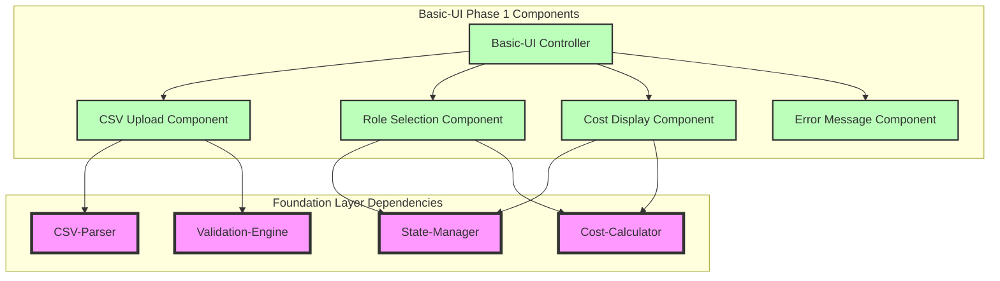
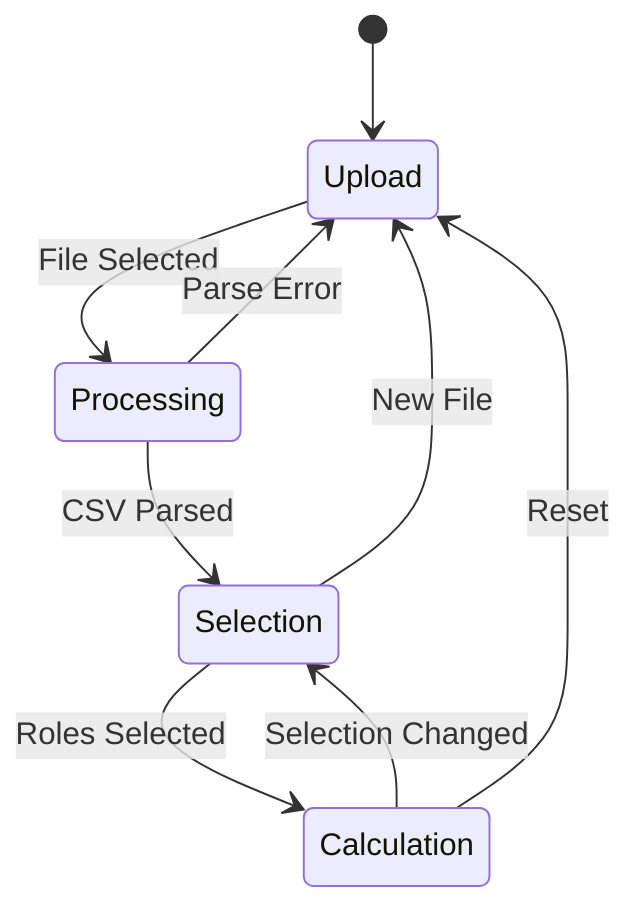

# Basic-UI Phase 1 - Technical Specification

## 1. Technical Overview
The Basic-UI module implements a client-side web interface using vanilla JavaScript, HTML5, and CSS3. Phase 1 focuses on establishing the foundational architecture for CSV upload, role selection, and cost display functionality. The implementation prioritizes simplicity, maintainability, and extensibility for future phases.

## 2. Architecture Design

### 2.1 Component Architecture


### 2.2 File Structure
```
src/
├── styles/
│   ├── basic-ui.css
│   ├── components/
│   │   ├── upload.css
│   │   ├── role-selection.css
│   │   ├── cost-display.css
│   │   └── error-message.css
├── scripts/
│   ├── modules/
│   │   ├── basic-ui/
│   │   │   ├── BasicUIController.js
│   │   │   ├── CSVUploadComponent.js
│   │   │   ├── RoleSelectionComponent.js
│   │   │   ├── CostDisplayComponent.js
│   │   │   └── ErrorMessageComponent.js
│   │   └── utils/
│   │       ├── DOMHelper.js
│   │       └── EventEmitter.js
├── index.html
└── main.js
```

## 3. Component Specifications

### 3.1 BasicUIController
**Purpose:** Central orchestrator managing component lifecycle and inter-component communication

**Dependencies:**
- CSVUploadComponent
- RoleSelectionComponent  
- CostDisplayComponent
- ErrorMessageComponent
- State-Manager
- Event system

**Public Interface:**
```javascript
class BasicUIController {
    constructor(containerElement)
    initialize()
    destroy()
    
    // Event Handlers
    onCSVUploaded(fileData)
    onRoleSelectionChanged(selectedRoles)
    onError(errorType, errorMessage)
}
```

**Key Responsibilities:**
- Initialize and coordinate all UI components
- Handle cross-component communication via events
- Manage application state transitions
- Coordinate with foundation layer services

### 3.2 CSVUploadComponent
**Purpose:** Handles CSV file upload interface and user interactions

**Dependencies:**
- CSV-Parser (foundation layer)
- Validation-Engine (foundation layer)
- DOMHelper utility
- EventEmitter

**Public Interface:**
```javascript
class CSVUploadComponent {
    constructor(containerElement, eventEmitter)
    render()
    destroy()
    
    // Public Methods
    showLoadingState()
    showSuccessState(roleCount)
    showErrorState(message)
    reset()
}
```

**Internal Methods:**
```javascript
// Private Methods
_setupEventListeners()
_handleFileSelect(event)
_handleFileDrop(event)
_validateFileType(file)
_processFile(file)
_emitUploadComplete(data)
_emitUploadError(error)
```

**HTML Structure:**
```html
<div class="csv-upload-container">
    <div class="upload-area" id="uploadArea">
        <div class="upload-content">
            <div class="upload-icon">📄</div>
            <h3>Upload Rate Card CSV</h3>
            <p>Drag & drop your CSV file here or click to browse</p>
            <button class="browse-button" id="browseButton">Browse Files</button>
        </div>
        <div class="upload-loading hidden" id="uploadLoading">
            <div class="spinner"></div>
            <p>Processing CSV file...</p>
        </div>
        <div class="upload-success hidden" id="uploadSuccess">
            <div class="success-icon">✅</div>
            <p class="success-message">Successfully loaded <span id="roleCount">0</span> roles</p>
        </div>
    </div>
    <input type="file" id="fileInput" accept=".csv" style="display: none;">
</div>
```

### 3.3 RoleSelectionComponent
**Purpose:** Displays parsed roles and handles selection interactions

**Dependencies:**
- State-Manager (foundation layer)
- Cost-Calculator (foundation layer)
- DOMHelper utility
- EventEmitter

**Public Interface:**
```javascript
class RoleSelectionComponent {
    constructor(containerElement, eventEmitter)
    render(roles)
    destroy()
    
    // Public Methods
    updateRoles(roles)
    getSelectedRoles()
    selectAll()
    clearAll()
    disable()
    enable()
}
```

**Internal Methods:**
```javascript
// Private Methods
_setupEventListeners()
_renderRoleList(roles)
_handleRoleToggle(roleId, isSelected)
_handleSelectAll()
_handleClearAll()
_emitSelectionChanged()
_sortRoles(roles)
```

**HTML Structure:**
```html
<div class="role-selection-container hidden" id="roleSelection">
    <div class="role-selection-header">
        <h3>Select Team Roles</h3>
        <div class="bulk-actions">
            <button class="link-button" id="selectAllBtn">Select All</button>
            <button class="link-button" id="clearAllBtn">Clear All</button>
        </div>
    </div>
    <div class="role-list" id="roleList">
        <!-- Dynamically populated role items -->
    </div>
    <div class="role-empty-state hidden" id="roleEmptyState">
        <p>No roles found in CSV file</p>
    </div>
</div>
```

**Role Item Template:**
```html
<div class="role-item" data-role-id="{roleId}">
    <label class="role-checkbox">
        <input type="checkbox" data-role-id="{roleId}">
        <span class="checkmark"></span>
        <div class="role-info">
            <span class="role-name">{roleName}</span>
            <span class="role-rate">${rate}/hr</span>
        </div>
    </label>
</div>
```

### 3.4 CostDisplayComponent
**Purpose:** Shows real-time cost calculations based on selected roles

**Dependencies:**
- State-Manager (foundation layer)
- Cost-Calculator (foundation layer)
- DOMHelper utility
- EventEmitter

**Public Interface:**
```javascript
class CostDisplayComponent {
    constructor(containerElement, eventEmitter)
    render()
    destroy()
    
    // Public Methods
    updateCost(selectedRoles, totalCost)
    showZeroState()
    hide()
    show()
}
```

**Internal Methods:**
```javascript
// Private Methods
_calculateTotalCost(selectedRoles)
_formatCurrency(amount)
_renderCostBreakdown(selectedRoles)
_renderTotalCost(totalCost)
```

**HTML Structure:**
```html
<div class="cost-display-container hidden" id="costDisplay">
    <div class="cost-summary">
        <h3>Configuration Cost</h3>
        <div class="total-cost">
            <span class="cost-label">Total Hourly Cost:</span>
            <span class="cost-amount" id="totalCost">$0.00</span>
        </div>
        <div class="role-count">
            <span id="selectedCount">0</span> roles selected
        </div>
    </div>
    <div class="cost-zero-state hidden" id="costZeroState">
        <p>Select roles to see cost calculation</p>
    </div>
</div>
```

### 3.5 ErrorMessageComponent
**Purpose:** Displays user-friendly error messages and recovery options

**Dependencies:**
- DOMHelper utility
- EventEmitter

**Public Interface:**
```javascript
class ErrorMessageComponent {
    constructor(containerElement, eventEmitter)
    render()
    destroy()
    
    // Public Methods
    showError(type, message, recoveryAction)
    hideError()
    showWarning(message)
    hideWarning()
}
```

**Error Types:**
- `CSV_INVALID_FORMAT`: Invalid CSV file structure
- `CSV_PARSE_ERROR`: Error parsing CSV content
- `FILE_TOO_LARGE`: File exceeds size limit
- `UNSUPPORTED_FILE`: Non-CSV file uploaded
- `CALCULATION_ERROR`: Error in cost calculation

**HTML Structure:**
```html
<div class="error-container hidden" id="errorContainer">
    <div class="error-message">
        <div class="error-icon">⚠️</div>
        <div class="error-content">
            <h4 class="error-title" id="errorTitle">Error</h4>
            <p class="error-text" id="errorText"></p>
            <button class="error-action hidden" id="errorAction">Try Again</button>
        </div>
        <button class="error-close" id="errorClose">×</button>
    </div>
</div>
```

## 4. State Management

### 4.1 Application State Structure
```javascript
const ApplicationState = {
    ui: {
        currentStep: 'upload', // 'upload' | 'selection' | 'calculation'
        isLoading: false,
        error: null
    },
    data: {
        csvFile: null,
        roles: [],
        selectedRoles: [],
        totalCost: 0
    }
};
```

### 4.2 State Transitions


### 4.3 Event System
**Event Bus Implementation:**
```javascript
class EventEmitter {
    constructor() {
        this.events = {};
    }
    
    on(event, callback) { /* implementation */ }
    off(event, callback) { /* implementation */ }
    emit(event, data) { /* implementation */ }
}
```

**Application Events:**
- `csv:uploaded` - CSV file successfully uploaded
- `csv:parsed` - CSV parsing completed
- `csv:error` - CSV parsing failed
- `roles:changed` - Role selection changed
- `cost:calculated` - Cost calculation updated
- `ui:error` - UI error occurred
- `ui:reset` - Application reset requested

## 5. Integration Specifications

### 5.1 CSV-Parser Integration
```javascript
// Expected CSV-Parser interface
const csvParser = {
    parse(csvContent) {
        // Returns: { success: boolean, data: Role[], error?: string }
    }
};

// Role data structure
const Role = {
    id: string,
    name: string,
    rate: number,
    description?: string
};
```

### 5.2 State-Manager Integration
```javascript
// Expected State-Manager interface
const stateManager = {
    setRoles(roles) { /* implementation */ },
    getRoles() { /* implementation */ },
    setSelectedRoles(roleIds) { /* implementation */ },
    getSelectedRoles() { /* implementation */ },
    subscribe(callback) { /* implementation */ }
};
```

### 5.3 Cost-Calculator Integration
```javascript
// Expected Cost-Calculator interface
const costCalculator = {
    calculateTotal(selectedRoles) {
        // Returns: { total: number, breakdown: object }
    }
};
```

## 6. Performance Specifications

### 6.1 Response Time Requirements
- **CSV Upload Response**: < 200ms for file selection feedback
- **CSV Parsing**: < 3 seconds for files up to 200 roles
- **Role Selection Response**: < 100ms for checkbox interaction
- **Cost Calculation**: < 50ms for calculation update
- **UI Transitions**: < 150ms for smooth animations

### 6.2 Memory Management
- **CSV Data**: Release file content after parsing
- **Event Listeners**: Clean up on component destroy
- **DOM References**: Use weak references where possible
- **State Cleanup**: Clear state on application reset

### 6.3 Scalability Constraints
- **Maximum Roles**: Support up to 50 roles without UI degradation
- **File Size Limit**: 5MB maximum CSV file size
- **Browser Memory**: < 50MB total memory usage
- **DOM Elements**: < 500 elements at any time

## 7. Error Handling Strategy

### 7.1 Error Categories
**User Errors:**
- Invalid file type selection
- Empty or malformed CSV files
- Files exceeding size limits

**System Errors:**
- CSV parsing failures
- Calculation engine errors
- Browser compatibility issues

**Network Errors:** (Not applicable in Phase 1 - client-side only)

### 7.2 Error Recovery Patterns
```javascript
// Error Recovery Flow
try {
    await processCSVFile(file);
} catch (error) {
    if (error.type === 'PARSE_ERROR') {
        showParseErrorMessage(error.details);
        enableFileReselection();
    } else if (error.type === 'SIZE_ERROR') {
        showFileSizeError(error.maxSize);
        enableFileReselection();
    } else {
        showGenericError();
        enableAppReset();
    }
}
```

### 7.3 Validation Strategy
**Client-Side Validation:**
- File type validation (CSV extension)
- File size validation (< 5MB)
- CSV structure validation (headers present)
- Role data validation (name and rate required)

## 8. Browser Compatibility

### 8.1 Supported Browsers
- **Chrome**: 90+ (ES6 modules, CSS Grid)
- **Firefox**: 88+ (ES6 modules, CSS Grid)
- **Safari**: 14+ (ES6 modules, CSS Grid)
- **Edge**: 90+ (Chromium-based)

### 8.2 Feature Detection
```javascript
// Feature detection implementation
const BrowserSupport = {
    hasFileAPI: () => !!(window.File && window.FileReader),
    hasES6Modules: () => 'noModule' in HTMLScriptElement.prototype,
    hasCSSGrid: () => CSS.supports('display', 'grid'),
    
    checkCompatibility() {
        return this.hasFileAPI() && this.hasES6Modules() && this.hasCSSGrid();
    }
};
```

### 8.3 Progressive Enhancement
- **Core Functionality**: Works without JavaScript (basic form submission)
- **Enhanced Experience**: Full interactivity with JavaScript enabled
- **Graceful Degradation**: Fallback messaging for unsupported browsers

## 9. Security Considerations

### 9.1 Client-Side Security
- **File Type Validation**: Strict CSV file type checking
- **Content Sanitization**: Escape user data in DOM insertion
- **XSS Prevention**: No direct HTML insertion from user data
- **Data Isolation**: No data transmission outside browser

### 9.2 Input Validation
```javascript
// Input sanitization example
function sanitizeText(input) {
    return input
        .replace(/</g, '&lt;')
        .replace(/>/g, '&gt;')
        .replace(/"/g, '&quot;')
        .replace(/'/g, '&#x27;');
}
```

## 10. Testing Strategy

### 10.1 Unit Testing
- **Component Testing**: Each component tested in isolation
- **Utility Testing**: Helper functions and utilities
- **State Management**: State transitions and data flow
- **Error Handling**: All error scenarios covered

### 10.2 Integration Testing
- **Component Communication**: Event flow between components
- **Foundation Layer Integration**: CSV parser, state manager, calculator
- **User Workflow**: Complete upload → select → calculate flow

### 10.3 User Acceptance Testing
- **Usability Testing**: Real users complete core workflow
- **Error Recovery**: Users recover from common errors
- **Performance Testing**: Response times meet requirements

## 11. Deployment Configuration

### 11.1 Build Process
```javascript
// Simple build configuration for Phase 1
const buildConfig = {
    entry: 'src/main.js',
    output: 'dist/app.js',
    styles: 'dist/styles.css',
    minify: true,
    sourceMaps: true
};
```

### 11.2 Development Environment
- **Local Server**: Simple HTTP server for development
- **Hot Reload**: File watching for CSS/JS changes
- **Debug Mode**: Console logging and error details
- **Mock Data**: Sample CSV files for testing

## 12. Future Architecture Considerations

### 12.1 Phase 2 Preparation
- **Component Extensibility**: Architecture supports time allocation inputs
- **State Expansion**: State structure accommodates configuration management
- **Event System**: Event bus ready for complex inter-component communication

### 12.2 Scaling Strategy
- **Module Bundling**: Prepare for webpack/rollup integration
- **Component Libraries**: Abstract reusable UI components
- **State Management**: Consider Vuex/Redux for complex state
- **Testing Framework**: Expand to full testing suite

## 13. Performance Monitoring

### 13.1 Metrics Collection
```javascript
// Performance monitoring hooks
const PerformanceMonitor = {
    trackUploadTime(startTime, endTime) { /* implementation */ },
    trackParseTime(startTime, endTime) { /* implementation */ },
    trackCalculationTime(startTime, endTime) { /* implementation */ },
    trackMemoryUsage() { /* implementation */ }
};
```

### 13.2 Optimization Targets
- **First Paint**: < 1 second
- **Interactive**: < 2 seconds
- **CSV Processing**: < 3 seconds (200 roles)
- **Memory Usage**: < 50MB peak