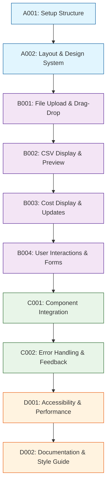

# Development Tasks

## 1. Task Overview
- **Component:** Basic-UI
- **Technical Spec:** [Link to technical-spec.md](technical-spec.md)
- **Total Estimated Effort:** 42 story points
- **Implementation Order:** 4 task groups in sequence

## 2. Task Categories

### Category A: Foundation & Setup
Core infrastructure and basic structure

### Category B: Core Implementation  
Primary business logic and functionality

### Category C: Integration & Testing
External connections and validation

### Category D: Polish & Documentation
Final touches and documentation

## 3. Detailed Task Breakdown

### 📋 Foundation & Setup

**TASK-A001: Set up Basic-UI component structure and dependencies**
- **Summary:** Basic-UI - Setup Structure & Dependencies
- **Issue Type:** Story
- **Epic Link:** Basic-UI Epic
- **Story Points:** 2
- **Priority:** High
- **Labels:** setup, foundation, basic-ui
- **Components:** Basic-UI
- **Description:** 
  Create basic project structure, install dependencies, set up development environment for Basic-UI component.
  
  **Technical Requirements:**
  - Set up HTML/CSS/TypeScript project structure per technical spec
  - Configure build tools and development environment
  - Install required libraries for file handling and UI components
  - Set up accessibility testing tools
  
- **Acceptance Criteria:**
  - Component folder structure matches technical specification
  - Development environment configured with TypeScript
  - File handling libraries properly installed and configured
  - Accessibility testing tools are integrated
- **Dependencies:** None
- **Jira Sub-tasks:**
  - Create project structure
  - Configure TypeScript and build tools
  - Install file handling libraries
  - Set up accessibility testing

**TASK-A002: Implement core UI layout and responsive design system**
- **Summary:** Basic-UI - Core Layout & Responsive Design
- **Issue Type:** Story
- **Epic Link:** Basic-UI Epic
- **Story Points:** 5
- **Priority:** High
- **Labels:** layout, responsive, design-system, basic-ui
- **Components:** Basic-UI
- **Description:**
  Create responsive layout system and design foundations as defined in technical specification.
  
  **Technical Requirements:**
  - Implement responsive grid system using CSS Grid/Flexbox
  - Create design tokens for consistent styling
  - Add mobile-first responsive breakpoints
  - Set up component layout architecture
  
- **Acceptance Criteria:**
  - Responsive layout works from 320px to 1920px screen widths
  - Design tokens provide consistent spacing, colors, and typography
  - Mobile-first approach ensures optimal mobile performance
  - Layout components are reusable and modular
- **Dependencies:** TASK-A001
- **Jira Sub-tasks:**
  - Implement responsive grid system
  - Create design tokens
  - Set up mobile-first breakpoints
  - Build layout components

### 🔧 Core Implementation

**TASK-B001: Implement file upload interface and drag-and-drop**
- **Summary:** Basic-UI - File Upload Interface & Drag-and-Drop
- **Issue Type:** Story
- **Epic Link:** Basic-UI Epic
- **Story Points:** 6
- **Priority:** High
- **Labels:** file-upload, drag-drop, ui, basic-ui
- **Components:** Basic-UI
- **Description:**
  Build comprehensive file upload interface with drag-and-drop functionality.
  
  **Technical Requirements:**
  - Implement File API-based upload with drag-and-drop
  - Add file validation (type, size, format checking)
  - Create upload progress indication and status feedback
  - Handle multiple file selection and management
  
- **Acceptance Criteria:**
  - Drag-and-drop works for CSV files from desktop
  - File validation provides clear error messages
  - Upload progress is clearly indicated to users
  - Multiple files can be managed simultaneously
  - Accessibility standards are met for file upload
- **Dependencies:** TASK-A002
- **Jira Sub-tasks:**
  - Implement drag-and-drop functionality
  - Add file validation logic
  - Create progress indicators
  - Handle multiple file management
  - Add accessibility features

**TASK-B002: Implement CSV data display and preview components**
- **Summary:** Basic-UI - CSV Data Display & Preview
- **Issue Type:** Story
- **Epic Link:** Basic-UI Epic
- **Story Points:** 7
- **Priority:** High
- **Labels:** data-display, csv-preview, ui, basic-ui
- **Components:** Basic-UI
- **Description:**
  Build data display components for CSV preview and team configuration visualization.
  
  **Technical Requirements:**
  - Create scrollable data table with virtual scrolling
  - Add column mapping interface for CSV data
  - Implement team member grid with role/hours display
  - Create data validation status indicators
  
- **Acceptance Criteria:**
  - Data tables handle large datasets efficiently (1000+ rows)
  - Column mapping interface is intuitive and functional
  - Team member grid clearly shows roles and hour allocations
  - Validation errors are highlighted with clear explanations
  - Tables are accessible and keyboard navigable
- **Dependencies:** TASK-B001
- **Jira Sub-tasks:**
  - Create scrollable data table
  - Build column mapping interface
  - Implement team member grid
  - Add validation status indicators
  - Ensure accessibility compliance

**TASK-B003: Implement cost calculation display and real-time updates**
- **Summary:** Basic-UI - Cost Display & Real-time Updates
- **Issue Type:** Story
- **Epic Link:** Basic-UI Epic
- **Story Points:** 6
- **Priority:** High
- **Labels:** cost-display, real-time, calculations, basic-ui
- **Components:** Basic-UI
- **Description:**
  Build cost calculation display components with real-time updates and breakdown visualization.
  
  **Technical Requirements:**
  - Create cost summary dashboard with total and breakdowns
  - Implement real-time calculation updates on data changes
  - Add cost breakdown by role/team member visualization
  - Create calculation status and loading indicators
  
- **Acceptance Criteria:**
  - Cost summary updates immediately when configuration changes
  - Breakdown visualizations are clear and accurate
  - Real-time updates don't cause UI performance issues
  - Loading states provide appropriate feedback
  - Currency formatting follows localization standards
- **Dependencies:** TASK-B002
- **Jira Sub-tasks:**
  - Create cost summary dashboard
  - Implement real-time update system
  - Build breakdown visualizations
  - Add loading and status indicators
  - Implement currency formatting

**TASK-B004: Implement user interaction and form controls**
- **Summary:** Basic-UI - User Interactions & Form Controls
- **Issue Type:** Story
- **Epic Link:** Basic-UI Epic
- **Story Points:** 5
- **Priority:** High
- **Labels:** forms, interactions, ui-controls, basic-ui
- **Components:** Basic-UI
- **Description:**
  Build comprehensive form controls and user interaction elements.
  
  **Technical Requirements:**
  - Create form controls for team configuration editing
  - Add interactive elements (buttons, inputs, selects)
  - Implement form validation with real-time feedback
  - Create consistent interaction patterns and states
  
- **Acceptance Criteria:**
  - Form controls are intuitive and follow UI patterns
  - Real-time validation provides immediate feedback
  - Interaction states (hover, focus, disabled) are clear
  - Forms are fully accessible with keyboard navigation
  - Input validation prevents invalid data entry
- **Dependencies:** TASK-B003
- **Jira Sub-tasks:**
  - Create form control components
  - Add interactive elements
  - Implement form validation
  - Design interaction states
  - Ensure accessibility compliance

### 🔗 Integration & Testing

**TASK-C001: Implement component integration and data flow**
- **Summary:** Basic-UI - Component Integration & Data Flow
- **Issue Type:** Story
- **Epic Link:** Basic-UI Epic
- **Story Points:** 8
- **Priority:** Medium
- **Labels:** integration, data-flow, components, basic-ui
- **Components:** Basic-UI
- **Description:**
  Build comprehensive integration with all system components and establish proper data flow.
  
  **Technical Requirements:**
  - Integrate CSV-Parser for file processing
  - Connect State-Manager for data persistence
  - Integrate Validation-Engine for input validation
  - Connect Team-Configuration-Builder for team management
  - Integrate Cost-Calculator for real-time calculations
  
- **Acceptance Criteria:**
  - All components integrate seamlessly without errors
  - Data flows correctly between UI and backend components
  - State management maintains consistency across views
  - Component interactions don't cause performance issues
  - Error states are handled gracefully across integrations
- **Dependencies:** TASK-B004
- **Jira Sub-tasks:**
  - Integrate CSV-Parser component
  - Connect State-Manager
  - Integrate Validation-Engine
  - Connect Team-Configuration-Builder
  - Integrate Cost-Calculator
  - Test cross-component data flow

**TASK-C002: Add error handling and user feedback systems**
- **Summary:** Basic-UI - Error Handling & User Feedback
- **Issue Type:** Story
- **Epic Link:** Basic-UI Epic
- **Story Points:** 4
- **Priority:** Medium
- **Labels:** error-handling, feedback, ux, basic-ui
- **Components:** Basic-UI
- **Description:**
  Build comprehensive error handling and user feedback systems for optimal user experience.
  
  **Technical Requirements:**
  - Create error message display system
  - Add success/warning notification system
  - Implement loading states and progress indicators
  - Create help text and guidance for users
  
- **Acceptance Criteria:**
  - Error messages are clear, actionable, and appropriately placed
  - Success notifications confirm completed actions
  - Loading states prevent user confusion during processing
  - Help text guides users through complex operations
  - Feedback system doesn't overwhelm the interface
- **Dependencies:** TASK-C001
- **Jira Sub-tasks:**
  - Create error message system
  - Add notification components
  - Implement loading states
  - Create help and guidance text
  - Test user feedback flows

### ✨ Polish & Documentation

**TASK-D001: Implement accessibility features and performance optimization**
- **Summary:** Basic-UI - Accessibility & Performance Optimization
- **Issue Type:** Story
- **Epic Link:** Basic-UI Epic
- **Story Points:** 6
- **Priority:** High
- **Labels:** accessibility, performance, optimization, basic-ui
- **Components:** Basic-UI
- **Description:**
  Ensure full accessibility compliance and optimize performance for production use.
  
  **Technical Requirements:**
  - Achieve WCAG 2.1 AA compliance across all components
  - Optimize rendering performance for large datasets
  - Add keyboard navigation and screen reader support
  - Implement focus management and ARIA labels
  
- **Acceptance Criteria:**
  - All components pass WCAG 2.1 AA accessibility audits
  - Performance remains smooth with 1000+ data rows
  - Keyboard navigation works for all interactive elements
  - Screen readers can access all content and functionality
  - Focus management provides clear visual indication
- **Dependencies:** TASK-A002, TASK-B001, TASK-B002, TASK-B003, TASK-B004, TASK-C001, TASK-C002
- **Jira Sub-tasks:**
  - Conduct accessibility audit
  - Implement ARIA labels and roles
  - Add keyboard navigation support
  - Optimize rendering performance
  - Test with screen readers
  - Implement focus management

**TASK-D002: Create comprehensive documentation and style guide**
- **Summary:** Basic-UI - Documentation & Style Guide
- **Issue Type:** Story
- **Epic Link:** Basic-UI Epic
- **Story Points:** 3
- **Priority:** Medium
- **Labels:** documentation, style-guide, basic-ui
- **Components:** Basic-UI
- **Description:**
  Create comprehensive documentation and style guide for UI components and usage patterns.
  
  **Technical Requirements:**
  - Document all UI components with usage examples
  - Create style guide with design patterns and guidelines
  - Document accessibility features and requirements
  - Create integration guide for developers
  
- **Acceptance Criteria:**
  - Component documentation includes clear usage examples
  - Style guide provides consistent design patterns
  - Accessibility documentation guides proper implementation
  - Integration guide enables easy component adoption
  - Documentation is complete and ready for team use
- **Dependencies:** TASK-D001
- **Jira Sub-tasks:**
  - Document UI components
  - Create design style guide
  - Document accessibility features
  - Write integration guide
  - Review and finalize documentation

## 4. Task Dependencies & Sequencing

## 5. Parallel Development Opportunities

### What Can Be Built Simultaneously:
- **After A002:** B001 can start immediately
- **After B001:** B002 and form structure for B004 can begin in parallel
- **After B003:** B004 can be completed while C001 integration planning begins

### Critical Path:
A001 → A002 → B001 → B002 → B003 → B004 → C001 → C002 → D001 → D002

## 6. Risk Mitigation Tasks

### Technical Risks:
- **Performance with Large Datasets:** Addressed through virtual scrolling in B002 and optimization in D001
- **Accessibility Compliance:** Dedicated focus in D001 with comprehensive testing
- **Cross-browser Compatibility:** Testing throughout development and final verification in D001
- **Component Integration Complexity:** Systematic integration approach in C001

## 7. Definition of Done

### Task Completion Criteria:
- ✅ All acceptance criteria met
- ✅ Unit tests written and passing
- ✅ Code review completed
- ✅ Integration tests passing (where applicable)
- ✅ Documentation updated
- ✅ Accessibility testing completed

### Component Completion Criteria:
- ✅ All tasks completed per definition of done
- ✅ Technical specification requirements met
- ✅ WCAG 2.1 AA accessibility compliance achieved
- ✅ Performance targets met for large datasets
- ✅ Cross-browser compatibility verified
- ✅ Ready for production deployment

## 8. Estimation Summary

| Category | Task Count | Total Effort | Duration (days) |
|----------|-----------|--------------|-----------------|
| Foundation & Setup | 2 | 7 points | 3-4 days |
| Core Implementation | 4 | 24 points | 10-12 days |
| Integration & Testing | 2 | 12 points | 5-6 days |
| Polish & Documentation | 2 | 9 points | 4-5 days |
| **TOTAL** | **10** | **52 points** | **22-27 days** |

## 9. Traceability Matrix

| Task ID | Technical Spec Section | Functional Requirements | Business Value |
|---------|------------------------|-------------------------|----------------|
| A001 | Section 5.1 | Setup/Infrastructure | Development efficiency |
| A002 | Section 4.1, 8.1 | FR-040, FR-044 | Responsive design foundation |
| B001 | Section 3.1, 4.2 | FR-040, FR-041 | File upload capability |
| B002 | Section 3.1, 4.3 | FR-041, FR-042 | Data visualization |
| B003 | Section 3.1, 4.4 | FR-043, FR-044 | Cost display functionality |
| B004 | Section 3.1, 4.5 | FR-042, FR-045 | User interaction capability |
| C001 | Section 6.1 | Integration requirements | System cohesion |
| C002 | Section 3.3, 9.1 | FR-045 | User experience quality |
| D001 | Section 8.1, 10.1 | FR-044 | Accessibility compliance |
| D002 | Section 11.1 | Documentation | Developer experience |

## 10. Implementation Notes

### Development Best Practices:
- Follow component-driven development approach
- Implement mobile-first responsive design
- Use semantic HTML for accessibility foundation
- Regular accessibility testing throughout development

### Quality Gates:
- Automated testing pipeline must pass
- Code coverage minimum 80% for UI logic
- Accessibility audit must pass WCAG 2.1 AA
- Performance benchmarks must meet targets for large datasets
- Cross-browser testing must pass for major browsers

### Communication Plan:
- Daily standup updates on task progress
- Demo UI functionality after each category
- Accessibility reviews with stakeholders
- User experience testing sessions
- Escalate blockers immediately to technical lead