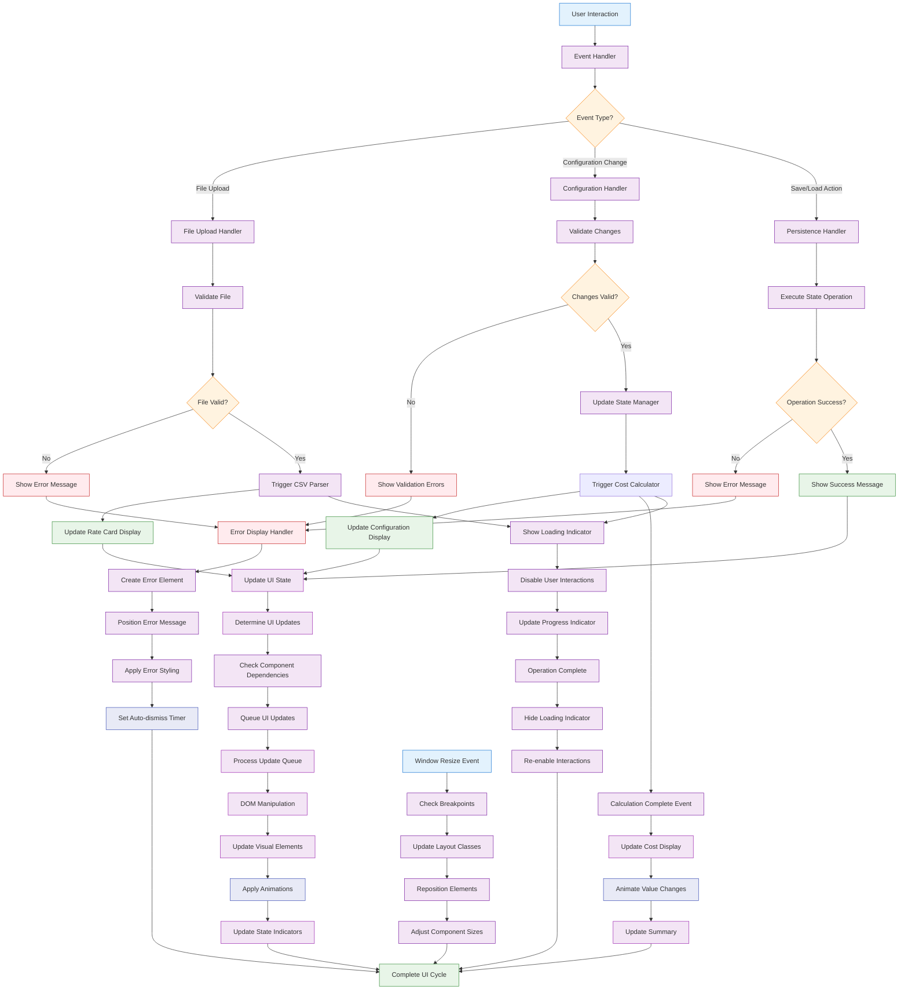

# Technical Specification

## 1. Component Overview
- **Purpose:** Main user interface component providing CSV upload, configuration form, and cost display for the embryonic system
- **Scope:** Handles user interactions, displays data, coordinates component integration, and provides responsive interface
- **Dependencies:** CSV-Parser, State-Manager, Validation-Engine, Team-Configuration-Builder, Cost-Calculator
- **Dependents:** None (top-level experience layer component)

## 2. Functional Requirements
List of functional requirements this component must fulfill:
- **FR-038:** User must be able to upload CSV files through web interface
- **FR-039:** System must display parsed rate card data in readable format
- **FR-040:** User must be able to create and manage team configurations
- **FR-041:** System must display real-time cost calculations and totals
- **FR-042:** User interface must be responsive across desktop and tablet devices
- **FR-043:** System must provide clear error messages and validation feedback
- **FR-044:** User must be able to save and load configurations
- **FR-045:** Interface must support rapid configuration creation workflow

## 3. Component Interface

### 3.1 Public API
Define the external interface this component exposes:

```typescript
interface BasicUIAPI {
  // Application lifecycle
  initialize(containerId: string, config?: UIConfiguration): Promise<void>;
  destroy(): void;
  refresh(): void;
  
  // UI state management
  setUIMode(mode: UIMode): void;
  getUIState(): UIState;
  showLoading(message?: string): void;
  hideLoading(): void;
  
  // Error and message handling
  showError(error: UIError): void;
  showSuccess(message: string): void;
  showWarning(message: string): void;
  clearMessages(): void;
  
  // Data display
  displayRateCard(rateCard: RateCardData): void;
  displayConfiguration(config: TeamConfiguration): void;
  displayCalculationResult(result: CalculationResult): void;
  
  // User interaction handlers
  onFileUpload(callback: FileUploadCallback): void;
  onConfigurationChange(callback: ConfigurationChangeCallback): void;
  onCalculationRequest(callback: CalculationRequestCallback): void;
  
  // Utility methods
  exportConfiguration(configId: string): void;
  resetInterface(): void;
  validateCurrentInput(): ValidationSummary;
}

interface UIConfiguration {
  theme: 'light' | 'dark' | 'auto';
  language: string;
  currency: string;
  precision: number;
  enableAnimations: boolean;
  compactMode: boolean;
  debugMode: boolean;
}

interface UIState {
  currentMode: UIMode;
  isLoading: boolean;
  hasRateCard: boolean;
  activeConfigurationId: string | null;
  unsavedChanges: boolean;
  validationErrors: UIValidationError[];
  currentStep: WorkflowStep;
}

interface UIError {
  type: 'error' | 'warning' | 'info';
  title: string;
  message: string;
  details?: string;
  actionable: boolean;
  suggestions?: string[];
  dismissible: boolean;
}

type UIMode = 'upload' | 'configure' | 'calculate' | 'results';
type WorkflowStep = 'upload' | 'review' | 'build' | 'calculate' | 'finalize';

// UI Section Interfaces
interface RateCardDisplay {
  showRoleList(roles: RoleRateData[]): void;
  showRateStatistics(stats: RateCardStatistics): void;
  showUploadForm(): void;
  clearDisplay(): void;
}

interface ConfigurationBuilder {
  showRoleSelector(availableRoles: RoleRateData[]): void;
  showTeamMemberList(members: TeamMember[]): void;
  showConfigurationSummary(summary: TeamSummary): void;
  enableEditing(enabled: boolean): void;
}

interface CostDisplay {
  showCostBreakdown(breakdown: CostBreakdown): void;
  showTotalCost(total: number, currency: string): void;
  showCalculationProgress(progress: number): void;
  animateValueChange(oldValue: number, newValue: number): void;
}
```

### 3.2 Input/Output Contracts
- **Inputs:** 
  - User file uploads for CSV rate cards
  - User interactions for team configuration
  - Real-time calculation results from Cost-Calculator
  - Validation feedback from Validation-Engine
- **Outputs:** 
  - Structured user interface with reactive updates
  - User interaction events for dependent components
  - Error and success feedback to users
  - Exported configuration data
- **Data Formats:** 
  - HTML DOM elements for user interface
  - JavaScript events for user interactions
  - Structured data objects for component communication

### 3.3 Error Handling
- **Error Types:** 
  - File upload errors (invalid format, size limits)
  - Configuration validation errors
  - Calculation errors and timeouts
  - UI rendering and interaction errors
- **Error Responses:** 
  - User-friendly error messages with clear explanations
  - Actionable suggestions for error resolution
  - Visual indicators for error states
  - Graceful degradation for non-critical features
- **Recovery Strategies:** 
  - Auto-retry for transient errors
  - Manual retry options for users
  - Fallback UI states for critical failures
  - Data preservation during error recovery

## 4. Data Model

### 4.1 Data Storage
- **Storage Type:** DOM state and temporary UI data with no persistent storage
- **Data Schema:** UI component state and user interaction data

```typescript
// Internal UI state management
interface InternalUIState {
  domElements: Map<string, HTMLElement>;
  eventListeners: Map<string, EventListener[]>;
  currentData: {
    rateCard: RateCardData | null;
    activeConfiguration: TeamConfiguration | null;
    calculationResult: CalculationResult | null;
  };
  uiSettings: UIConfiguration;
  animationQueue: AnimationTask[];
  validationState: UIValidationState;
}

// UI Component Registry
interface ComponentRegistry {
  fileUpload: FileUploadComponent;
  rateCardDisplay: RateCardDisplayComponent;
  configurationBuilder: ConfigurationBuilderComponent;
  costDisplay: CostDisplayComponent;
  errorDisplay: ErrorDisplayComponent;
  navigationBar: NavigationComponent;
}

// Event handling
interface UIEventHandlers {
  fileUploadHandlers: Set<FileUploadCallback>;
  configurationChangeHandlers: Set<ConfigurationChangeCallback>;
  calculationRequestHandlers: Set<CalculationRequestCallback>;
  validationErrorHandlers: Set<ValidationErrorCallback>;
}

// Animation and transition management
interface AnimationTask {
  element: HTMLElement;
  property: string;
  fromValue: any;
  toValue: any;
  duration: number;
  easing: string;
  onComplete?: () => void;
}

// Responsive design breakpoints
interface ResponsiveBreakpoints {
  mobile: number;    // 768px
  tablet: number;    // 1024px
  desktop: number;   // 1200px
  wide: number;      // 1600px
}
```

### 4.2 Data Flow


### 4.3 Data Validation
- **Input Validation:** 
  - File upload validation (type, size, format)
  - User input validation for configuration forms
  - Real-time validation feedback display
- **Business Rules:** 
  - UI workflow validation (proper step sequence)
  - Data consistency validation between components
  - User permission validation for actions
- **Data Integrity:** 
  - UI state consistency with underlying data
  - Event handler integrity and proper cleanup
  - Component lifecycle management

## 5. Technology Stack

### 5.1 Core Technologies
- **Programming Language:** JavaScript/TypeScript (ES2020+)
- **Framework:** Vanilla JavaScript with modern DOM APIs
- **Styling:** CSS3 with CSS Grid and Flexbox for responsive design
- **Build Tools:** CSS preprocessor (SCSS/Sass) for maintainable styles

### 5.2 Technology Rationale
- **Why These Choices:** 
  - Vanilla JavaScript provides direct control over user experience
  - Modern CSS ensures responsive design without framework overhead
  - TypeScript provides type safety for complex UI interactions
  - No framework dependencies keeps bundle size minimal
- **Alternatives Considered:** 
  - React/Vue (adds complexity and bundle size for MVP)
  - Bootstrap/Tailwind (unnecessary for focused UI requirements)
  - Web Components (browser support complexity)
- **Trade-offs:** 
  - Benefits: Fast, lightweight, full control, works offline
  - Limitations: More manual DOM management, CSS maintenance complexity

## 6. Integration Design

### 6.1 Dependency Integration
- **CSV-Parser Integration:** 
  - Handle file upload events and trigger parsing
  - Display parsing results and errors to users
  - Provide user feedback during parsing operations
- **State-Manager Integration:** 
  - React to state changes for UI updates
  - Trigger state operations from user interactions
  - Display current application state visually
- **Team-Configuration-Builder Integration:** 
  - Embed configuration builder within main interface
  - Handle configuration events and updates
  - Display configuration data and summaries
- **Cost-Calculator Integration:** 
  - Display real-time calculation results
  - Show calculation progress and completion
  - Handle calculation errors and edge cases

### 6.2 Service Integration
- **Browser APIs:** File API for upload handling, localStorage for UI preferences
- **Performance Monitoring:** Track UI performance and user interactions
- **Accessibility Services:** Screen reader support and keyboard navigation

## 7. Performance Considerations

### 7.1 Performance Requirements
- **Response Time:** UI updates must complete within 100ms for smooth user experience
- **Throughput:** Handle rapid user interactions without lag or dropped events
- **Scalability:** Support display of large rate cards (200+ roles) without performance degradation

### 7.2 Performance Strategies
- **DOM Optimization:** 
  - Virtual scrolling for large data lists
  - Efficient DOM updates using document fragments
  - Lazy loading of non-critical UI components
- **Event Handling:** 
  - Event delegation for efficient event management
  - Debounced input handling to reduce computation
  - Throttled resize and scroll event handling
- **Animation Performance:** 
  - CSS transforms for smooth animations
  - RequestAnimationFrame for custom animations
  - GPU acceleration for complex transitions

## 8. Security Design

### 8.1 Security Requirements
- **Input Security:** Validate and sanitize all user inputs
- **XSS Prevention:** Prevent script injection through user data
- **File Security:** Safe handling of uploaded CSV files

### 8.2 Security Implementation
- **Input Sanitization:** 
  - Escape all user-provided text before DOM insertion
  - Use textContent instead of innerHTML for user data
  - Validate file uploads before processing
- **DOM Security:** 
  - Content Security Policy (CSP) headers
  - Secure handling of dynamic content creation
  - Prevention of event handler injection

## 9. Monitoring & Observability

### 9.1 Logging
- **Log Levels:** 
  - ERROR: UI rendering failures, critical user workflow issues
  - WARN: Performance issues, accessibility problems
  - INFO: User interactions, workflow progression
  - DEBUG: Detailed UI state changes, event handling
- **Log Format:** Structured JSON with user interaction context
- **Sensitive Data:** Never log personal data or file contents

### 9.2 Metrics
- **Performance Metrics:** 
  - UI rendering times
  - Animation frame rates
  - Memory usage during UI operations
- **Business Metrics:** 
  - User workflow completion rates
  - Most commonly used features
  - Error rates by UI component
- **Alerting:** 
  - High UI error rates
  - Performance degradation
  - Accessibility compliance issues

## 10. Testing Strategy

### 10.1 Unit Testing
- **Test Coverage:** Target 85% code coverage for UI logic
- **Key Test Cases:** 
  - User interaction handling and event processing
  - DOM manipulation and rendering
  - Error display and user feedback
  - Responsive design behavior
  - Animation and transition logic
- **Mock Dependencies:** Mock all backend components for isolated UI testing

### 10.2 Integration Testing
- **Integration Points:** Test with real backend components and user workflows
- **Test Data:** 
  - Various CSV file formats and sizes
  - Different device sizes and orientations
  - Edge cases and error scenarios
- **Environment Requirements:** Browser environment with DOM, File API, and CSS support

## 11. Deployment Considerations

### 11.1 Environment Requirements
- **Infrastructure:** Client-side only (no server requirements)
- **Browser Support:** Modern browsers with ES6+, CSS Grid, File API support
- **Configuration:** UI settings configurable through JavaScript constants

### 11.2 Deployment Strategy
- **Build Process:** 
  - TypeScript compilation
  - SCSS compilation and CSS optimization
  - Asset bundling and minification
  - Responsive design testing
- **Deployment Steps:** 
  - Bundle all UI assets
  - Include in static web application
  - Configure CSP headers for security
- **Rollback Plan:** Version control allows rollback to previous UI version

## 12. Risk Mitigation
Address specific risks identified in the risk assessment:
- **User Experience Issues:** Intuitive interface design with user testing
- **Performance Problems:** Optimized rendering and efficient event handling
- **Browser Compatibility:** Progressive enhancement and feature detection
- **Accessibility Concerns:** WCAG compliance and assistive technology support

## 13. Future Considerations
- **Extensibility:** 
  - Component-based architecture for reusable UI elements
  - Theme system for customizable appearance
  - Plugin architecture for additional UI features
- **Migration Path:** 
  - Gradual migration to modern UI framework (React/Vue)
  - Progressive Web App (PWA) capabilities
  - Mobile app integration possibilities
- **Deprecation Strategy:** 
  - Maintain UI API compatibility for smooth transitions
  - Clear migration path for framework adoption
  - Backward compatibility for user preferences and data