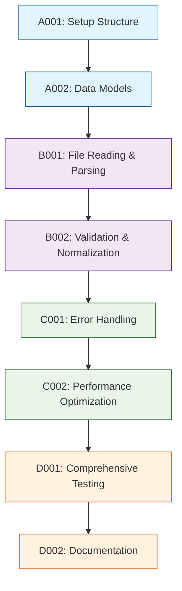

# Development Tasks

## 1. Task Overview
- **Component:** CSV-Parser
- **Technical Spec:** [Link to technical-spec.md](technical-spec.md)
- **Total Estimated Effort:** 20 story points
- **Implementation Order:** 4 task groups in sequence

## 2. Task Categories

### Category A: Foundation & Setup
Core infrastructure and basic structure

### Category B: Core Implementation  
Primary business logic and functionality

### Category C: Integration & Testing
External connections and validation

### Category D: Polish & Documentation
Final touches and documentation

## 3. Detailed Task Breakdown

### 📋 Foundation & Setup

**TASK-A001: Set up CSV-Parser component structure and dependencies**
- **Summary:** CSV-Parser - Setup Structure & Dependencies
- **Issue Type:** Story
- **Epic Link:** CSV-Parser Epic
- **Story Points:** 2
- **Priority:** High
- **Labels:** setup, foundation, csv-parser
- **Components:** CSV-Parser
- **Description:** 
  Create basic project structure, install dependencies, set up development environment for CSV-Parser component.
  
  **Technical Requirements:**
  - Set up folder structure per technical spec
  - Configure TypeScript compilation for CSV parsing
  - Set up basic testing framework
  
- **Acceptance Criteria:**
  - Component folder structure matches technical specification
  - TypeScript configuration works for CSV parsing types
  - Basic "hello world" CSV parser function runs without errors
  - Development environment configured and documented
- **Dependencies:** None
- **Jira Sub-tasks:**
  - Create folder structure
  - Configure TypeScript settings
  - Set up testing framework
  - Document setup process

**TASK-A002: Implement core data models and interfaces**
- **Summary:** CSV-Parser - Core Data Models
- **Issue Type:** Story
- **Epic Link:** CSV-Parser Epic
- **Story Points:** 3
- **Priority:** High
- **Labels:** data-model, foundation, csv-parser
- **Components:** CSV-Parser
- **Description:**
  Create data structures and TypeScript interfaces as defined in technical specification for CSV-Parser.
  
  **Technical Requirements:**
  - Implement data models from technical spec section 4.1
  - Add TypeScript interfaces for ParseResult, RoleRateData, etc.
  - Set up validation schemas for parsed data
  
- **Acceptance Criteria:**
  - All data models implemented with correct fields and types
  - TypeScript interfaces provide compile-time type safety
  - Data structures match technical specification exactly
  - Unit tests validate data model operations
- **Dependencies:** TASK-A001
- **Jira Sub-tasks:**
  - Define TypeScript interfaces
  - Implement data model classes
  - Create validation schemas
  - Write unit tests for models

### 🔧 Core Implementation

**TASK-B001: Implement CSV file reading and basic parsing**
- **Summary:** CSV-Parser - File Reading & Basic Parsing
- **Issue Type:** Story
- **Epic Link:** CSV-Parser Epic
- **Story Points:** 5
- **Priority:** High
- **Labels:** parsing, core, csv-parser
- **Components:** CSV-Parser
- **Description:**
  Build the core CSV parsing functionality including file reading and basic CSV structure parsing.
  
  **Technical Requirements:**
  - Implement file reading using browser File API
  - Add CSV delimiter detection (comma, semicolon)
  - Parse CSV headers and validate basic structure
  - Handle common CSV formatting issues
  
- **Acceptance Criteria:**
  - Files can be read from browser File API successfully
  - CSV delimiter detection works for comma and semicolon delimited files
  - Headers are correctly parsed and validated
  - Basic CSV parsing works for well-formed files
  - Error handling provides clear messages for malformed files
- **Dependencies:** TASK-A002
- **Jira Sub-tasks:**
  - Implement file reading functionality
  - Add delimiter detection logic
  - Create header parsing logic
  - Implement basic error handling
  - Write integration tests

**TASK-B002: Implement data validation and normalization**
- **Summary:** CSV-Parser - Data Validation & Normalization
- **Issue Type:** Story
- **Epic Link:** CSV-Parser Epic
- **Story Points:** 6
- **Priority:** High
- **Labels:** validation, normalization, csv-parser
- **Components:** CSV-Parser
- **Description:**
  Build comprehensive data validation and normalization for parsed CSV data.
  
  **Technical Requirements:**
  - Validate role names and hourly rates per business rules
  - Normalize data types and handle edge cases
  - Generate unique IDs for roles
  - Provide detailed validation error messages
  
- **Acceptance Criteria:**
  - Role names are validated as non-empty strings
  - Hourly rates are validated as positive numbers within reasonable ranges
  - Data normalization handles whitespace and type conversion
  - Unique IDs are generated for each role
  - Validation errors provide specific row and column information
- **Dependencies:** TASK-B001
- **Jira Sub-tasks:**
  - Implement role name validation
  - Add hourly rate validation
  - Create data normalization logic
  - Implement ID generation
  - Write comprehensive validation tests

### 🔗 Integration & Testing

**TASK-C001: Implement error handling and edge case management**
- **Summary:** CSV-Parser - Error Handling & Edge Cases
- **Issue Type:** Story
- **Epic Link:** CSV-Parser Epic
- **Story Points:** 4
- **Priority:** Medium
- **Labels:** error-handling, edge-cases, csv-parser
- **Components:** CSV-Parser
- **Description:**
  Build comprehensive error handling for various CSV formats and edge cases.
  
  **Technical Requirements:**
  - Handle empty files and files with no data rows
  - Manage files with missing required columns
  - Process files with special characters and encoding issues
  - Provide user-friendly error messages with suggestions
  
- **Acceptance Criteria:**
  - Empty files are handled gracefully with appropriate messages
  - Missing required columns are detected and reported clearly
  - Special characters and encoding issues are managed
  - Error messages provide actionable suggestions for users
  - Edge cases don't crash the parser
- **Dependencies:** TASK-B002
- **Jira Sub-tasks:**
  - Implement empty file handling
  - Add missing column detection
  - Handle special characters and encoding
  - Create user-friendly error messages
  - Write edge case tests

**TASK-C002: Add performance optimization and caching**
- **Summary:** CSV-Parser - Performance Optimization
- **Issue Type:** Story
- **Epic Link:** CSV-Parser Epic
- **Story Points:** 3
- **Priority:** Medium
- **Labels:** performance, optimization, csv-parser
- **Components:** CSV-Parser
- **Description:**
  Implement performance optimizations and caching to meet response time requirements.
  
  **Technical Requirements:**
  - Optimize parsing for files up to 1MB in under 500ms
  - Implement memory-efficient row processing
  - Add basic caching for repeated file parsing
  - Monitor and log performance metrics
  
- **Acceptance Criteria:**
  - Files under 1MB parse in under 500ms consistently
  - Memory usage scales linearly with file size
  - Caching reduces parsing time for repeated files
  - Performance metrics are collected and logged
  - Parser handles up to 200 roles without degradation
- **Dependencies:** TASK-C001
- **Jira Sub-tasks:**
  - Optimize parsing algorithms
  - Implement memory-efficient processing
  - Add basic caching mechanism
  - Create performance monitoring
  - Write performance tests

### ✨ Polish & Documentation

**TASK-D001: Comprehensive testing and quality assurance**
- **Summary:** CSV-Parser - Comprehensive Testing Suite
- **Issue Type:** Story
- **Epic Link:** CSV-Parser Epic
- **Story Points:** 5
- **Priority:** High
- **Labels:** testing, quality, csv-parser
- **Components:** CSV-Parser
- **Description:**
  Build comprehensive testing suite to ensure quality and reliability of CSV parsing functionality.
  
  **Technical Requirements:**
  - Achieve 90% test coverage for parsing logic
  - Test various CSV formats and edge cases
  - Performance testing for large files
  - Integration testing with browser File API
  
- **Acceptance Criteria:**
  - Test coverage meets 90% target for parsing logic
  - All supported CSV formats are tested
  - Edge cases and error scenarios are covered
  - Performance tests validate response time requirements
  - Integration tests work with real browser File API
- **Dependencies:** TASK-A002, TASK-B001, TASK-B002, TASK-C001, TASK-C002
- **Jira Sub-tasks:**
  - Write unit tests for all parsing functions
  - Create integration tests for file handling
  - Add performance tests for large files
  - Test edge cases and error scenarios
  - Set up automated test execution

**TASK-D002: Documentation and API finalization**
- **Summary:** CSV-Parser - Documentation & API Finalization
- **Issue Type:** Story
- **Epic Link:** CSV-Parser Epic
- **Story Points:** 2
- **Priority:** Medium
- **Labels:** documentation, api, csv-parser
- **Components:** CSV-Parser
- **Description:**
  Create comprehensive documentation and finalize public API for CSV-Parser component.
  
  **Technical Requirements:**
  - Document all public API methods and interfaces
  - Create usage examples and integration guides
  - Finalize TypeScript type definitions
  - Document error codes and troubleshooting
  
- **Acceptance Criteria:**
  - API documentation covers all public methods
  - Usage examples demonstrate common scenarios
  - TypeScript definitions are complete and accurate
  - Error codes are documented with solutions
  - Component is ready for integration with State-Manager
- **Dependencies:** TASK-D001
- **Jira Sub-tasks:**
  - Write API documentation
  - Create usage examples
  - Finalize TypeScript definitions
  - Document error handling
  - Conduct final API review

## 4. Task Dependencies & Sequencing

## 5. Parallel Development Opportunities

### What Can Be Built Simultaneously:
- **After A002:** B001 can start immediately
- **After B001:** B002 can begin while B001 testing continues
- **After B002:** C001 and C002 can be developed in parallel

### Critical Path:
A001 → A002 → B001 → B002 → C001 → D001 → D002

## 6. Risk Mitigation Tasks

### Technical Risks:
- **CSV Format Variations:** Addressed in B001 with delimiter detection and B002 with normalization
- **Performance Issues:** Dedicated optimization in C002
- **Data Quality:** Comprehensive validation in B002 and error handling in C001

## 7. Definition of Done

### Task Completion Criteria:
- ✅ All acceptance criteria met
- ✅ Unit tests written and passing
- ✅ Code review completed
- ✅ Integration tests passing (where applicable)
- ✅ Documentation updated

### Component Completion Criteria:
- ✅ All tasks completed per definition of done
- ✅ Technical specification requirements met
- ✅ Performance targets achieved (500ms for 1MB files)
- ✅ 90% test coverage achieved
- ✅ Ready for State-Manager integration

## 8. Estimation Summary

| Category | Task Count | Total Effort | Duration (days) |
|----------|-----------|--------------|-----------------|
| Foundation & Setup | 2 | 5 points | 2-3 days |
| Core Implementation | 2 | 11 points | 5-6 days |
| Integration & Testing | 2 | 7 points | 3-4 days |
| Polish & Documentation | 2 | 7 points | 3-4 days |
| **TOTAL** | **8** | **30 points** | **13-17 days** |

## 9. Traceability Matrix

| Task ID | Technical Spec Section | Functional Requirements | Business Value |
|---------|------------------------|-------------------------|----------------|
| A001 | Section 5.1 | Setup/Infrastructure | Development efficiency |
| A002 | Section 4.1 | FR-001, FR-002 | Data integrity |
| B001 | Section 3.1, 6.1 | FR-001, FR-003 | File processing capability |
| B002 | Section 4.3, 7.1 | FR-004, FR-006 | Data quality assurance |
| C001 | Section 3.3, 8.1 | FR-005, FR-007 | Error handling reliability |
| C002 | Section 7.1, 7.2 | Performance requirements | User experience |
| D001 | Section 10.1 | Quality assurance | System reliability |
| D002 | Section 11.1 | Documentation | Developer experience |

## 10. Implementation Notes

### Development Best Practices:
- Follow test-driven development (TDD) approach
- Use TypeScript strict mode for type safety
- Regular code reviews after each task completion
- Performance testing with actual CSV files

### Quality Gates:
- Automated testing pipeline must pass
- Code coverage minimum 90%
- Performance benchmarks must meet 500ms target
- All edge cases must be handled gracefully

### Communication Plan:
- Daily standup updates on task progress
- Demo parsing functionality after each category
- Escalate blockers immediately to technical lead