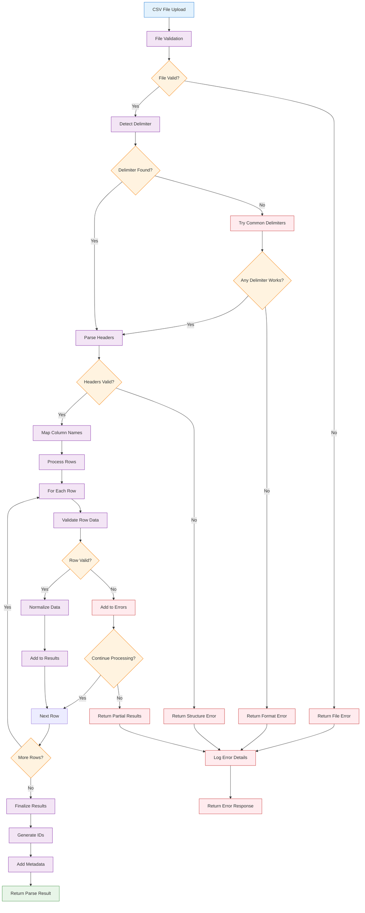

# Technical Specification

## 1. Component Overview
- **Purpose:** Transforms uploaded CSV files into standardized JavaScript objects for rate card data processing
- **Scope:** Handles CSV file parsing, data normalization, and basic structure validation for role-based rate cards
- **Dependencies:** None (Foundation layer component)
- **Dependents:** State-Manager, Validation-Engine

## 2. Functional Requirements
List of functional requirements this component must fulfill:
- **FR-001:** System must accept CSV file uploads via web interface
- **FR-002:** System must parse CSV files containing role names and hourly rates
- **FR-003:** System must handle various CSV formats (comma, semicolon delimited)
- **FR-004:** System must validate basic CSV structure and data types
- **FR-005:** System must provide meaningful error messages for parsing failures
- **FR-006:** System must normalize data into consistent JavaScript objects
- **FR-007:** System must handle edge cases like empty cells, extra whitespace, and special characters

## 3. Component Interface

### 3.1 Public API
Define the external interface this component exposes:

```typescript
interface CSVParserAPI {
  // Parse uploaded CSV file and return structured data
  parseCSVFile(file: File): Promise<ParseResult>;
  
  // Parse CSV string content directly
  parseCSVString(csvContent: string): Promise<ParseResult>;
  
  // Validate CSV structure before parsing
  validateCSVStructure(file: File): Promise<ValidationResult>;
  
  // Get supported CSV formats
  getSupportedFormats(): CSVFormatConfig[];
}

interface ParseResult {
  success: boolean;
  data: RoleRateData[];
  errors: ParseError[];
  warnings: ParseWarning[];
  metadata: ParseMetadata;
}

interface RoleRateData {
  id: string;                    // Generated unique identifier
  roleName: string;              // Role title (e.g., "Senior Developer")
  hourlyRate: number;            // Hourly rate in decimal format
  category?: string;             // Optional role category
  description?: string;          // Optional role description
  rawRowData: Record<string, any>; // Original row data for debugging
}

interface ParseError {
  type: 'STRUCTURE' | 'DATA_TYPE' | 'REQUIRED_FIELD' | 'FORMAT';
  message: string;
  row?: number;
  column?: string;
  value?: any;
}

interface ValidationResult {
  isValid: boolean;
  requiredColumns: string[];
  detectedColumns: string[];
  issues: ValidationIssue[];
}
```

### 3.2 Input/Output Contracts
- **Inputs:** 
  - CSV File object from web upload
  - CSV string content for direct parsing
  - Configuration options for parsing behavior
- **Outputs:** 
  - Standardized RoleRateData array
  - Error and warning information
  - Parsing metadata (row count, format detected, etc.)
- **Data Formats:** 
  - Input: CSV files with role/rate data
  - Output: Structured JavaScript objects with normalized data

### 3.3 Error Handling
- **Error Types:** 
  - Structure errors (missing columns, invalid format)
  - Data type errors (non-numeric rates, empty required fields)
  - File format errors (unsupported encoding, corrupted data)
- **Error Responses:** 
  - Detailed ParseError objects with specific row/column information
  - User-friendly error messages for common issues
  - Warnings for non-critical issues that don't prevent parsing
- **Recovery Strategies:** 
  - Skip invalid rows and continue processing valid data
  - Apply default values for optional missing fields
  - Provide suggestions for fixing common format issues

## 4. Data Model

### 4.1 Data Storage
- **Storage Type:** In-memory processing only (no persistent storage)
- **Data Schema:** Temporary objects during parsing, output as structured arrays

```typescript
// Internal parsing state
interface ParsingState {
  currentRow: number;
  detectedDelimiter: string;
  columnMapping: Map<string, string>;
  errors: ParseError[];
  warnings: ParseWarning[];
  processedRows: RoleRateData[];
}

// Expected CSV structure
interface ExpectedCSVStructure {
  requiredColumns: {
    roleName: string[];     // Possible column names: ["Role", "Role Name", "Position"]
    hourlyRate: string[];   // Possible column names: ["Rate", "Hourly Rate", "Cost"]
  };
  optionalColumns: {
    category: string[];     // Possible column names: ["Category", "Department"]
    description: string[];  // Possible column names: ["Description", "Notes"]
  };
}
```

### 4.2 Data Flow


### 4.3 Data Validation
- **Input Validation:** 
  - File size limits (max 5MB for CSV files)
  - File type verification (text/csv, application/csv)
  - Character encoding detection and validation
- **Business Rules:** 
  - Role names must be non-empty strings
  - Hourly rates must be positive numbers
  - No duplicate role names within same CSV
- **Data Integrity:** 
  - Consistent data types across all rows
  - Required fields present and valid
  - Reasonable value ranges (rates between $1-$500/hour)

## 5. Technology Stack

### 5.1 Core Technologies
- **Programming Language:** JavaScript/TypeScript (ES2020+)
- **Framework:** Vanilla JavaScript (no external dependencies for MVP)
- **Database:** None (in-memory processing only)
- **Additional Libraries:** 
  - Papa Parse (for robust CSV parsing) - consideration for Phase 2
  - File API (native browser support for file handling)

### 5.2 Technology Rationale
- **Why These Choices:** 
  - Vanilla JavaScript ensures minimal bundle size and maximum compatibility
  - Browser File API provides native file handling without server dependencies
  - No external libraries for MVP reduces complexity and security surface
- **Alternatives Considered:** 
  - Papa Parse library (robust but adds dependency)
  - Server-side parsing (adds infrastructure complexity)
  - Web Workers (adds complexity for MVP scope)
- **Trade-offs:** 
  - Benefits: Simple, fast, no dependencies, works offline
  - Limitations: Manual CSV parsing, limited format support, single-threaded

## 6. Integration Design

### 6.1 Dependency Integration
This is a foundation component with no dependencies.

### 6.2 Service Integration
- **File System Integration:** Browser File API for reading uploaded files
- **Error Logging:** Console logging for development, structured logging for production
- **Performance Monitoring:** Basic timing metrics for parsing operations

## 7. Performance Considerations

### 7.1 Performance Requirements
- **Response Time:** Parse CSV files under 1MB in under 500ms
- **Throughput:** Handle up to 200 roles in a single CSV file
- **Scalability:** Memory usage scales linearly with file size (target: <10MB memory for 1MB CSV)

### 7.2 Performance Strategies
- **Caching:** Cache parsed results during user session to avoid re-parsing
- **Memory Management:** Process rows incrementally to minimize peak memory usage
- **Optimization:** 
  - Use native string methods for delimiter detection
  - Avoid unnecessary object creation during parsing
  - Lazy validation - validate only when needed

## 8. Security Design

### 8.1 Security Requirements
- **Input Validation:** Strict validation of file content and structure
- **Data Protection:** No data leaves the browser (client-side only processing)
- **File Safety:** Protection against malicious file uploads

### 8.2 Security Implementation
- **Input Sanitization:** 
  - File size limits to prevent memory exhaustion
  - Content type validation
  - String sanitization for role names and descriptions
- **XSS Prevention:** Escape all user data before displaying
- **Memory Protection:** Limit maximum rows processed to prevent DoS

## 9. Monitoring & Observability

### 9.1 Logging
- **Log Levels:** 
  - ERROR: Parsing failures, file format issues
  - WARN: Data quality issues, recoverable errors
  - INFO: Successful parsing operations, file metadata
  - DEBUG: Detailed parsing steps, performance metrics
- **Log Format:** Structured JSON logs with parsing context
- **Sensitive Data:** Never log actual rate data or personal information

### 9.2 Metrics
- **Performance Metrics:** 
  - Parsing time by file size
  - Memory usage during parsing
  - Success/failure rates
- **Business Metrics:** 
  - Number of roles parsed per session
  - Common error types
  - File format distribution
- **Alerting:** 
  - High error rates indicating format issues
  - Performance degradation beyond thresholds
  - Memory usage spikes

## 10. Testing Strategy

### 10.1 Unit Testing
- **Test Coverage:** Target 90% code coverage for parsing logic
- **Key Test Cases:** 
  - Valid CSV parsing with various delimiters
  - Error handling for malformed files
  - Edge cases (empty files, single row, special characters)
  - Data type validation and conversion
- **Mock Dependencies:** Mock File API for controlled testing

### 10.2 Integration Testing
- **Integration Points:** Test with actual CSV files of various formats
- **Test Data:** 
  - Sample rate cards with 5-200 roles
  - Edge case files (empty, malformed, special characters)
  - Performance test files (large datasets)
- **Environment Requirements:** Browser environment with File API support

## 11. Deployment Considerations

### 11.1 Environment Requirements
- **Infrastructure:** Client-side only (no server requirements)
- **Browser Support:** Modern browsers with File API support (Chrome 13+, Firefox 3.6+, Safari 6+)
- **Configuration:** No environment-specific configuration needed

### 11.2 Deployment Strategy
- **Build Process:** 
  - TypeScript compilation to JavaScript
  - Optional bundling and minification
  - No build-time dependencies for runtime
- **Deployment Steps:** 
  - Include compiled JavaScript in web application bundle
  - No separate deployment needed
- **Rollback Plan:** 
  - Version control allows easy rollback to previous parser version
  - Feature flags can disable advanced parsing features

## 12. Risk Mitigation
Address specific risks identified in the risk assessment:
- **CSV Format Variations:** Support multiple delimiter types and flexible column mapping
- **Data Quality Issues:** Comprehensive validation with clear error messages
- **Performance with Large Files:** Incremental processing and memory management
- **User Experience:** Graceful error handling with actionable feedback

## 13. Future Considerations
- **Extensibility:** 
  - Plugin architecture for custom validation rules
  - Support for additional file formats (Excel, JSON)
  - Advanced column mapping and data transformation
- **Migration Path:** 
  - Replace manual parsing with Papa Parse library for better format support
  - Add Web Worker support for large file processing
  - Implement server-side parsing for enterprise features
- **Deprecation Strategy:** 
  - Maintain backwards compatibility for parsed data format
  - Graceful migration path for any API changes
  - Clear versioning for parsing capabilities