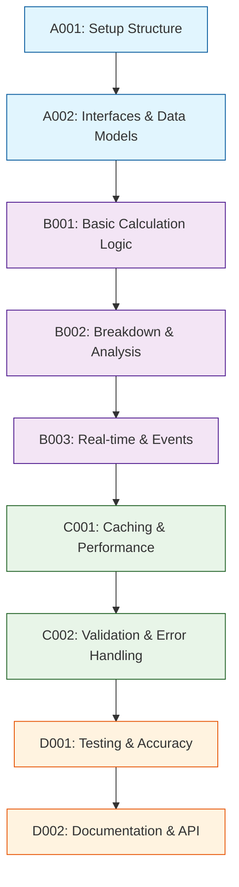

# Development Tasks

## 1. Task Overview
- **Component:** Cost-Calculator
- **Technical Spec:** [Link to technical-spec.md](technical-spec.md)
- **Total Estimated Effort:** 28 story points
- **Implementation Order:** 4 task groups in sequence

## 2. Task Categories

### Category A: Foundation & Setup
Core infrastructure and basic structure

### Category B: Core Implementation  
Primary business logic and functionality

### Category C: Integration & Testing
External connections and validation

### Category D: Polish & Documentation
Final touches and documentation

## 3. Detailed Task Breakdown

### 📋 Foundation & Setup

**TASK-A001: Set up Cost-Calculator component structure and dependencies**
- **Summary:** Cost-Calculator - Setup Structure & Dependencies
- **Issue Type:** Story
- **Epic Link:** Cost-Calculator Epic
- **Story Points:** 2
- **Priority:** High
- **Labels:** setup, foundation, cost-calculator
- **Components:** Cost-Calculator
- **Description:** 
  Create basic project structure, install dependencies, set up development environment for Cost-Calculator component.
  
  **Technical Requirements:**
  - Set up folder structure per technical spec
  - Install and configure decimal precision library (Decimal.js)
  - Configure TypeScript for calculation types and interfaces
  - Set up testing framework for mathematical operations
  
- **Acceptance Criteria:**
  - Component folder structure matches technical specification
  - Decimal precision library is properly configured
  - TypeScript configuration works for calculation types
  - Basic calculator class instantiates without errors
- **Dependencies:** None
- **Jira Sub-tasks:**
  - Create folder structure
  - Install Decimal.js library
  - Configure TypeScript settings
  - Set up testing framework

**TASK-A002: Implement core calculation interfaces and data models**
- **Summary:** Cost-Calculator - Core Interfaces & Data Models
- **Issue Type:** Story
- **Epic Link:** Cost-Calculator Epic
- **Story Points:** 3
- **Priority:** High
- **Labels:** interfaces, data-models, cost-calculator
- **Components:** Cost-Calculator
- **Description:**
  Create calculation interfaces and data models as defined in technical specification.
  
  **Technical Requirements:**
  - Implement calculation interfaces from technical spec section 3.1
  - Add TypeScript interfaces for CalculationResult, TeamMemberCost, etc.
  - Set up precision configuration and calculation metadata
  - Create error handling structures for calculation failures
  
- **Acceptance Criteria:**
  - All calculation interfaces implemented with correct types
  - Data models support precise decimal calculations
  - Precision configuration enables accurate monetary calculations
  - Error handling structures support detailed error reporting
- **Dependencies:** TASK-A001
- **Jira Sub-tasks:**
  - Define calculation interfaces
  - Implement data models with decimal precision
  - Create precision configuration
  - Set up error handling structures

### 🔧 Core Implementation

**TASK-B001: Implement basic cost calculation logic**
- **Summary:** Cost-Calculator - Basic Cost Calculation Logic
- **Issue Type:** Story
- **Epic Link:** Cost-Calculator Epic
- **Story Points:** 5
- **Priority:** High
- **Labels:** calculation, core-logic, cost-calculator
- **Components:** Cost-Calculator
- **Description:**
  Build core cost calculation functionality for team members and configurations.
  
  **Technical Requirements:**
  - Implement rate × hours calculation with decimal precision
  - Add team member cost calculation and validation
  - Create total cost summation with proper rounding
  - Handle calculation edge cases and error conditions
  
- **Acceptance Criteria:**
  - Rate × hours calculations are precise to 2 decimal places
  - Team member costs are calculated correctly with validation
  - Total cost summation handles large numbers accurately
  - Edge cases (zero hours, invalid rates) are handled gracefully
  - Calculation results include proper metadata
- **Dependencies:** TASK-A002
- **Jira Sub-tasks:**
  - Implement rate × hours calculation
  - Add team member cost calculation
  - Create total cost summation
  - Handle edge cases and validation
  - Write calculation accuracy tests

**TASK-B002: Implement calculation breakdown and analysis**
- **Summary:** Cost-Calculator - Calculation Breakdown & Analysis
- **Issue Type:** Story
- **Epic Link:** Cost-Calculator Epic
- **Story Points:** 6
- **Priority:** High
- **Labels:** breakdown, analysis, cost-calculator
- **Components:** Cost-Calculator
- **Description:**
  Build detailed calculation breakdown and analysis features for comprehensive reporting.
  
  **Technical Requirements:**
  - Implement role-based cost breakdown analysis
  - Add percentage calculations for cost distribution
  - Create hourly distribution and cost metrics
  - Generate summary statistics and averages
  
- **Acceptance Criteria:**
  - Role-based breakdowns show detailed cost analysis
  - Percentage calculations sum to 100% correctly
  - Hourly distributions provide accurate time metrics
  - Summary statistics (averages, totals) are mathematically correct
  - Breakdown data supports visualization requirements
- **Dependencies:** TASK-B001
- **Jira Sub-tasks:**
  - Implement role-based breakdown
  - Add percentage calculations
  - Create hourly distribution metrics
  - Generate summary statistics
  - Write breakdown accuracy tests

**TASK-B003: Implement real-time calculation and event handling**
- **Summary:** Cost-Calculator - Real-time Calculation & Events
- **Issue Type:** Story
- **Epic Link:** Cost-Calculator Epic
- **Story Points:** 5
- **Priority:** High
- **Labels:** real-time, events, cost-calculator
- **Components:** Cost-Calculator
- **Description:**
  Build real-time calculation capabilities and event-driven architecture.
  
  **Technical Requirements:**
  - Implement real-time calculation triggers
  - Add calculation event handling and notifications
  - Create calculation queue management for batch operations
  - Handle concurrent calculation requests efficiently
  
- **Acceptance Criteria:**
  - Real-time calculations trigger on configuration changes
  - Event notifications work for calculation completion
  - Calculation queue handles multiple requests efficiently
  - Concurrent calculations don't interfere with each other
  - Performance meets 500ms requirement for 50 team members
- **Dependencies:** TASK-B002
- **Jira Sub-tasks:**
  - Implement real-time triggers
  - Add event handling system
  - Create calculation queue
  - Handle concurrent requests
  - Write performance tests

### 🔗 Integration & Testing

**TASK-C001: Implement caching and performance optimization**
- **Summary:** Cost-Calculator - Caching & Performance Optimization
- **Issue Type:** Story
- **Epic Link:** Cost-Calculator Epic
- **Story Points:** 6
- **Priority:** Medium
- **Labels:** caching, performance, cost-calculator
- **Components:** Cost-Calculator
- **Description:**
  Implement comprehensive caching strategies and performance optimizations.
  
  **Technical Requirements:**
  - Add intelligent calculation result caching
  - Implement cache invalidation on input changes
  - Create LRU cache eviction for memory management
  - Add performance monitoring and metrics collection
  
- **Acceptance Criteria:**
  - Calculation results are cached and reused efficiently
  - Cache invalidation works correctly on data changes
  - Memory usage remains stable with LRU eviction
  - Performance metrics track calculation times and cache efficiency
  - Cache hit rates improve performance significantly
- **Dependencies:** TASK-B003
- **Jira Sub-tasks:**
  - Implement result caching
  - Add cache invalidation logic
  - Create LRU eviction mechanism
  - Add performance monitoring
  - Write cache efficiency tests

**TASK-C002: Add validation integration and error handling**
- **Summary:** Cost-Calculator - Validation Integration & Error Handling
- **Issue Type:** Story
- **Epic Link:** Cost-Calculator Epic
- **Story Points:** 4
- **Priority:** Medium
- **Labels:** validation, error-handling, cost-calculator
- **Components:** Cost-Calculator
- **Description:**
  Build integration with Validation-Engine and comprehensive error handling.
  
  **Technical Requirements:**
  - Integrate with Validation-Engine for input validation
  - Add calculation error detection and recovery
  - Create detailed error reporting with context
  - Handle validation failures gracefully
  
- **Acceptance Criteria:**
  - Validation-Engine integration validates all calculation inputs
  - Calculation errors are detected and reported clearly
  - Error recovery maintains system stability
  - Validation failures provide actionable feedback
  - Error handling doesn't impact performance
- **Dependencies:** TASK-C001
- **Jira Sub-tasks:**
  - Integrate Validation-Engine
  - Add error detection logic
  - Create error reporting system
  - Implement error recovery
  - Write error handling tests

### ✨ Polish & Documentation

**TASK-D001: Comprehensive testing and accuracy verification**
- **Summary:** Cost-Calculator - Testing & Accuracy Verification
- **Issue Type:** Story
- **Epic Link:** Cost-Calculator Epic
- **Story Points:** 5
- **Priority:** High
- **Labels:** testing, accuracy, cost-calculator
- **Components:** Cost-Calculator
- **Description:**
  Build comprehensive testing suite with focus on calculation accuracy and edge cases.
  
  **Technical Requirements:**
  - Achieve 100% test coverage for calculation logic
  - Test mathematical accuracy with known calculation sets
  - Performance testing for large team configurations
  - Edge case testing for boundary conditions
  
- **Acceptance Criteria:**
  - Test coverage reaches 100% for calculation logic
  - Mathematical accuracy is verified with test vectors
  - Performance tests validate 500ms target for 50 members
  - Edge cases (zero values, maximum numbers) are handled
  - Floating-point precision issues are prevented
- **Dependencies:** TASK-A002, TASK-B001, TASK-B002, TASK-B003, TASK-C001, TASK-C002
- **Jira Sub-tasks:**
  - Write unit tests for all calculation functions
  - Create mathematical accuracy tests
  - Add performance tests for large configurations
  - Test edge cases and boundary conditions
  - Verify precision and rounding accuracy

**TASK-D002: Documentation and API finalization**
- **Summary:** Cost-Calculator - Documentation & API Finalization
- **Issue Type:** Story
- **Epic Link:** Cost-Calculator Epic
- **Story Points:** 2
- **Priority:** Medium
- **Labels:** documentation, api, cost-calculator
- **Components:** Cost-Calculator
- **Description:**
  Create comprehensive documentation and finalize API for production use.
  
  **Technical Requirements:**
  - Document all calculation methods and formulas
  - Create usage examples with real-world scenarios
  - Finalize TypeScript type definitions
  - Document performance characteristics and limitations
  
- **Acceptance Criteria:**
  - API documentation covers all calculation methods
  - Mathematical formulas are clearly documented
  - Usage examples demonstrate common scenarios
  - Performance characteristics are documented
  - Component is ready for integration with all dependent components
- **Dependencies:** TASK-D001
- **Jira Sub-tasks:**
  - Write API documentation
  - Document calculation formulas
  - Create usage examples
  - Document performance characteristics
  - Conduct final API review

## 4. Task Dependencies & Sequencing

## 5. Parallel Development Opportunities

### What Can Be Built Simultaneously:
- **After A002:** B001 can start immediately
- **After B001:** B002 can begin while B001 testing continues
- **After B003:** C001 and C002 can be developed in parallel

### Critical Path:
A001 → A002 → B001 → B002 → B003 → C001 → D001 → D002

## 6. Risk Mitigation Tasks

### Technical Risks:
- **Calculation Accuracy:** Addressed through decimal precision library in A001 and accuracy verification in D001
- **Performance Issues:** Dedicated optimization in C001 with caching and monitoring
- **Floating-point Errors:** Prevented through Decimal.js library and comprehensive testing

## 7. Definition of Done

### Task Completion Criteria:
- ✅ All acceptance criteria met
- ✅ Unit tests written and passing
- ✅ Code review completed
- ✅ Integration tests passing (where applicable)
- ✅ Documentation updated

### Component Completion Criteria:
- ✅ All tasks completed per definition of done
- ✅ Technical specification requirements met
- ✅ Performance targets achieved (500ms for 50 team members)
- ✅ 100% test coverage for calculation logic
- ✅ Mathematical accuracy verified
- ✅ Ready for integration with all dependent components

## 8. Estimation Summary

| Category | Task Count | Total Effort | Duration (days) |
|----------|-----------|--------------|-----------------|
| Foundation & Setup | 2 | 5 points | 2-3 days |
| Core Implementation | 3 | 16 points | 7-8 days |
| Integration & Testing | 2 | 10 points | 4-5 days |
| Polish & Documentation | 2 | 7 points | 3-4 days |
| **TOTAL** | **9** | **38 points** | **16-20 days** |

## 9. Traceability Matrix

| Task ID | Technical Spec Section | Functional Requirements | Business Value |
|---------|------------------------|-------------------------|----------------|
| A001 | Section 5.1 | Setup/Infrastructure | Development efficiency |
| A002 | Section 4.1 | FR-030, FR-036 | Calculation framework |
| B001 | Section 3.1, 4.2 | FR-030, FR-031 | Core calculation capability |
| B002 | Section 3.1, 4.3 | FR-032, FR-034 | Detailed cost analysis |
| B003 | Section 6.1, 7.1 | FR-031, FR-037 | Real-time performance |
| C001 | Section 7.1, 7.2 | FR-037 | Performance optimization |
| C002 | Section 3.3, 6.1 | FR-035 | Calculation validation |
| D001 | Section 10.1 | Quality assurance | Mathematical accuracy |
| D002 | Section 11.1 | Documentation | Developer experience |

## 10. Implementation Notes

### Development Best Practices:
- Follow test-driven development (TDD) approach
- Use decimal precision library for all monetary calculations
- Implement comprehensive error handling for edge cases
- Regular performance testing with large datasets

### Quality Gates:
- Automated testing pipeline must pass
- Code coverage minimum 100% for calculation logic
- Mathematical accuracy verified with test vectors
- Performance benchmarks must meet 500ms target

### Communication Plan:
- Daily standup updates on task progress
- Demo calculation functionality after each category
- Mathematical accuracy reviews with stakeholders
- Escalate blockers immediately to technical lead