# Cost-Calculator Technical Specification

## 1. Component Overview
- **Purpose:** Real-time calculation of total project costs based on team configurations with rate × hours calculations and summations
- **Scope:** Handles cost calculations, totals aggregation, performance optimization, and calculation result caching
- **Dependencies:** State-Manager (for configuration data), Validation-Engine (for calculation validation)
- **Dependents:** Basic-UI (displays calculated results), Team-Configuration-Builder (triggers calculations)

## 2. Functional Requirements
List of functional requirements this component must fulfill:
- **FR-030:** System must calculate total cost as sum of (hourly rate × hours allocated) for all team members
- **FR-031:** System must provide real-time calculation updates as configurations change
- **FR-032:** System must calculate individual team member costs and totals
- **FR-033:** System must handle multiple configurations simultaneously
- **FR-034:** System must provide calculation breakdowns and summaries
- **FR-035:** System must validate calculation inputs and handle edge cases
- **FR-036:** System must maintain calculation accuracy to 2 decimal places
- **FR-037:** System must complete calculations within 500ms for configurations up to 50 roles

## 3. Component Interface

### 3.1 Public API
Define the external interface this component exposes:

```typescript
interface CostCalculatorAPI {
  // Primary calculation methods
  calculateConfiguration(configId: string): Promise<CalculationResult>;
  calculateTeamMember(member: TeamMember): CalculationResult;
  calculateTotal(members: TeamMember[]): TotalCalculation;
  
  // Real-time calculation management
  enableRealTimeCalculation(configId: string): void;
  disableRealTimeCalculation(configId: string): void;
  recalculateAll(): Promise<Map<string, CalculationResult>>;
  
  // Calculation result access
  getCalculationResult(configId: string): CalculationResult | null;
  getAllCalculationResults(): Map<string, CalculationResult>;
  getCalculationHistory(configId: string): CalculationHistory[];
  
  // Performance and caching
  clearCalculationCache(configId?: string): void;
  getCalculationStatistics(): CalculationStatistics;
  validateCalculationInputs(config: TeamConfiguration): ValidationResult;
  
  // Event handling
  onCalculationComplete(callback: CalculationCompleteCallback): void;
  onCalculationError(callback: CalculationErrorCallback): void;
  
  // Utility methods
  formatCurrency(amount: number, currency?: string): string;
  compareCosts(configId1: string, configId2: string): CostComparison;
  exportCalculationResults(configId: string): CalculationExport;
}

interface CalculationResult {
  configurationId: string;
  timestamp: Date;
  isValid: boolean;
  teamMemberCosts: TeamMemberCost[];
  subtotal: number;
  total: number;
  breakdown: CostBreakdown;
  metadata: CalculationMetadata;
  errors: CalculationError[];
}

interface TeamMemberCost {
  memberId: string;
  roleId: string;
  roleName: string;
  hourlyRate: number;
  hoursAllocated: number;
  totalCost: number;
  costPercentage: number; // Percentage of total configuration cost
}

interface CostBreakdown {
  totalHours: number;
  averageHourlyRate: number;
  roleBreakdown: RoleCostBreakdown[];
  hourlyDistribution: HourlyDistribution[];
  costDistribution: CostDistribution[];
}

interface RoleCostBreakdown {
  roleId: string;
  roleName: string;
  memberCount: number;
  totalHours: number;
  totalCost: number;
  averageRate: number;
  percentage: number;
}

interface CalculationMetadata {
  calculationTime: number; // Milliseconds
  cacheHit: boolean;
  inputHash: string; // For cache invalidation
  version: string; // Calculator version
  precision: number; // Decimal places
}

interface CalculationStatistics {
  totalCalculations: number;
  averageCalculationTime: number;
  cacheHitRate: number;
  errorRate: number;
  lastCalculationTime: Date;
  performanceMetrics: PerformanceMetrics;
}
```

### 3.2 Input/Output Contracts
- **Inputs:** 
  - Team configurations with role assignments and hours
  - Individual team member data for specific calculations
  - Configuration IDs for batch calculations
- **Outputs:** 
  - Detailed calculation results with breakdowns
  - Real-time cost updates as configurations change
  - Performance metrics and calculation statistics
- **Data Formats:** 
  - All monetary values as precise decimal numbers
  - Timestamps as Date objects for consistency
  - Calculation results as structured objects with metadata

### 3.3 Error Handling
- **Error Types:** 
  - Invalid configuration data errors
  - Mathematical calculation errors (overflow, precision issues)
  - Performance timeout errors
  - Cache corruption errors
- **Error Responses:** 
  - Structured error objects with specific error codes
  - Graceful degradation for non-critical calculation features
  - Fallback calculations when cache fails
- **Recovery Strategies:** 
  - Automatic retry for transient calculation errors
  - Cache rebuild when corruption detected
  - Default values for missing or invalid inputs

## 4. Data Model

### 4.1 Data Storage
- **Storage Type:** In-memory calculation cache with temporary result storage
- **Data Schema:** Cached calculation results and performance metrics

```typescript
// Internal calculation state
interface CalculationState {
  resultCache: Map<string, CalculationResult>;
  realtimeConfigs: Set<string>;
  calculationQueue: CalculationTask[];
  statistics: CalculationStatistics;
  performanceMetrics: PerformanceMetrics;
}

interface CalculationTask {
  configId: string;
  priority: 'high' | 'normal' | 'low';
  timestamp: Date;
  retryCount: number;
  maxRetries: number;
}

// Cache management
interface CacheEntry {
  result: CalculationResult;
  inputHash: string;
  lastAccessed: Date;
  accessCount: number;
  ttl: number; // Time to live in milliseconds
}

// Performance tracking
interface PerformanceMetrics {
  calculationTimes: number[];
  memoryUsage: number[];
  cacheSize: number;
  queueLength: number;
  errorCounts: Map<string, number>;
}

// Calculation precision settings
interface PrecisionConfig {
  monetaryPrecision: number; // Decimal places for money
  percentagePrecision: number; // Decimal places for percentages
  hoursPrecision: number; // Decimal places for hours
  roundingMode: 'round' | 'floor' | 'ceil';
}
```

### 4.2 Data Flow

```mermaid
flowchart TD
    A[Configuration Change Event] --> B[Cost Calculator Trigger]
    B --> B1{Real-time Enabled?}
    B1 -->|No| B2[Queue for Batch Processing]
    B1 -->|Yes| C[Immediate Calculation]
    
    C --> C1[Validate Input Configuration]
    C1 --> C2{Input Valid?}
    C2 -->|No| C3[Return Validation Error]
    C2 -->|Yes| C4[Generate Input Hash]
    
    C4 --> D[Check Calculation Cache]
    D --> D1{Cache Hit?}
    D1 -->|Yes| D2[Validate Cache Entry]
    D2 --> D3{Cache Valid?}
    D3 -->|Yes| D4[Return Cached Result]
    D3 -->|No| E[Invalidate Cache Entry]
    D1 -->|No| E
    
    E --> F[Start Calculation Timer]
    F --> F1[Initialize Calculation Context]
    F1 --> F2[Process Team Members]
    
    F2 --> G[For Each Team Member]
    G --> G1[Validate Member Data]
    G1 --> G2{Member Valid?}
    G2 -->|No| G3[Log Warning, Skip Member]
    G2 -->|Yes| G4[Calculate Member Cost]
    
    G4 --> G5[Rate × Hours Calculation]
    G5 --> G6[Apply Precision Rounding]
    G6 --> G7[Validate Result Range]
    G7 --> G8{Result Valid?}
    G8 -->|No| G9[Apply Error Handling]
    G8 -->|Yes| G10[Add to Results]
    
    G10 --> H{More Members?}
    H -->|Yes| G
    H -->|No| I[Calculate Totals]
    
    I --> I1[Sum Individual Costs]
    I1 --> I2[Calculate Percentages]
    I2 --> I3[Generate Breakdown]
    I3 --> I4[Calculate Statistics]
    I4 --> I5[Apply Final Precision]
    
    I5 --> J[Create Calculation Result]
    J --> J1[Stop Timer, Record Metrics]
    J1 --> J2[Update Cache]
    J2 --> J3[Update Statistics]
    J3 --> K[Notify Calculation Complete]
    
    %% Error handling flows
    C3 --> L[Log Calculation Error]
    G3 --> L
    G9 --> L
    L --> M[Create Error Result]
    M --> K
    
    %% Cache management
    J2 --> N{Cache Size Limit?}
    N -->|Yes| N1[Evict Oldest Entries]
    N -->|No| O[Continue]
    N1 --> O
    
    %% Batch processing
    B2 --> P[Add to Calculation Queue]
    P --> P1[Process Queue]
    P1 --> P2[Priority Sorting]
    P2 --> C
    
    %% Performance monitoring
    J1 --> Q[Update Performance Metrics]
    Q --> Q1[Check Performance Thresholds]
    Q1 --> Q2{Performance OK?}
    Q2 -->|No| Q3[Trigger Performance Alert]
    Q2 -->|Yes| K
    Q3 --> K
    
    classDef input fill:#E3F2FD,stroke:#1976D2;
    classDef process fill:#F3E5F5,stroke:#7B1FA2;
    classDef decision fill:#FFF3E0,stroke:#F57C00;
    classDef error fill:#FFEBEE,stroke:#C62828;
    classDef success fill:#E8F5E8,stroke:#388E3C;
    classDef cache fill:#F0F4C3,stroke:#827717;
    classDef performance fill:#E1F5FE,stroke:#0277BD;
    
    class A input;
    class B,C,C1,C4,E,F,F1,F2,G,G1,G4,G5,G6,G7,G10,I,I1,I2,I3,I4,I5,J,J1,J2,J3,N1,P,P1,P2,Q,Q1 process;
    class B1,C2,D1,D3,G2,G8,H,N,Q2 decision;
    class C3,G3,G9,L,M error;
    class D4,K,O success;
    class D,D2,E,J2 cache;
    class F,J1,Q,Q1,Q3 performance;
```


### 4.3 Data Validation
- **Input Validation:** 
  - Hours must be positive numbers within reasonable ranges
  - Hourly rates must be positive and within economic bounds
  - Team configurations must have valid structure
- **Business Rules:** 
  - Total costs should not exceed reasonable project limits
  - Individual role costs should be economically sensible
  - Calculation precision should maintain accuracy
- **Data Integrity:** 
  - Calculation results must be mathematically consistent
  - Cache entries must match current input data
  - Performance metrics must be accurate and reliable

## 5. Technology Stack

### 5.1 Core Technologies
- **Programming Language:** JavaScript/TypeScript (ES2020+)
- **Framework:** Vanilla JavaScript with mathematical precision libraries
- **Database:** None (in-memory caching only)
- **Additional Libraries:** 
  - Decimal.js or similar for precise decimal arithmetic
  - Performance timing APIs (performance.now())

### 5.2 Technology Rationale
- **Why These Choices:** 
  - Decimal precision library prevents floating-point calculation errors
  - Native JavaScript provides fastest calculation performance
  - In-memory caching ensures real-time calculation response
  - TypeScript ensures type safety for numerical calculations
- **Alternatives Considered:** 
  - BigNumber.js (more features but larger bundle size)
  - WebAssembly (complexity not justified for MVP scope)
  - Server-side calculation (conflicts with offline-first approach)
- **Trade-offs:** 
  - Benefits: Fast, accurate, offline-capable, type-safe
  - Limitations: Client-side computation limits, memory constraints for large datasets

## 6. Integration Design

### 6.1 Dependency Integration
- **State-Manager Integration:** 
  - Subscribe to configuration changes for real-time calculations
  - Access team configuration data for calculations
  - Store calculation results in application state
- **Validation-Engine Integration:** 
  - Validate calculation inputs before processing
  - Ensure data quality for accurate calculations
  - Provide validation feedback for calculation errors

### 6.2 Service Integration
- **Performance Monitoring:** Integration with application performance tracking
- **Error Logging:** Structured logging for calculation errors and performance issues
- **Cache Management:** Intelligent cache eviction and optimization

## 7. Performance Considerations

### 7.1 Performance Requirements
- **Response Time:** Calculations must complete within 500ms for up to 50 team members
- **Throughput:** Support real-time calculations for multiple configurations simultaneously
- **Scalability:** Memory usage scales linearly with configuration size and count

### 7.2 Performance Strategies
- **Caching:** 
  - Intelligent cache invalidation based on input changes
  - LRU cache eviction for memory management
  - Pre-calculated common scenarios
- **Optimization:** 
  - Batch calculations for efficiency
  - Lazy calculation of detailed breakdowns
  - Parallel processing for independent calculations
- **Memory Management:** 
  - Limit cache size to prevent memory exhaustion
  - Cleanup old calculation results automatically
  - Monitor memory usage and alert on thresholds

## 8. Security Design

### 8.1 Security Requirements
- **Data Protection:** Ensure calculation data remains secure in browser
- **Input Security:** Prevent malicious inputs from affecting calculations
- **Precision Security:** Maintain calculation accuracy against manipulation

### 8.2 Security Implementation
- **Input Sanitization:** 
  - Validate all numeric inputs for reasonable ranges
  - Prevent calculation manipulation through input validation
  - Limit calculation complexity to prevent DoS
- **Calculation Security:** 
  - Use secure random number generation for cache keys
  - Prevent precision attacks through controlled rounding
  - Validate calculation results for reasonableness

## 9. Monitoring & Observability

### 9.1 Logging
- **Log Levels:** 
  - ERROR: Calculation failures, precision errors
  - WARN: Performance issues, cache problems
  - INFO: Calculation operations, cache statistics
  - DEBUG: Detailed calculation steps, performance metrics
- **Log Format:** Structured JSON with calculation context
- **Sensitive Data:** Never log actual monetary values or rates

### 9.2 Metrics
- **Performance Metrics:** 
  - Calculation response times by configuration size
  - Cache hit/miss ratios
  - Memory usage during calculations
- **Business Metrics:** 
  - Average project costs calculated per session
  - Most common team configuration sizes
  - Calculation accuracy and precision statistics
- **Alerting:** 
  - Calculation response times exceeding thresholds
  - High error rates indicating system issues
  - Memory usage approaching limits

## 10. Testing Strategy

### 10.1 Unit Testing
- **Test Coverage:** Target 100% code coverage for calculation logic
- **Key Test Cases:** 
  - Basic cost calculations (rate × hours)
  - Edge cases (zero hours, maximum values)
  - Precision and rounding accuracy
  - Cache invalidation and management
  - Error handling and recovery scenarios
- **Mock Dependencies:** Mock State-Manager and Validation-Engine for isolated testing

### 10.2 Integration Testing
- **Integration Points:** Test with real State-Manager and team configurations
- **Test Data:** 
  - Various team sizes and rate combinations
  - Edge cases (single member, maximum team size)
  - Performance test data (large configurations)
- **Environment Requirements:** Browser environment with sufficient memory and precision

## 11. Deployment Considerations

### 11.1 Environment Requirements
- **Infrastructure:** Client-side only (no server requirements)
- **Browser Support:** Modern browsers with precise number handling
- **Configuration:** Calculation precision and cache settings configurable

### 11.2 Deployment Strategy
- **Build Process:** 
  - TypeScript compilation with numerical type checking
  - Bundle with decimal precision library
  - Performance optimization for calculation loops
- **Deployment Steps:** Include compiled calculator in application bundle
- **Rollback Plan:** Version control allows rollback to previous calculation logic

## 12. Risk Mitigation
Address specific risks identified in the risk assessment:
- **Calculation Accuracy:** Use decimal precision libraries to prevent floating-point errors
- **Performance Issues:** Caching and optimization ensure fast real-time calculations
- **Memory Usage:** Cache management and limits prevent memory exhaustion
- **Data Consistency:** Validation ensures calculation inputs and results are consistent

## 13. Future Considerations
- **Extensibility:** 
  - Plugin architecture for custom calculation rules
  - Support for complex cost models (overhead, taxes, etc.)
  - Integration with external pricing and rate services
- **Migration Path:** 
  - WebAssembly implementation for complex calculations
  - Server-side calculation support for enterprise features
  - Machine learning for cost estimation and optimization
- **Deprecation Strategy:** 
  - Maintain API compatibility for dependent components
  - Clear migration path for calculation engine upgrades
  - Backward compatibility for saved calculation results