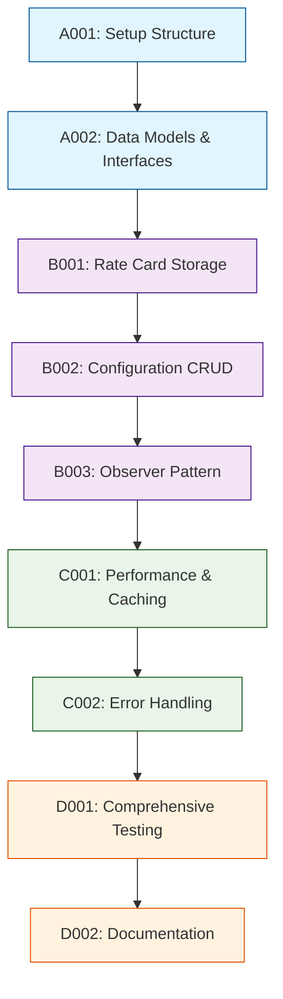

# Development Tasks

## 1. Task Overview
- **Component:** State-Manager
- **Technical Spec:** [Link to technical-spec.md](technical-spec.md)
- **Total Estimated Effort:** 26 story points
- **Implementation Order:** 4 task groups in sequence

## 2. Task Categories

### Category A: Foundation & Setup
Core infrastructure and basic structure

### Category B: Core Implementation  
Primary business logic and functionality

### Category C: Integration & Testing
External connections and validation

### Category D: Polish & Documentation
Final touches and documentation

## 3. Detailed Task Breakdown

### 📋 Foundation & Setup

**TASK-A001: Set up State-Manager component structure and dependencies**
- **Summary:** State-Manager - Setup Structure & Dependencies
- **Issue Type:** Story
- **Epic Link:** State-Manager Epic
- **Story Points:** 2
- **Priority:** High
- **Labels:** setup, foundation, state-manager
- **Components:** State-Manager
- **Description:** 
  Create basic project structure, install dependencies, set up development environment for State-Manager component.
  
  **Technical Requirements:**
  - Set up folder structure per technical spec
  - Configure TypeScript for state management types
  - Set up testing framework with mock dependencies
  - Configure observer pattern implementation
  
- **Acceptance Criteria:**
  - Component folder structure matches technical specification
  - TypeScript configuration works for state management types
  - Basic state manager class instantiates without errors
  - Development environment configured and documented
- **Dependencies:** None
- **Jira Sub-tasks:**
  - Create folder structure
  - Configure TypeScript settings
  - Set up testing framework
  - Document setup process

**TASK-A002: Implement core data models and state interfaces**
- **Summary:** State-Manager - Core Data Models & Interfaces
- **Issue Type:** Story
- **Epic Link:** State-Manager Epic
- **Story Points:** 3
- **Priority:** High
- **Labels:** data-model, foundation, state-manager
- **Components:** State-Manager
- **Description:**
  Create data structures and TypeScript interfaces as defined in technical specification for State-Manager.
  
  **Technical Requirements:**
  - Implement data models from technical spec section 4.1
  - Add TypeScript interfaces for ApplicationState, TeamConfiguration, etc.
  - Set up observer pattern interfaces for state subscriptions
  - Create internal state management structures
  
- **Acceptance Criteria:**
  - All data models implemented with correct fields and types
  - TypeScript interfaces provide compile-time type safety
  - Observer pattern interfaces defined for state changes
  - Internal state structures support efficient operations
- **Dependencies:** TASK-A001
- **Jira Sub-tasks:**
  - Define TypeScript interfaces
  - Implement data model classes
  - Create observer pattern interfaces
  - Write unit tests for models

### 🔧 Core Implementation

**TASK-B001: Implement rate card storage and management**
- **Summary:** State-Manager - Rate Card Storage & Management
- **Issue Type:** Story
- **Epic Link:** State-Manager Epic
- **Story Points:** 4
- **Priority:** High
- **Labels:** rate-card, storage, state-manager
- **Components:** State-Manager
- **Description:**
  Build rate card storage and management functionality for CSV-parsed data.
  
  **Technical Requirements:**
  - Implement rate card storage with metadata tracking
  - Add rate card validation and integrity checks
  - Create efficient lookup mechanisms for role data
  - Handle rate card replacement and clearing
  
- **Acceptance Criteria:**
  - Rate cards can be stored with complete metadata
  - Validation ensures data integrity before storage
  - Role lookups are efficient (O(1) for role ID access)
  - Rate card operations (set, get, clear) work correctly
  - State change notifications work for rate card updates
- **Dependencies:** TASK-A002
- **Jira Sub-tasks:**
  - Implement rate card storage logic
  - Add validation and integrity checks
  - Create efficient lookup mechanisms
  - Implement state change notifications
  - Write integration tests

**TASK-B002: Implement configuration management and CRUD operations**
- **Summary:** State-Manager - Configuration Management & CRUD
- **Issue Type:** Story
- **Epic Link:** State-Manager Epic
- **Story Points:** 6
- **Priority:** High
- **Labels:** configuration, crud, state-manager
- **Components:** State-Manager
- **Description:**
  Build comprehensive configuration management with create, read, update, delete operations.
  
  **Technical Requirements:**
  - Implement configuration CRUD operations
  - Add active configuration management
  - Create unique ID generation for configurations
  - Handle configuration validation and referential integrity
  
- **Acceptance Criteria:**
  - Configurations can be created, read, updated, and deleted
  - Active configuration management works correctly
  - Unique IDs are generated for each configuration
  - Referential integrity maintained between configs and rate cards
  - State notifications trigger on configuration changes
- **Dependencies:** TASK-B001
- **Jira Sub-tasks:**
  - Implement CRUD operations
  - Add active configuration management
  - Create ID generation logic
  - Implement referential integrity checks
  - Write comprehensive CRUD tests

**TASK-B003: Implement state subscription and observer pattern**
- **Summary:** State-Manager - State Subscription & Observer Pattern
- **Issue Type:** Story
- **Epic Link:** State-Manager Epic
- **Story Points:** 5
- **Priority:** High
- **Labels:** observer, subscription, state-manager
- **Components:** State-Manager
- **Description:**
  Build observer pattern implementation for reactive state updates and component notifications.
  
  **Technical Requirements:**
  - Implement observer pattern for state changes
  - Add subscription management with cleanup
  - Create efficient notification batching
  - Handle subscriber error isolation
  
- **Acceptance Criteria:**
  - Components can subscribe to state changes
  - Unsubscribe functionality prevents memory leaks
  - State notifications are batched for performance
  - Subscriber errors don't affect other subscribers
  - Performance is maintained with multiple subscribers
- **Dependencies:** TASK-B002
- **Jira Sub-tasks:**
  - Implement observer pattern
  - Add subscription management
  - Create notification batching
  - Implement error isolation
  - Write performance tests

### 🔗 Integration & Testing

**TASK-C001: Implement performance optimization and caching**
- **Summary:** State-Manager - Performance Optimization & Caching
- **Issue Type:** Story
- **Epic Link:** State-Manager Epic
- **Story Points:** 4
- **Priority:** Medium
- **Labels:** performance, caching, state-manager
- **Components:** State-Manager
- **Description:**
  Implement performance optimizations and caching strategies to meet response time requirements.
  
  **Technical Requirements:**
  - Add calculation result caching
  - Implement derived data caching
  - Create intelligent cache invalidation
  - Optimize lookup operations and memory usage
  
- **Acceptance Criteria:**
  - State updates complete within 50ms consistently
  - Calculation results are cached and reused efficiently
  - Cache invalidation works correctly on data changes
  - Memory usage scales linearly with data size
  - Performance monitoring tracks operation times
- **Dependencies:** TASK-B003
- **Jira Sub-tasks:**
  - Implement calculation caching
  - Add derived data caching
  - Create cache invalidation logic
  - Optimize lookup operations
  - Write performance tests

**TASK-C002: Add error handling and data validation**
- **Summary:** State-Manager - Error Handling & Data Validation
- **Issue Type:** Story
- **Epic Link:** State-Manager Epic
- **Story Points:** 3
- **Priority:** Medium
- **Labels:** error-handling, validation, state-manager
- **Components:** State-Manager
- **Description:**
  Build comprehensive error handling and data validation for all state operations.
  
  **Technical Requirements:**
  - Implement input validation for all operations
  - Add error handling with graceful degradation
  - Create state corruption detection and recovery
  - Handle edge cases and boundary conditions
  
- **Acceptance Criteria:**
  - All inputs are validated before state modifications
  - Errors are handled gracefully without crashing
  - State corruption is detected and recovered
  - Edge cases are handled with appropriate fallbacks
  - Error messages are clear and actionable
- **Dependencies:** TASK-C001
- **Jira Sub-tasks:**
  - Implement input validation
  - Add error handling logic
  - Create corruption detection
  - Handle edge cases
  - Write error scenario tests

### ✨ Polish & Documentation

**TASK-D001: Comprehensive testing and quality assurance**
- **Summary:** State-Manager - Comprehensive Testing Suite
- **Issue Type:** Story
- **Epic Link:** State-Manager Epic
- **Story Points:** 4
- **Priority:** High
- **Labels:** testing, quality, state-manager
- **Components:** State-Manager
- **Description:**
  Build comprehensive testing suite to ensure quality and reliability of state management functionality.
  
  **Technical Requirements:**
  - Achieve 95% test coverage for state management logic
  - Test all CRUD operations and edge cases
  - Performance testing for large datasets
  - Integration testing with observer pattern
  
- **Acceptance Criteria:**
  - Test coverage meets 95% target for state logic
  - All CRUD operations are thoroughly tested
  - Edge cases and error scenarios are covered
  - Performance tests validate response time requirements
  - Observer pattern integration tests pass
- **Dependencies:** TASK-A002, TASK-B001, TASK-B002, TASK-B003, TASK-C001, TASK-C002
- **Jira Sub-tasks:**
  - Write unit tests for all state operations
  - Create integration tests for observer pattern
  - Add performance tests for large datasets
  - Test edge cases and error scenarios
  - Set up automated test execution

**TASK-D002: Documentation and API finalization**
- **Summary:** State-Manager - Documentation & API Finalization
- **Issue Type:** Story
- **Epic Link:** State-Manager Epic
- **Story Points:** 2
- **Priority:** Medium
- **Labels:** documentation, api, state-manager
- **Components:** State-Manager
- **Description:**
  Create comprehensive documentation and finalize public API for State-Manager component.
  
  **Technical Requirements:**
  - Document all public API methods and interfaces
  - Create usage examples and integration guides
  - Finalize TypeScript type definitions
  - Document state management patterns and best practices
  
- **Acceptance Criteria:**
  - API documentation covers all public methods
  - Usage examples demonstrate common scenarios
  - TypeScript definitions are complete and accurate
  - State management patterns are documented
  - Component is ready for integration with other components
- **Dependencies:** TASK-D001
- **Jira Sub-tasks:**
  - Write API documentation
  - Create usage examples
  - Finalize TypeScript definitions
  - Document patterns and best practices
  - Conduct final API review

## 4. Task Dependencies & Sequencing

## 5. Parallel Development Opportunities

### What Can Be Built Simultaneously:
- **After A002:** B001 can start immediately
- **After B002:** B003 can begin while B002 testing continues
- **After B003:** C001 and C002 can be developed in parallel

### Critical Path:
A001 → A002 → B001 → B002 → B003 → C001 → D001 → D002

## 6. Risk Mitigation Tasks

### Technical Risks:
- **Memory Exhaustion:** Addressed in C001 with caching strategies and limits
- **State Corruption:** Comprehensive validation in C002 and detection mechanisms
- **Performance Issues:** Dedicated optimization in C001 with monitoring

## 7. Definition of Done

### Task Completion Criteria:
- ✅ All acceptance criteria met
- ✅ Unit tests written and passing
- ✅ Code review completed
- ✅ Integration tests passing (where applicable)
- ✅ Documentation updated

### Component Completion Criteria:
- ✅ All tasks completed per definition of done
- ✅ Technical specification requirements met
- ✅ Performance targets achieved (50ms state updates)
- ✅ 95% test coverage achieved
- ✅ Ready for integration with all dependent components

## 8. Estimation Summary

| Category | Task Count | Total Effort | Duration (days) |
|----------|-----------|--------------|-----------------|
| Foundation & Setup | 2 | 5 points | 2-3 days |
| Core Implementation | 3 | 15 points | 7-8 days |
| Integration & Testing | 2 | 7 points | 3-4 days |
| Polish & Documentation | 2 | 6 points | 3-4 days |
| **TOTAL** | **9** | **33 points** | **15-19 days** |

## 9. Traceability Matrix

| Task ID | Technical Spec Section | Functional Requirements | Business Value |
|---------|------------------------|-------------------------|----------------|
| A001 | Section 5.1 | Setup/Infrastructure | Development efficiency |
| A002 | Section 4.1 | FR-008, FR-009 | Data integrity |
| B001 | Section 3.1, 6.1 | FR-008 | Rate card management |
| B002 | Section 3.1, 4.2 | FR-009, FR-010, FR-012 | Configuration management |
| B003 | Section 3.1, 7.2 | FR-011 | Reactive updates |
| C001 | Section 7.1, 7.2 | Performance requirements | User experience |
| C002 | Section 3.3, 8.1 | Data validation | System reliability |
| D001 | Section 10.1 | Quality assurance | System reliability |
| D002 | Section 11.1 | Documentation | Developer experience |

## 10. Implementation Notes

### Development Best Practices:
- Follow test-driven development (TDD) approach
- Use TypeScript strict mode for type safety
- Implement proper memory management for state data
- Regular performance testing with large datasets

### Quality Gates:
- Automated testing pipeline must pass
- Code coverage minimum 95%
- Performance benchmarks must meet 50ms target
- Memory usage monitoring in place

### Communication Plan:
- Daily standup updates on task progress
- Demo state management functionality after each category
- Escalate blockers immediately to technical lead