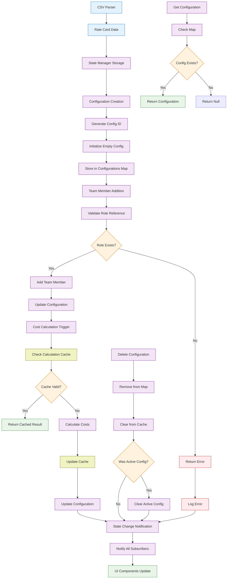

# Technical Specification

## 1. Component Overview
- **Purpose:** In-memory storage and management of rate card data and active team configurations for the application
- **Scope:** Manages parsed CSV data, team configurations, calculation results, and application state
- **Dependencies:** CSV-Parser (receives parsed data)
- **Dependents:** Team-Configuration-Builder, Cost-Calculator, Basic-UI

## 2. Functional Requirements
List of functional requirements this component must fulfill:
- **FR-008:** System must store parsed rate card data in memory for session duration
- **FR-009:** System must manage multiple team configurations simultaneously
- **FR-010:** System must persist configuration state during user interactions
- **FR-011:** System must provide efficient data access for UI components
- **FR-012:** System must handle configuration creation, updates, and deletion
- **FR-013:** System must maintain calculation results and cache for performance
- **FR-014:** System must support configuration comparison operations

## 3. Component Interface

### 3.1 Public API
Define the external interface this component exposes:

```typescript
interface StateManagerAPI {
  // Rate card management
  setRateCard(rateCard: RateCardData): void;
  getRateCard(): RateCardData | null;
  clearRateCard(): void;
  
  // Configuration management
  createConfiguration(name?: string): string; // Returns configuration ID
  getConfiguration(id: string): TeamConfiguration | null;
  updateConfiguration(id: string, updates: Partial<TeamConfiguration>): boolean;
  deleteConfiguration(id: string): boolean;
  getAllConfigurations(): TeamConfiguration[];
  
  // Active configuration management
  setActiveConfiguration(id: string): boolean;
  getActiveConfiguration(): TeamConfiguration | null;
  
  // State subscription for reactive updates
  subscribe(listener: StateChangeListener): () => void; // Returns unsubscribe function
  getState(): ApplicationState;
  
  // Utility methods
  exportConfiguration(id: string): ConfigurationExport;
  importConfiguration(data: ConfigurationExport): string; // Returns new config ID
  clearAllData(): void;
}

interface RateCardData {
  id: string;
  name: string;
  uploadDate: Date;
  roles: RoleRateData[];
  metadata: {
    totalRoles: number;
    averageRate: number;
    rateRange: { min: number; max: number; };
  };
}

interface TeamConfiguration {
  id: string;
  name: string;
  createdDate: Date;
  lastModified: Date;
  rateCardId: string;
  teamMembers: TeamMember[];
  totalCost: number;
  quoteAmount?: number;
  ebitdaMargin?: number;
  discounts: Discount[];
  metadata: ConfigurationMetadata;
}

interface TeamMember {
  id: string;
  roleId: string;        // References role from rate card
  roleName: string;      // Cached for performance
  hourlyRate: number;    // Cached for performance
  hoursAllocated: number;
  totalCost: number;     // Pre-calculated for performance
}

interface ApplicationState {
  rateCard: RateCardData | null;
  configurations: Map<string, TeamConfiguration>;
  activeConfigurationId: string | null;
  uiState: {
    isLoading: boolean;
    lastError: string | null;
    unsavedChanges: boolean;
  };
  performanceMetrics: {
    lastCalculationTime: number;
    totalConfigurations: number;
    sessionStartTime: Date;
  };
}
```

### 3.2 Input/Output Contracts
- **Inputs:** 
  - Parsed rate card data from CSV-Parser
  - Configuration updates from UI components
  - Team member selections and hour allocations
- **Outputs:** 
  - Current application state
  - Individual configuration data
  - State change notifications for subscribers
- **Data Formats:** 
  - All data stored as JavaScript objects
  - Dates as Date objects for consistency
  - Numeric values as primitives (number type)

### 3.3 Error Handling
- **Error Types:** 
  - Configuration not found errors
  - Invalid data update errors
  - Memory limit exceeded errors
  - Rate card reference errors
- **Error Responses:** 
  - Boolean return values for success/failure operations
  - Detailed error objects for complex operations
  - State rollback for failed updates
- **Recovery Strategies:** 
  - Automatic state cleanup for invalid references
  - Graceful degradation when configurations are corrupted
  - Default state restoration if critical errors occur

## 4. Data Model

### 4.1 Data Storage
- **Storage Type:** In-memory JavaScript objects and Maps
- **Data Schema:** Structured objects with referential integrity

```typescript
// Internal state structure
class InternalState {
  private rateCard: RateCardData | null = null;
  private configurations: Map<string, TeamConfiguration> = new Map();
  private activeConfigurationId: string | null = null;
  private subscribers: Set<StateChangeListener> = new Set();
  private uiState: UIState = {
    isLoading: false,
    lastError: null,
    unsavedChanges: false
  };
  
  // Performance optimization caches
  private calculationCache: Map<string, CalculationResult> = new Map();
  private derivedDataCache: Map<string, any> = new Map();
}

// Configuration metadata for analytics
interface ConfigurationMetadata {
  version: number;
  calculationCount: number;
  lastCalculationTime: Date;
  teamSize: number;
  totalHours: number;
  averageHourlyRate: number;
}
```

### 4.2 Data Flow


### 4.3 Data Validation
- **Input Validation:** 
  - Configuration names must be non-empty strings
  - Hours allocated must be positive numbers
  - Rate card references must exist
- **Business Rules:** 
  - Total team hours should not exceed reasonable limits (1000 hours per role)
  - Quote amounts must be positive if provided
  - Configuration names should be unique within session
- **Data Integrity:** 
  - Referential integrity between configurations and rate cards
  - Consistent calculation results
  - Cache invalidation when source data changes

## 5. Technology Stack

### 5.1 Core Technologies
- **Programming Language:** JavaScript/TypeScript (ES2020+)
- **Framework:** Vanilla JavaScript with Observer pattern
- **Database:** None (in-memory only)
- **Additional Libraries:** 
  - UUID generation library (crypto.randomUUID() or fallback)
  - Optional: Immutable.js for state immutability (Phase 2 consideration)

### 5.2 Technology Rationale
- **Why These Choices:** 
  - In-memory storage provides fastest access for real-time calculations
  - JavaScript Maps provide O(1) lookups for configurations
  - Observer pattern enables reactive UI updates
  - No persistence simplifies security and privacy
- **Alternatives Considered:** 
  - LocalStorage (limited size, synchronous API issues)
  - IndexedDB (complex API for simple needs)
  - Redux/MobX (over-engineering for MVP scope)
- **Trade-offs:** 
  - Benefits: Fast, simple, no external dependencies, works offline
  - Limitations: Data lost on page refresh, memory constraints for large datasets

## 6. Integration Design

### 6.1 Dependency Integration
- **CSV-Parser Integration:** 
  - Receives parsed rate card data via `setRateCard()` method
  - Validates rate card structure before storage
  - Maintains reference between configurations and rate card

### 6.2 Service Integration
- **Event System:** Observer pattern for state change notifications
- **Performance Monitoring:** Basic metrics collection for optimization
- **Error Logging:** Structured logging for debugging and monitoring

## 7. Performance Considerations

### 7.1 Performance Requirements
- **Response Time:** State updates must complete within 50ms
- **Throughput:** Support up to 10 concurrent configurations
- **Scalability:** Handle rate cards with 200+ roles without performance degradation

### 7.2 Performance Strategies
- **Caching:** 
  - Cache calculated values to avoid recalculation
  - Cache derived data like totals and averages
  - Intelligent cache invalidation on data changes
- **Memory Management:** 
  - Use JavaScript Maps for O(1) lookups
  - Lazy calculation of derived properties
  - Cleanup unused configurations from memory
- **Optimization:** 
  - Batch state notifications to reduce UI updates
  - Use object references instead of deep copying where safe
  - Pre-calculate commonly accessed values

## 8. Security Design

### 8.1 Security Requirements
- **Data Protection:** All data remains in browser memory only
- **Input Validation:** Validate all data before storing in state
- **Memory Security:** Prevent memory exhaustion attacks

### 8.2 Security Implementation
- **Input Sanitization:** 
  - Validate configuration names and prevent XSS
  - Limit array sizes to prevent memory exhaustion
  - Type checking for all numeric inputs
- **Data Isolation:** 
  - No global state exposure
  - Controlled access through API methods only
  - Clear separation between internal and external state

## 9. Monitoring & Observability

### 9.1 Logging
- **Log Levels:** 
  - ERROR: State corruption, failed operations
  - WARN: Performance issues, large datasets
  - INFO: Configuration operations, state changes
  - DEBUG: Detailed state transitions, cache operations
- **Log Format:** Structured JSON with state context
- **Sensitive Data:** Never log actual rate data or financial information

### 9.2 Metrics
- **Performance Metrics:** 
  - State update response times
  - Memory usage tracking
  - Cache hit/miss ratios
- **Business Metrics:** 
  - Number of configurations per session
  - Average team size per configuration
  - Calculation frequency
- **Alerting:** 
  - Memory usage approaching limits
  - Frequent state corruption errors
  - Performance degradation trends

## 10. Testing Strategy

### 10.1 Unit Testing
- **Test Coverage:** Target 95% code coverage for state management logic
- **Key Test Cases:** 
  - Configuration CRUD operations
  - State change notifications
  - Cache invalidation scenarios
  - Error handling and recovery
  - Memory management edge cases
- **Mock Dependencies:** Mock CSV-Parser for controlled rate card data

### 10.2 Integration Testing
- **Integration Points:** Test with real CSV-Parser output and UI components
- **Test Data:** 
  - Various rate card sizes (5-200 roles)
  - Multiple configuration scenarios
  - Edge cases (empty configs, invalid references)
- **Environment Requirements:** Browser environment with sufficient memory

## 11. Deployment Considerations

### 11.1 Environment Requirements
- **Infrastructure:** Client-side only (no server requirements)
- **Browser Support:** Modern browsers with Map support (IE11+, all modern browsers)
- **Configuration:** Memory limits based on browser constraints

### 11.2 Deployment Strategy
- **Build Process:** 
  - TypeScript compilation
  - Optional bundling with main application
  - No runtime dependencies
- **Deployment Steps:** Include compiled JavaScript in application bundle
- **Rollback Plan:** Version control allows rollback to previous state manager version

## 12. Risk Mitigation
Address specific risks identified in the risk assessment:
- **Memory Exhaustion:** Implement limits on configuration count and size
- **State Corruption:** Validate all inputs and provide state recovery mechanisms
- **Performance Degradation:** Cache strategies and performance monitoring
- **Data Loss:** Clear user communication about session-only storage

## 13. Future Considerations
- **Extensibility:** 
  - Plugin architecture for custom state middleware
  - Support for state persistence (localStorage, IndexedDB)
  - Undo/redo functionality for configuration changes
- **Migration Path:** 
  - Gradual migration to more sophisticated state management
  - Integration with backend storage for data persistence
  - Support for real-time collaboration features
- **Deprecation Strategy:** 
  - Maintain API compatibility for dependent components
  - Clear migration path for state persistence features
  - Backward compatibility for exported configuration format