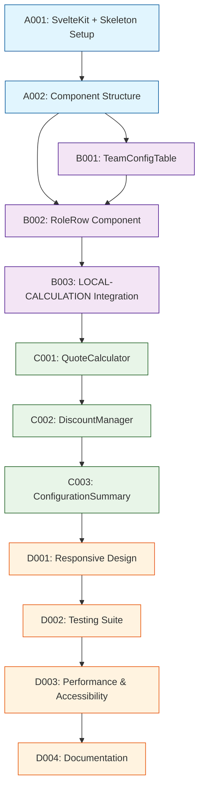

# TEAM-BUILDER Development Tasks

## 1. Task Overview
- **Component:** TEAM-BUILDER
- **Technical Spec:** [Link to technical-spec.md](./technical-spec.md)
- **Total Estimated Effort:** 34 story points
- **Implementation Order:** 4 task groups in sequence

## 2. Task Categories

### Category A: Foundation & Setup
Core infrastructure and basic SvelteKit structure with Skeleton UI integration

### Category B: Core Implementation  
Primary table interface, role management, and calculation integration

### Category C: Integration & Testing
Quote calculator, discount management, and performance optimization

### Category D: Polish & Documentation
Responsive design, accessibility, comprehensive testing, and documentation

## 3. Library Research Summary

### Skeleton UI (`/websites/v2_skeleton_dev`)
**Context7 ID:** /websites/v2_skeleton_dev
**Purpose:** UI components for SvelteKit with Tailwind CSS
**Complexity Level:** Medium

#### Key Concepts
- **Table Component**: Built-in reactive table with `TableSource` interface
- **Form Elements**: Material design inputs with validation styling
- **Component Structure**: Import-based component system with TypeScript support

#### Common Patterns
- **Setup/Initialization:** `import { Table, InputChip } from '@skeletonlabs/skeleton'`
- **Basic Usage:** Reactive data binding with `$:` syntax for table sources
- **Configuration:** TableSource object with head, body, meta, foot arrays

#### Integration Notes
- **Dependencies:** Requires Tailwind CSS and Tailwind Forms plugin
- **Compatibility:** Full SvelteKit SSR support
- **Setup Steps:** NPM install + Tailwind configuration

#### Testing Approach
- **Testing Framework:** Component testing with Vitest + Testing Library
- **Mock Strategies:** Mock TableSource data for component isolation
- **Common Test Patterns:** User interaction testing, data binding validation

#### Implementation Considerations
- **Performance:** Built-in reactivity with memoization support
- **Memory Usage:** Efficient virtual scrolling for large datasets
- **Error Handling:** Input validation through Tailwind Forms styling
- **Security:** No specific security concerns for UI components

#### Task Impact
- **Affects Tasks:** A001, A002, B001, B002 (all table-related tasks)
- **Complexity Adjustment:** +0 story points (well-documented)
- **Special Requirements:** Tailwind Forms plugin setup required

### SvelteKit (`/sveltejs/kit`)
**Context7 ID:** /sveltejs/kit
**Purpose:** Full-stack Svelte framework with reactive state management
**Complexity Level:** Medium

#### Key Concepts
- **Reactive State**: `$derived` and `$state` for automatic updates
- **Context API**: `setContext`/`getContext` for component communication
- **Store Management**: Built-in stores with reactive updates

#### Common Patterns
- **Setup/Initialization:** Component-based architecture with `+page.svelte` patterns
- **Basic Usage**: Props with `let { data } = $props()` and reactive calculations
- **Configuration:** Store-based state management with context API

#### Integration Notes
- **Dependencies:** Node.js runtime, Vite build system
- **Compatibility:** Full SSR/SSG support with client hydration
- **Setup Steps:** SvelteKit project initialization with adapter configuration

#### Testing Approach
- **Testing Framework:** Vitest with SvelteKit testing utilities
- **Mock Strategies:** Mock page stores and context providers
- **Common Test Patterns:** Component lifecycle testing, store reactivity validation

#### Implementation Considerations
- **Performance:** Compiler-optimized reactivity with minimal runtime overhead
- **Memory Usage**: Efficient component lifecycle with automatic cleanup
- **Error Handling:** Built-in error boundaries and load function error handling
- **Security:** Built-in CSRF protection and secure defaults

#### Task Impact
- **Affects Tasks:** All tasks (framework foundation)
- **Complexity Adjustment:** +0 story points (standard framework)
- **Special Requirements:** Understanding of Svelte reactivity patterns

## 4. Detailed Task Breakdown

### 📋 Foundation & Setup

**TASK-A001: Set up SvelteKit project with Skeleton UI dependencies**
- **Summary:** TEAM-BUILDER - Setup SvelteKit & Skeleton UI
- **Issue Type:** Story
- **Epic Link:** TEAM-BUILDER Epic
- **Story Points:** 2
- **Priority:** High
- **Labels:** setup, foundation, team-builder, sveltekit
- **Components:** TEAM-BUILDER
- **Description:** 
  Create SvelteKit project structure, install Skeleton UI and dependencies, configure Tailwind CSS with Skeleton theme.
  
  **Technical Requirements:**
  - Initialize SvelteKit project with TypeScript support
  - Install Skeleton UI package and Tailwind dependencies
  - Configure Tailwind Forms plugin for input styling
  - Set up basic project structure per technical spec section 2
  
- **Acceptance Criteria:**
  - SvelteKit project initializes and runs without errors
  - Skeleton UI components import successfully
  - Tailwind CSS compiles with Skeleton theme
  - Development server starts on localhost with hot reload
  - Basic "hello world" page renders with Skeleton styling
- **Dependencies:** None
- **Jira Sub-tasks:**
  - Initialize SvelteKit project with create-svelte
  - Install @skeletonlabs/skeleton and Tailwind dependencies
  - Configure tailwind.config.js with Skeleton preset
  - Set up app.html and app.css with Skeleton theme
  - Verify development environment functionality

**TASK-A002: Create component structure and TypeScript interfaces**
- **Summary:** TEAM-BUILDER - Component Structure & TypeScript Models
- **Issue Type:** Story
- **Epic Link:** TEAM-BUILDER Epic
- **Story Points:** 3
- **Priority:** High
- **Labels:** data-model, foundation, team-builder, typescript
- **Components:** TEAM-BUILDER
- **Description:**
  Create component file structure and TypeScript interfaces as defined in technical specification section 3.
  
  **Technical Requirements:**
  - Implement data models from technical spec section 3.1
  - Create component structure per section 4
  - Set up Svelte stores architecture per section 3.2
  - Add type definitions for all interfaces
  
- **Acceptance Criteria:**
  - All TypeScript interfaces compile without errors
  - Component folder structure matches technical specification
  - Svelte stores structure is properly typed
  - Mock data structures validate against interfaces
  - Basic store actions are defined (not implemented)
- **Dependencies:** TASK-A001
- **Jira Sub-tasks:**
  - Create TypeScript interfaces in src/lib/types/
  - Set up component file structure in src/lib/components/
  - Create Svelte stores in src/lib/stores/
  - Add mock data for development testing
  - Write basic store action signatures

### 🔧 Core Implementation

**TASK-B001: Implement TeamConfigTable with basic row management**
- **Summary:** TEAM-BUILDER - TeamConfigTable Core Implementation
- **Issue Type:** Story
- **Epic Link:** TEAM-BUILDER Epic
- **Story Points:** 5
- **Priority:** High
- **Labels:** table, core, team-builder, skeleton-ui
- **Components:** TEAM-BUILDER
- **Description:**
  Build the main TeamConfigTable component using Skeleton UI Table component with add/remove row functionality.
  
  **Technical Requirements:**
  - Implement TeamConfigTable component per technical spec section 4.1
  - Use Skeleton UI Table component with TableSource interface
  - Add row addition and removal functionality
  - Implement basic row validation
  
- **Acceptance Criteria:**
  - Table renders with proper column headers
  - Add row button creates new RoleAllocation entries
  - Remove row button deletes entries with confirmation
  - Table supports up to 20 rows per performance requirements
  - Input validation provides real-time feedback
- **Dependencies:** TASK-A002
- **Jira Sub-tasks:**
  - Create TeamConfigTable.svelte component
  - Implement TableSource data binding
  - Add row addition functionality
  - Add row removal with confirmation
  - Implement basic input validation

**TASK-B002: Implement RoleRow component with role selection**
- **Summary:** TEAM-BUILDER - RoleRow Component with Role Selection
- **Issue Type:** Story
- **Epic Link:** TEAM-BUILDER Epic
- **Story Points:** 8
- **Priority:** High
- **Labels:** role-selection, core, team-builder, autocomplete
- **Components:** TEAM-BUILDER
- **Description:**
  Build individual RoleRow component with role selection dropdown, time allocation inputs, and calculated cost display.
  
  **Technical Requirements:**
  - Implement RoleRow component per technical spec section 4.2
  - Use Skeleton UI Autocomplete for role selection
  - Add time allocation input with hours/days toggle
  - Integrate LOCAL-CALCULATION for cost calculation
  - Implement currency formatting for cost display
  
- **Acceptance Criteria:**
  - Role selection dropdown filters available roles
  - Time allocation input accepts decimal values
  - Hours/days toggle converts values correctly
  - Cost calculation updates in real-time (<100ms)
  - Currency formatting displays properly
  - Input validation prevents invalid values
- **Dependencies:** TASK-A002, TASK-B001
- **Jira Sub-tasks:**
  - Create RoleRow.svelte component
  - Implement role selection with Skeleton Autocomplete
  - Add time allocation input with format toggle
  - Integrate LOCAL-CALCULATION API calls
  - Implement currency formatting utility
  - Add comprehensive input validation

**TASK-B003: Integrate LOCAL-CALCULATION component**
- **Summary:** TEAM-BUILDER - LOCAL-CALCULATION Integration
- **Issue Type:** Story
- **Epic Link:** TEAM-BUILDER Epic
- **Story Points:** 3
- **Priority:** High
- **Labels:** calculation, integration, team-builder, performance
- **Components:** TEAM-BUILDER, LOCAL-CALCULATION
- **Description:**
  Integrate the LOCAL-CALCULATION component for real-time cost calculations per technical specification section 10.1.
  
  **Technical Requirements:**
  - Connect to LOCAL-CALCULATION API interface
  - Implement debounced calculation updates
  - Add performance monitoring for <100ms requirement
  - Handle calculation errors gracefully
  
- **Acceptance Criteria:**
  - All calculation methods integrate successfully
  - Real-time updates perform under 100ms
  - Calculation accuracy maintained to 2 decimal places
  - Error handling prevents UI crashes
  - Performance monitoring validates requirements
- **Dependencies:** TASK-B002, LOCAL-CALCULATION component
- **Jira Sub-tasks:**
  - Import LOCAL-CALCULATION API interfaces
  - Implement debounced calculation calls
  - Add performance monitoring utilities
  - Implement error handling for calculations
  - Write integration tests with LOCAL-CALCULATION

### 🔗 Integration & Testing

**TASK-C001: Implement QuoteCalculator component**
- **Summary:** TEAM-BUILDER - QuoteCalculator & EBITDA Analysis
- **Issue Type:** Story
- **Epic Link:** TEAM-BUILDER Epic
- **Story Points:** 5
- **Priority:** Medium
- **Labels:** quote, calculator, team-builder, ebitda
- **Components:** TEAM-BUILDER
- **Description:**
  Build QuoteCalculator component for client quote input and EBITDA margin analysis per technical specification section 4.4.
  
  **Technical Requirements:**
  - Implement QuoteCalculator component with currency input
  - Add real-time EBITDA margin calculation
  - Implement margin threshold warnings
  - Add quote validation rules per section 8.1
  
- **Acceptance Criteria:**
  - Currency input accepts and formats values correctly
  - EBITDA margin calculates and displays in real-time
  - Warning indicators show for negative/low margins
  - Quote validation prevents invalid amounts
  - Component integrates with configuration summary
- **Dependencies:** TASK-B003
- **Jira Sub-tasks:**
  - Create QuoteCalculator.svelte component
  - Implement currency-formatted input
  - Add EBITDA margin calculation display
  - Implement margin threshold warnings
  - Add quote amount validation

**TASK-C002: Implement DiscountManager component**
- **Summary:** TEAM-BUILDER - DiscountManager Implementation
- **Issue Type:** Story
- **Epic Link:** TEAM-BUILDER Epic
- **Story Points:** 6
- **Priority:** Medium
- **Labels:** discount, manager, team-builder, validation
- **Components:** TEAM-BUILDER
- **Description:**
  Build DiscountManager component for percentage and fixed amount discounts with impact preview per technical specification section 4.5.
  
  **Technical Requirements:**
  - Implement discount type toggle (percentage/fixed)
  - Add impact preview before discount application
  - Implement margin impact warnings
  - Add discount validation per section 8.1
  
- **Acceptance Criteria:**
  - Discount type toggle works between percentage and fixed
  - Impact preview shows before applying discount
  - Margin warnings display for excessive discounts
  - Discount validation prevents invalid values
  - Discount removal functionality works correctly
- **Dependencies:** TASK-C001
- **Jira Sub-tasks:**
  - Create DiscountManager.svelte component
  - Implement discount type selection toggle
  - Add discount impact preview functionality
  - Implement margin impact warnings
  - Add discount validation and removal

**TASK-C003: Implement ConfigurationSummary component**
- **Summary:** TEAM-BUILDER - ConfigurationSummary Display
- **Issue Type:** Story
- **Epic Link:** TEAM-BUILDER Epic
- **Story Points:** 3
- **Priority:** Medium
- **Labels:** summary, configuration, team-builder, display
- **Components:** TEAM-BUILDER
- **Description:**
  Build ConfigurationSummary component to display total costs, profit analysis, and applied discounts per technical specification section 4.3.
  
  **Technical Requirements:**
  - Display total internal cost and client revenue
  - Show EBITDA margin percentage and absolute values
  - Display applied discount details
  - Add profit/loss indicators with proper styling
  
- **Acceptance Criteria:**
  - All cost totals display correctly with currency formatting
  - EBITDA margin shows both percentage and dollar amounts
  - Discount details appear when discount is applied
  - Profit/loss indicators use appropriate colors/styling
  - Summary updates reactively with configuration changes
- **Dependencies:** TASK-C002
- **Jira Sub-tasks:**
  - Create ConfigurationSummary.svelte component
  - Implement cost and revenue display
  - Add EBITDA margin calculation display
  - Implement discount details section
  - Add profit/loss indicator styling

### ✨ Polish & Documentation

**TASK-D001: Implement responsive design and mobile optimization**
- **Summary:** TEAM-BUILDER - Responsive Design & Mobile Optimization
- **Issue Type:** Story
- **Epic Link:** TEAM-BUILDER Epic
- **Story Points:** 5
- **Priority:** Medium
- **Labels:** responsive, mobile, team-builder, ui
- **Components:** TEAM-BUILDER
- **Description:**
  Implement responsive design across all breakpoints with mobile-optimized layouts per technical specification section 6.2.
  
  **Technical Requirements:**
  - Implement responsive breakpoints per section 6.2
  - Create mobile card layout for role configurations
  - Optimize touch interactions for mobile devices
  - Test across device sizes for usability
  
- **Acceptance Criteria:**
  - Desktop layout (>1024px) shows full table functionality
  - Tablet layout (768-1024px) uses collapsed columns appropriately
  - Mobile layout (<768px) uses card-based design
  - Touch interactions work smoothly on mobile devices
  - All components remain usable across breakpoints
- **Dependencies:** TASK-C003
- **Jira Sub-tasks:**
  - Implement desktop responsive styles
  - Create tablet layout with collapsed columns
  - Design mobile card-based layout
  - Optimize touch interactions
  - Test across multiple device sizes

**TASK-D002: Add comprehensive testing suite**
- **Summary:** TEAM-BUILDER - Comprehensive Testing Suite
- **Issue Type:** Story
- **Epic Link:** TEAM-BUILDER Epic
- **Story Points:** 8
- **Priority:** High
- **Labels:** testing, quality, team-builder, vitest
- **Components:** TEAM-BUILDER
- **Description:**
  Build comprehensive testing suite including unit tests, integration tests, and E2E tests per technical specification section 9.
  
  **Technical Requirements:**
  - Achieve >90% code coverage target
  - Implement unit tests for all components
  - Add integration tests for calculation workflows
  - Create E2E tests for complete user workflows
  
- **Acceptance Criteria:**
  - Code coverage exceeds 90% for all components
  - Unit tests cover all component functionality
  - Integration tests validate calculation accuracy
  - E2E tests cover complete configuration workflows
  - All tests run in CI/CD pipeline successfully
- **Dependencies:** TASK-D001
- **Jira Sub-tasks:**
  - Set up Vitest testing environment
  - Write unit tests for all components
  - Create integration tests for calculations
  - Implement Playwright E2E tests
  - Set up CI/CD test automation

**TASK-D003: Performance optimization and accessibility**
- **Summary:** TEAM-BUILDER - Performance Optimization & Accessibility
- **Issue Type:** Story
- **Epic Link:** TEAM-BUILDER Epic
- **Story Points:** 5
- **Priority:** Medium
- **Labels:** performance, accessibility, team-builder, wcag
- **Components:** TEAM-BUILDER
- **Description:**
  Optimize component performance and ensure WCAG 2.1 accessibility compliance per technical specification sections 7 and 11.
  
  **Technical Requirements:**
  - Meet performance targets from section 7.1
  - Implement accessibility features for WCAG 2.1 compliance
  - Add keyboard navigation support
  - Implement screen reader compatibility
  
- **Acceptance Criteria:**
  - Performance targets met (<50ms individual updates, <100ms totals)
  - WCAG 2.1 compliance verified with accessibility testing
  - Keyboard navigation works for all interactive elements
  - Screen reader announces changes and state updates
  - Memory usage stays under 10MB for typical configurations
- **Dependencies:** TASK-D002
- **Jira Sub-tasks:**
  - Implement performance optimizations
  - Add accessibility attributes and ARIA labels
  - Implement keyboard navigation
  - Add screen reader announcements
  - Conduct accessibility audit and testing

**TASK-D004: Documentation and deployment preparation**
- **Summary:** TEAM-BUILDER - Documentation & Deployment Preparation
- **Issue Type:** Story
- **Epic Link:** TEAM-BUILDER Epic
- **Story Points:** 3
- **Priority:** Medium
- **Labels:** documentation, deployment, team-builder
- **Components:** TEAM-BUILDER
- **Description:**
  Create comprehensive documentation and prepare component for deployment and integration with dependent components.
  
  **Technical Requirements:**
  - Document component API and usage patterns
  - Create integration guide for dependent components
  - Prepare build configuration for production deployment
  - Document troubleshooting and maintenance procedures
  
- **Acceptance Criteria:**
  - Component API fully documented with TypeScript definitions
  - Integration guide enables dependent component development
  - Production build optimizes for performance and size
  - Troubleshooting guide covers common issues and solutions
  - Component ready for LOCAL-CALCULATION integration
- **Dependencies:** TASK-D003
- **Jira Sub-tasks:**
  - Write component API documentation
  - Create integration guide for dependent components
  - Configure production build optimization
  - Write troubleshooting and maintenance guide
  - Prepare component for milestone 1 delivery

## 5. Task Dependencies & Sequencing

## 6. Parallel Development Opportunities

### What Can Be Built Simultaneously:
- **After A002:** B001 and B002 can start in parallel (different component files)
- **After B003:** C001, C002, and C003 can be developed in parallel
- **After C003:** D001 and D002 can start while D003 is in progress

### Critical Path:
A001 → A002 → B001/B002 → B003 → C001/C002/C003 → D001 → D002 → D003 → D004

## 7. Risk Mitigation Tasks

### Technical Risks (from risk assessment):
- **Skeleton UI Learning Curve:** Mitigated by TASK-A001 research and setup phase
- **LOCAL-CALCULATION Integration:** Dedicated TASK-B003 for integration testing
- **Performance Requirements:** TASK-D003 specifically addresses performance optimization
- **Responsive Design Complexity:** TASK-D001 isolates responsive implementation

## 8. Definition of Done

### Task Completion Criteria:
- ✅ All acceptance criteria met
- ✅ Unit tests written and passing
- ✅ Code review completed
- ✅ Integration tests passing (where applicable)
- ✅ TypeScript compilation without errors
- ✅ Accessibility requirements verified

### Component Completion Criteria:
- ✅ All tasks completed per definition of done
- ✅ Technical specification requirements met
- ✅ Integration with LOCAL-CALCULATION verified
- ✅ Performance targets achieved (<100ms calculations)
- ✅ WCAG 2.1 accessibility compliance
- ✅ Ready for Milestone 1 delivery

## 9. Estimation Summary

| Category | Task Count | Total Effort | Duration (days) |
|----------|-----------|--------------|-----------------|
| Foundation & Setup | 2 | 5 points | 2-3 days |
| Core Implementation | 3 | 16 points | 8-10 days |
| Integration & Testing | 3 | 14 points | 7-9 days |
| Polish & Documentation | 4 | 21 points | 10-13 days |
| **TOTAL** | **12** | **56 points** | **27-35 days** |

## 10. Traceability Matrix

| Task ID | Technical Spec Section | Business Requirements | Business Value |
|---------|------------------------|-------------------------|----------------|
| A001 | Section 2, 11 | Infrastructure Setup | Development foundation |
| A002 | Section 3.1, 3.2 | Data Model Requirements | Type safety & structure |
| B001 | Section 4.1 | UC-001 (Quick Quote) | Core table functionality |
| B002 | Section 4.2 | UC-001 (Role Selection) | User interaction layer |
| B003 | Section 10.1 | UC-001 (Calculations) | Real-time cost calculation |
| C001 | Section 4.4 | UC-001 (Quote Input) | EBITDA analysis |
| C002 | Section 4.5 | UC-001 (Discounts) | Discount functionality |
| C003 | Section 4.3 | UC-001 (Summary) | Configuration overview |
| D001 | Section 6.2 | Responsive Design | Multi-device support |
| D002 | Section 9 | Quality Assurance | Reliability & maintainability |
| D003 | Section 7, WCAG | Performance & Accessibility | User experience |
| D004 | Section 11 | Documentation | Knowledge transfer |

## 11. Implementation Notes

### Development Best Practices:
- Follow Svelte component composition patterns
- Use TypeScript strict mode for type safety
- Implement reactive state patterns with $derived and $state
- Use Skeleton UI components consistently for design system compliance
- Apply progressive enhancement for accessibility

### Quality Gates:
- TypeScript compilation must pass with zero errors
- Unit test coverage minimum 90%
- Performance benchmarks must meet <100ms calculation requirement
- Accessibility audit must pass WCAG 2.1 Level AA
- Integration tests with LOCAL-CALCULATION must pass

### Communication Plan:
- Daily standup updates on task progress
- Demo completed functionality after each category
- Escalate performance or integration blockers immediately
- Code review required for all core implementation tasks
- Knowledge sharing session after milestone completion

### Framework-Specific Considerations:
- **SvelteKit Reactivity:** Use `$derived` for computed values that depend on props
- **Skeleton UI Integration:** Follow component composition patterns from documentation
- **Performance:** Leverage Svelte's compile-time optimizations
- **Testing:** Use Svelte Testing Library for component testing patterns
- **State Management:** Use context API for shared state between components