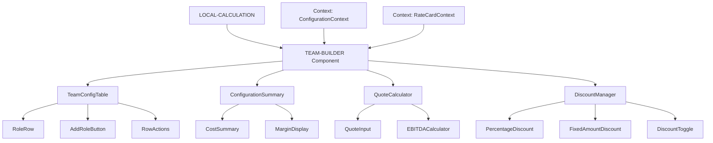
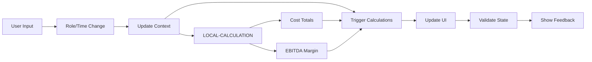

# Technical Specification

## 1. Overview

**Component Name:** TEAM-BUILDER  
**Type:** Frontend Interface Component  
**Technology Stack:** React + Next.js + TypeScript + Tailwind CSS  
**Purpose:** Interactive table interface for building team configurations with real-time cost calculations  
**Build Phase:** Milestone 1 (Foundation)  
**Dependencies:** LOCAL-CALCULATION component  

## 2. Component Architecture



## 3. Data Models

### 3.1 Core Data Structures

```typescript
interface RoleAllocation {
  id: string;
  roleId: string;
  roleName: string;
  hourlyRate: number;
  internalCost: number;
  timeAllocation: number;
  allocationType: 'hours' | 'days';
  hoursPerDay: number;
  calculatedCost: number;
  sortOrder: number;
}

interface TeamConfiguration {
  id: string;
  name: string;
  roles: RoleAllocation[];
  clientQuote: number;
  totalCost: number;
  totalRevenue: number;
  ebitdaMargin: number;
  appliedDiscount?: Discount;
  createdDate: Date;
  lastModified: Date;
}

interface Discount {
  type: 'percentage' | 'fixed';
  value: number;
  discountAmount: number;
  originalQuote: number;
  discountedQuote: number;
}

interface RateCardEntry {
  id: string;
  roleName: string;
  hourlyRate: number;
  internalCost: number;
  department: string;
  experienceLevel: string;
  isActive: boolean;
}
```

### 3.2 React Context Structure

```typescript
// contexts/ConfigurationContext.tsx
interface ConfigurationContextType {
  activeConfiguration: TeamConfiguration;
  savedConfigurations: TeamConfiguration[];
  rateCard: RateCardEntry[];
  calculationSettings: {
    hoursPerDay: number;
    currency: string;
    precision: number;
  };
  uiState: {
    isCalculating: boolean;
    errors: ValidationError[];
    warnings: string[];
  };
  actions: {
    addRole: (roleId: string, timeAllocation: number) => void;
    removeRole: (allocationId: string) => void;
    updateRole: (allocationId: string, updates: Partial<RoleAllocation>) => void;
    setQuote: (amount: number) => void;
    applyDiscount: (discount: Discount) => void;
    removeDiscount: () => void;
    saveConfiguration: (name: string) => void;
    loadConfiguration: (id: string) => void;
    resetConfiguration: () => void;
  };
}
```

## 4. Component Specifications

### 4.1 TeamConfigTable Component

**Purpose:** Main table interface for role configuration  
**File:** `src/components/TeamConfigTable.tsx`

**Props:**
```typescript
interface TeamConfigTableProps {
  configuration: TeamConfiguration;
  rateCard: RateCardEntry[];
  readonly?: boolean;
  maxRows?: number;
  className?: string;
}
```

**Key Features:**

- Dynamic row addition/removal using React state
- Role dropdown with search functionality using React Select
- Time allocation input with hours/days toggle
- Real-time cost calculation per row using useMemo
- Drag-and-drop row reordering with React DnD
- Inline validation feedback with React Hook Form

**Performance Requirements:**

- Row calculations must complete within 100ms using React.memo
- Support up to 20 rows without performance degradation
- Debounced input handling using useDebounce hook

### 4.2 RoleRow Component

**Purpose:** Individual configuration row with role selection and time allocation  
**File:** `src/components/RoleRow.tsx`

**Props:**
```typescript
interface RoleRowProps {
  roleAllocation: RoleAllocation;
  availableRoles: RateCardEntry[];
  index: number;
  onUpdate: (allocation: RoleAllocation) => void;
  onRemove: (id: string) => void;
  readonly?: boolean;
}
```

**Key Features:**
- Role selection dropdown with autocomplete
- Time allocation input with format toggle (hours/days)
- Calculated cost display with currency formatting
- Remove button with confirmation
- Validation state indicators

### 4.3 ConfigurationSummary Component

**Purpose:** Display total costs and profit analysis  
**File:** `src/lib/components/ConfigurationSummary.svelte`

**Props:**
```typescript
interface ConfigurationSummaryProps {
  configuration: TeamConfiguration;
  showDetails?: boolean;
  compact?: boolean;
}
```

**Displays:**

- Total internal cost
- Total client revenue
- EBITDA margin (percentage and absolute)
- Applied discount details
- Profit/loss indicators

### 4.4 QuoteCalculator Component

**Purpose:** Client quote input and EBITDA calculation  
**File:** `src/lib/components/QuoteCalculator.svelte`

**Props:**
```typescript
interface QuoteCalculatorProps {
  totalCost: number;
  currentQuote: number;
  onQuoteChange: (quote: number) => void;
  readonly?: boolean;
}
```

**Features:**
- Currency-formatted input
- Real-time EBITDA calculation
- Margin threshold warnings
- Quote validation

### 4.5 DiscountManager Component

**Purpose:** Discount application and impact analysis  
**File:** `src/lib/components/DiscountManager.svelte`

**Props:**
```typescript
interface DiscountManagerProps {
  originalQuote: number;
  currentDiscount?: Discount;
  onDiscountChange: (discount: Discount | null) => void;
  readonly?: boolean;
}
```

**Features:**
- Discount type toggle (percentage/fixed)
- Impact preview before application
- Margin impact warnings
- Discount removal functionality

## 5. State Management

### 5.1 React State Flow



### 5.2 Context Actions

```typescript
// Configuration actions (already defined in ConfigurationContext)
const useConfiguration = () => {
  const context = useContext(ConfigurationContext);
  if (!context) {
    throw new Error('useConfiguration must be used within ConfigurationProvider');
  }
  return context;
};

// Custom hooks for specific functionality
const useCalculations = () => {
  const { activeConfiguration } = useConfiguration();
  
  const totalCost = useMemo(() => 
    calculateTotalCost(activeConfiguration.roles), 
    [activeConfiguration.roles]
  );
  
  const ebitdaMargin = useMemo(() => 
    calculateEBITDAMargin(totalCost, activeConfiguration.clientQuote),
    [totalCost, activeConfiguration.clientQuote]
  );
  
  return { totalCost, ebitdaMargin };
};
```

## 6. Technology Stack

### 6.1 Core Technologies
- **Framework:** Next.js 14+ (App Router)
- **Language:** TypeScript 5+
- **Styling:** Tailwind CSS 3+
- **State Management:** React Context + useReducer
- **Forms:** React Hook Form + Zod validation
- **UI Components:** Headless UI + Custom Tailwind components

### 6.2 Key Dependencies
```json
{
  "dependencies": {
    "next": "^14.0.0",
    "react": "^18.0.0",
    "react-dom": "^18.0.0",
    "typescript": "^5.0.0",
    "tailwindcss": "^3.0.0",
    "react-hook-form": "^7.0.0",
    "zod": "^3.0.0",
    "@headlessui/react": "^1.7.0",
    "react-select": "^5.0.0",
    "decimal.js": "^10.4.0"
  },
  "devDependencies": {
    "@types/react": "^18.0.0",
    "@types/node": "^20.0.0",
    "eslint": "^8.0.0",
    "prettier": "^3.0.0"
  }
}
```

### 6.3 Technology Rationale
- **Next.js:** Excellent TypeScript support, built-in optimization, easy deployment
- **Tailwind CSS:** Rapid styling, consistent design system, responsive utilities
- **React Hook Form:** Performance-optimized forms with minimal re-renders
- **Zod:** Type-safe validation that integrates well with TypeScript
- **Decimal.js:** Precise financial calculations avoiding floating-point errors

## 7. User Interface Design

### 6.1 Layout Structure

```
┌─────────────────────────────────────────────────────────┐
│ Team Configuration Builder                              │
├─────────────────────────────────────────────────────────┤
│ ┌─ Configuration Table ─────────────────────────────┐   │
│ │ Role Name    │ Time Allocation │ Cost     │ [×]   │   │
│ │ [Dropdown]   │ [Input] [hrs/d] │ $1,200   │       │   │
│ │ Developer    │ 40 hrs         │ $1,200   │ [×]   │   │
│ │ Designer     │ 5 days         │ $800     │ [×]   │   │
│ │ + Add Role                                        │   │
│ └───────────────────────────────────────────────────┘   │
├─────────────────────────────────────────────────────────┤
│ ┌─ Quote & Profit Analysis ─────────────────────────┐   │
│ │ Client Quote: $5,000                             │   │
│ │ Total Cost:   $2,000                             │   │
│ │ EBITDA Margin: 60% ($3,000)                     │   │
│ │                                                  │   │
│ │ Discount: [None] [%] [Fixed] [$100]             │   │
│ │ Final Quote: $4,900  |  Final Margin: 58%       │   │
│ └───────────────────────────────────────────────────┘   │
├─────────────────────────────────────────────────────────┤
│ [Save Configuration] [Export] [Reset]                   │
└─────────────────────────────────────────────────────────┘
```

### 7.2 Responsive Breakpoints (Tailwind CSS)

- **Desktop (lg: >1024px):** Full table layout with all columns visible
- **Tablet (md: 768-1024px):** Collapsed cost column, expandable details
- **Mobile (sm: <768px):** Stack layout using Tailwind's responsive grid

**Tailwind Implementation:**
```tsx
<div className="grid grid-cols-1 md:grid-cols-4 lg:grid-cols-5 gap-4">
  <div className="md:col-span-2">Role Selection</div>
  <div className="md:col-span-1">Time Allocation</div>
  <div className="hidden lg:block">Cost</div>
  <div className="md:col-span-1">Actions</div>
</div>
```

### 7.3 Visual States

**Normal State:**
- Clean table rows with Tailwind's border and spacing utilities
- Hover effects using `hover:bg-gray-50` classes
- Currency formatting with proper alignment using `text-right`

**Calculation State:**
- Loading spinners using Tailwind's `animate-spin`
- Debounced input feedback with `transition-colors`
- Progressive calculation updates

**Error State:**
- Red border on invalid inputs
- Inline error messages below fields
- Summary error panel for critical issues

**Warning State:**
- Yellow/orange indicators for margin warnings
- Informational tooltips for guidance
- Preventive validation messages

## 7. Performance Requirements

### 7.1 Calculation Performance

- **Individual Row Updates:** <50ms per change
- **Total Recalculation:** <100ms for up to 20 roles
- **UI Updates:** <16ms for smooth 60fps interactions
- **Memory Usage:** <10MB for typical configurations

### 7.2 Optimization Strategies

```typescript
// Debounced input handling
const debouncedUpdate = debounce((allocation: RoleAllocation) => {
  updateConfiguration(allocation);
}, 300);

// Memoized calculations
$: totalCost = useMemo(() => 
  calculateTotalCost($configuration.roles), 
  [$configuration.roles]
);

// Virtual scrolling for large role lists
const virtualList = virtualizeRows(availableRoles, {
  itemHeight: 48,
  overscan: 5
});
```

## 8. Validation & Error Handling

### 8.1 Input Validation Rules

```typescript
interface ValidationRules {
  timeAllocation: {
    min: 0.1;
    max: 2000; // reasonable maximum hours
    precision: 1; // one decimal place
  };
  clientQuote: {
    min: 0;
    max: 10000000; // reasonable business limit
    precision: 2; // currency precision
  };
  discountPercentage: {
    min: 0;
    max: 100;
    precision: 2;
  };
  discountFixed: {
    min: 0;
    max: 'clientQuote'; // cannot exceed quote
    precision: 2;
  };
}
```

### 8.2 Error Types & Handling

```typescript
enum ValidationErrorType {
  INVALID_TIME_ALLOCATION = 'invalid_time_allocation',
  INVALID_QUOTE_AMOUNT = 'invalid_quote_amount',
  INVALID_DISCOUNT = 'invalid_discount',
  NEGATIVE_MARGIN = 'negative_margin',
  DUPLICATE_ROLE = 'duplicate_role',
  CALCULATION_ERROR = 'calculation_error'
}

interface ValidationError {
  type: ValidationErrorType;
  field: string;
  message: string;
  severity: 'error' | 'warning' | 'info';
}
```

## 9. Testing Strategy

### 9.1 Unit Tests

```typescript
// Component testing with Vitest + Testing Library
describe('RoleRow Component', () => {
  test('calculates cost correctly when time allocation changes');
  test('validates time allocation input ranges');
  test('emits update events with correct data');
  test('handles role selection changes');
  test('displays proper currency formatting');
});

describe('LOCAL-CALCULATION Integration', () => {
  test('real-time calculation performance under 100ms');
  test('calculation accuracy to 2 decimal places');
  test('handles edge cases (zero values, large numbers)');
});
```

### 9.2 E2E Tests

```typescript
// Playwright tests for user workflows
test('Complete configuration creation workflow', async ({ page }) => {
  // 1. Add roles to configuration
  // 2. Set time allocations
  // 3. Enter client quote
  // 4. Apply discount
  // 5. Verify calculations
  // 6. Save configuration
});
```

## 10. Integration Points

### 10.1 LOCAL-CALCULATION Component

```typescript
interface CalculationAPI {
  calculateRoleCost(allocation: RoleAllocation): number;
  calculateTotalCost(roles: RoleAllocation[]): number;
  calculateEBITDAMargin(revenue: number, cost: number): number;
  applyDiscount(quote: number, discount: Discount): number;
  validateConfiguration(config: TeamConfiguration): ValidationError[];
}
```

### 10.2 Future API Integration (Milestone 3)

```typescript
interface FutureAPIIntegration {
  // Will replace hardcoded rate card data
  fetchRateCard(): Promise<RateCardEntry[]>;
  saveConfiguration(config: TeamConfiguration): Promise<string>;
  loadConfiguration(id: string): Promise<TeamConfiguration>;
}
```

## 11. Implementation Checklist

### Phase 1: Core Structure
- [ ] Set up Next.js project with TypeScript and Tailwind CSS
- [ ] Create basic component structure with React functional components
- [ ] Implement TeamConfigTable with static data
- [ ] Add/remove row functionality using React state
- [ ] Basic styling with Tailwind CSS and responsive layout

### Phase 2: Calculations
- [ ] Integrate LOCAL-CALCULATION component
- [ ] Real-time cost calculations per row using useMemo
- [ ] Total cost calculation and display
- [ ] EBITDA margin calculation
- [ ] Performance optimization with React.memo and useCallback

### Phase 3: Advanced Features
- [ ] Quote input and profit analysis
- [ ] Discount application (percentage and fixed)
- [ ] Configuration saving to localStorage with React hooks
- [ ] Import/export functionality
- [ ] Input validation with React Hook Form and error handling

### Phase 4: Polish & Testing
- [ ] Complete responsive design
- [ ] Accessibility compliance (WCAG 2.1)
- [ ] Comprehensive test coverage
- [ ] Performance testing and optimization
- [ ] User experience refinements

## 12. Success Criteria

- ✅ Add/remove team roles with intuitive UI
- ✅ Real-time cost calculations under 100ms
- ✅ Support 20+ roles without performance issues
- ✅ Accurate EBITDA margin calculations
- ✅ Discount application with impact preview
- ✅ Responsive design across device sizes
- ✅ Input validation with clear error messages
- ✅ Configuration persistence in browser session
- ✅ Clean, professional UI matching design standards
- ✅ Comprehensive test coverage (>90%)
