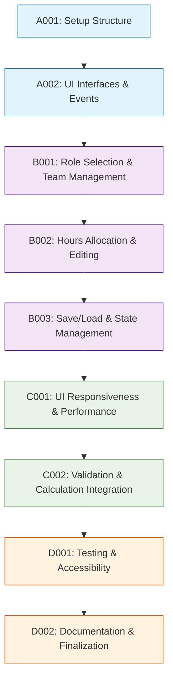

# Development Tasks

## 1. Task Overview
- **Component:** Team-Configuration-Builder
- **Technical Spec:** [Link to technical-spec.md](technical-spec.md)
- **Total Estimated Effort:** 32 story points
- **Implementation Order:** 4 task groups in sequence

## 2. Task Categories

### Category A: Foundation & Setup
Core infrastructure and basic structure

### Category B: Core Implementation  
Primary business logic and functionality

### Category C: Integration & Testing
External connections and validation

### Category D: Polish & Documentation
Final touches and documentation

## 3. Detailed Task Breakdown

### 📋 Foundation & Setup

**TASK-A001: Set up Team-Configuration-Builder component structure and dependencies**
- **Summary:** Team-Configuration-Builder - Setup Structure & Dependencies
- **Issue Type:** Story
- **Epic Link:** Team-Configuration-Builder Epic
- **Story Points:** 2
- **Priority:** High
- **Labels:** setup, foundation, team-builder
- **Components:** Team-Configuration-Builder
- **Description:** 
  Create basic project structure, install dependencies, set up development environment for Team-Configuration-Builder component.
  
  **Technical Requirements:**
  - Set up folder structure per technical spec
  - Configure TypeScript for UI and configuration types
  - Set up testing framework with DOM testing utilities
  - Configure event-driven architecture foundation
  
- **Acceptance Criteria:**
  - Component folder structure matches technical specification
  - TypeScript configuration works for UI and configuration types
  - Basic team builder class instantiates without errors
  - Event handling infrastructure is properly set up
- **Dependencies:** None
- **Jira Sub-tasks:**
  - Create folder structure
  - Configure TypeScript settings
  - Set up testing framework with DOM utilities
  - Set up event handling infrastructure

**TASK-A002: Implement core UI interfaces and event structures**
- **Summary:** Team-Configuration-Builder - Core UI Interfaces & Events
- **Issue Type:** Story
- **Epic Link:** Team-Configuration-Builder Epic
- **Story Points:** 3
- **Priority:** High
- **Labels:** interfaces, events, team-builder
- **Components:** Team-Configuration-Builder
- **Description:**
  Create UI interfaces and event structures as defined in technical specification.
  
  **Technical Requirements:**
  - Implement UI interfaces from technical spec section 3.1
  - Add TypeScript interfaces for TeamSummary, ConfigurationUIState, etc.
  - Set up event handling and callback systems
  - Create UI state management structures
  
- **Acceptance Criteria:**
  - All UI interfaces implemented with correct types
  - Event handling system supports configuration callbacks
  - UI state management structures enable reactive updates
  - Component API is properly defined and type-safe
- **Dependencies:** TASK-A001
- **Jira Sub-tasks:**
  - Define UI interfaces
  - Implement event structures
  - Create state management interfaces
  - Write unit tests for interfaces

### 🔧 Core Implementation

**TASK-B001: Implement role selection and team member management**
- **Summary:** Team-Configuration-Builder - Role Selection & Team Management
- **Issue Type:** Story
- **Epic Link:** Team-Configuration-Builder Epic
- **Story Points:** 7
- **Priority:** High
- **Labels:** role-selection, team-management, team-builder
- **Components:** Team-Configuration-Builder
- **Description:**
  Build role selection interface and team member management functionality.
  
  **Technical Requirements:**
  - Implement role selection from available rate card data
  - Add team member creation, updating, and removal
  - Create role filtering and search capabilities
  - Handle team member validation and error display
  
- **Acceptance Criteria:**
  - Users can select roles from available rate card data
  - Team members can be added, updated, and removed
  - Role filtering and search work efficiently
  - Validation errors are displayed clearly with suggestions
  - Real-time team summary updates work correctly
- **Dependencies:** TASK-A002
- **Jira Sub-tasks:**
  - Implement role selection interface
  - Add team member management logic
  - Create filtering and search functionality
  - Implement validation and error display
  - Write comprehensive functionality tests

**TASK-B002: Implement hours allocation and configuration editing**
- **Summary:** Team-Configuration-Builder - Hours Allocation & Configuration Editing
- **Issue Type:** Story
- **Epic Link:** Team-Configuration-Builder Epic
- **Story Points:** 6
- **Priority:** High
- **Labels:** hours, configuration, editing, team-builder
- **Components:** Team-Configuration-Builder
- **Description:**
  Build hours allocation interface and configuration editing capabilities.
  
  **Technical Requirements:**
  - Implement hours allocation input with validation
  - Add configuration name and metadata editing
  - Create real-time validation feedback
  - Handle auto-save and draft management
  
- **Acceptance Criteria:**
  - Hours allocation input works with proper validation
  - Configuration names and metadata can be edited
  - Real-time validation provides immediate feedback
  - Auto-save prevents data loss during editing
  - Configuration drafts are properly managed
- **Dependencies:** TASK-B001
- **Jira Sub-tasks:**
  - Implement hours allocation interface
  - Add configuration editing features
  - Create real-time validation
  - Implement auto-save functionality
  - Write editing workflow tests

**TASK-B003: Implement configuration save/load and state management**
- **Summary:** Team-Configuration-Builder - Save/Load & State Management
- **Issue Type:** Story
- **Epic Link:** Team-Configuration-Builder Epic
- **Story Points:** 5
- **Priority:** High
- **Labels:** save-load, state, team-builder
- **Components:** Team-Configuration-Builder
- **Description:**
  Build configuration persistence and state management integration.
  
  **Technical Requirements:**
  - Implement configuration save and load operations
  - Add integration with State-Manager for persistence
  - Create configuration duplication and templating
  - Handle configuration version management
  
- **Acceptance Criteria:**
  - Configurations can be saved and loaded successfully
  - State-Manager integration maintains data consistency
  - Configuration duplication creates independent copies
  - Version management prevents data conflicts
  - Unsaved changes are properly tracked and warned
- **Dependencies:** TASK-B002
- **Jira Sub-tasks:**
  - Implement save/load operations
  - Add State-Manager integration
  - Create duplication functionality
  - Implement version management
  - Write persistence tests

### 🔗 Integration & Testing

**TASK-C001: Implement UI responsiveness and performance optimization**
- **Summary:** Team-Configuration-Builder - UI Responsiveness & Performance
- **Issue Type:** Story
- **Epic Link:** Team-Configuration-Builder Epic
- **Story Points:** 5
- **Priority:** Medium
- **Labels:** responsive, performance, team-builder
- **Components:** Team-Configuration-Builder
- **Description:**
  Implement responsive UI design and performance optimizations for large team configurations.
  
  **Technical Requirements:**
  - Add responsive design for desktop and tablet devices
  - Implement virtual scrolling for large role lists
  - Create debounced input handling for performance
  - Add efficient DOM update strategies
  
- **Acceptance Criteria:**
  - UI works correctly on desktop and tablet devices
  - Large role lists (200+ roles) perform without lag
  - Input handling is responsive with proper debouncing
  - DOM updates are efficient and don't cause flicker
  - Memory usage remains stable during extended use
- **Dependencies:** TASK-B003
- **Jira Sub-tasks:**
  - Implement responsive design
  - Add virtual scrolling for large lists
  - Create debounced input handling
  - Optimize DOM update performance
  - Write performance tests

**TASK-C002: Add integration with validation and calculation engines**
- **Summary:** Team-Configuration-Builder - Validation & Calculation Integration
- **Issue Type:** Story
- **Epic Link:** Team-Configuration-Builder Epic
- **Story Points:** 4
- **Priority:** Medium
- **Labels:** integration, validation, calculation, team-builder
- **Components:** Team-Configuration-Builder
- **Description:**
  Build integration with Validation-Engine and Cost-Calculator for real-time feedback.
  
  **Technical Requirements:**
  - Integrate with Validation-Engine for input validation
  - Add Cost-Calculator integration for real-time cost updates
  - Create validation error display and suggestion handling
  - Handle calculation progress and completion events
  
- **Acceptance Criteria:**
  - Validation-Engine integration provides real-time feedback
  - Cost-Calculator integration shows live cost updates
  - Validation errors are displayed with clear suggestions
  - Calculation progress is shown during processing
  - Integration handles errors gracefully
- **Dependencies:** TASK-C001
- **Jira Sub-tasks:**
  - Integrate Validation-Engine
  - Add Cost-Calculator integration
  - Implement error display
  - Handle calculation events
  - Write integration tests

### ✨ Polish & Documentation

**TASK-D001: Comprehensive testing and accessibility**
- **Summary:** Team-Configuration-Builder - Testing & Accessibility
- **Issue Type:** Story
- **Epic Link:** Team-Configuration-Builder Epic
- **Story Points:** 6
- **Priority:** High
- **Labels:** testing, accessibility, team-builder
- **Components:** Team-Configuration-Builder
- **Description:**
  Build comprehensive testing suite and ensure accessibility compliance.
  
  **Technical Requirements:**
  - Achieve 90% test coverage for UI logic
  - Test all user interaction flows and edge cases
  - Implement accessibility features (WCAG compliance)
  - Add keyboard navigation and screen reader support
  
- **Acceptance Criteria:**
  - Test coverage reaches 90% for UI logic
  - All user interaction flows are thoroughly tested
  - Accessibility features meet WCAG guidelines
  - Keyboard navigation works for all features
  - Screen reader support provides clear feedback
- **Dependencies:** TASK-A002, TASK-B001, TASK-B002, TASK-B003, TASK-C001, TASK-C002
- **Jira Sub-tasks:**
  - Write unit tests for UI logic
  - Create user interaction flow tests
  - Implement accessibility features
  - Add keyboard navigation
  - Test screen reader compatibility

**TASK-D002: Documentation and component finalization**
- **Summary:** Team-Configuration-Builder - Documentation & Finalization
- **Issue Type:** Story
- **Epic Link:** Team-Configuration-Builder Epic
- **Story Points:** 3
- **Priority:** Medium
- **Labels:** documentation, finalization, team-builder
- **Components:** Team-Configuration-Builder
- **Description:**
  Create comprehensive documentation and finalize component for production use.
  
  **Technical Requirements:**
  - Document all public API methods and events
  - Create user interaction guides and examples
  - Finalize TypeScript type definitions
  - Document integration patterns with other components
  
- **Acceptance Criteria:**
  - API documentation covers all public methods and events
  - User interaction guides provide clear examples
  - TypeScript definitions are complete and accurate
  - Integration patterns are documented for other components
  - Component is ready for integration with Basic-UI
- **Dependencies:** TASK-D001
- **Jira Sub-tasks:**
  - Write API documentation
  - Create user interaction guides
  - Finalize TypeScript definitions
  - Document integration patterns
  - Conduct final component review

## 4. Task Dependencies & Sequencing

## 5. Parallel Development Opportunities

### What Can Be Built Simultaneously:
- **After A002:** B001 can start immediately
- **After B001:** B002 can begin while B001 testing continues
- **After B003:** C001 and C002 can be developed in parallel

### Critical Path:
A001 → A002 → B001 → B002 → B003 → C001 → D001 → D002

## 6. Risk Mitigation Tasks

### Technical Risks:
- **UI Complexity:** Addressed through responsive design in C001 and comprehensive testing in D001
- **Performance Issues:** Dedicated optimization in C001 with virtual scrolling and debouncing
- **Integration Complexity:** Systematic integration approach in C002 with proper error handling

## 7. Definition of Done

### Task Completion Criteria:
- ✅ All acceptance criteria met
- ✅ Unit tests written and passing
- ✅ Code review completed
- ✅ Integration tests passing (where applicable)
- ✅ Documentation updated

### Component Completion Criteria:
- ✅ All tasks completed per definition of done
- ✅ Technical specification requirements met
- ✅ Performance targets achieved (100ms UI updates)
- ✅ 90% test coverage achieved
- ✅ Accessibility compliance verified
- ✅ Ready for integration with Basic-UI and other components

## 8. Estimation Summary

| Category | Task Count | Total Effort | Duration (days) |
|----------|-----------|--------------|-----------------|
| Foundation & Setup | 2 | 5 points | 2-3 days |
| Core Implementation | 3 | 18 points | 8-9 days |
| Integration & Testing | 2 | 9 points | 4-5 days |
| Polish & Documentation | 2 | 9 points | 4-5 days |
| **TOTAL** | **9** | **41 points** | **18-22 days** |

## 9. Traceability Matrix

| Task ID | Technical Spec Section | Functional Requirements | Business Value |
|---------|------------------------|-------------------------|----------------|
| A001 | Section 5.1 | Setup/Infrastructure | Development efficiency |
| A002 | Section 4.1 | FR-022, FR-023 | UI framework |
| B001 | Section 3.1, 6.1 | FR-022, FR-025 | Role selection capability |
| B002 | Section 3.1, 4.2 | FR-023, FR-026 | Configuration editing |
| B003 | Section 3.1, 6.2 | FR-027, FR-028 | Configuration persistence |
| C001 | Section 7.1, 7.2 | FR-024, FR-029 | Performance & responsiveness |
| C002 | Section 6.1, 6.2 | Integration requirements | Real-time feedback |
| D001 | Section 10.1 | Quality & accessibility | User experience |
| D002 | Section 11.1 | Documentation | Developer experience |

## 10. Implementation Notes

### Development Best Practices:
- Follow test-driven development (TDD) approach
- Use TypeScript strict mode for type safety
- Implement progressive enhancement for accessibility
- Regular testing with actual user scenarios

### Quality Gates:
- Automated testing pipeline must pass
- Code coverage minimum 90% for UI logic
- Accessibility compliance verified
- Performance benchmarks must meet timing requirements

### Communication Plan:
- Daily standup updates on task progress
- Demo UI functionality after each category
- User testing sessions for usability feedback
- Escalate blockers immediately to technical lead