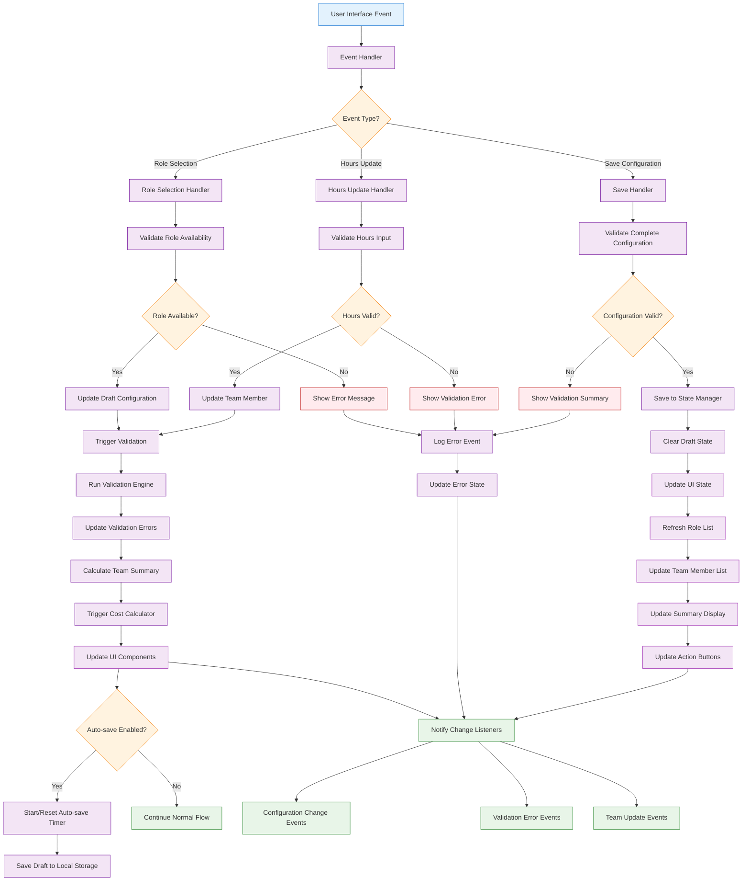

# Technical Specification

## 1. Component Overview
- **Purpose:** Interactive interface for selecting roles from rate cards and specifying time allocation for team configurations
- **Scope:** Handles role selection, hours allocation, team member management, and configuration creation/editing
- **Dependencies:** State-Manager (for data access), Validation-Engine (for input validation)
- **Dependents:** Cost-Calculator (receives team configurations), Basic-UI (embedded interface)

## 2. Functional Requirements
List of functional requirements this component must fulfill:
- **FR-022:** User must be able to select roles from imported rate card data
- **FR-023:** User must be able to specify hours allocation for each selected role
- **FR-024:** System must display real-time team composition and total hours
- **FR-025:** User must be able to add/remove team members from configuration
- **FR-026:** System must validate hours allocation against business rules
- **FR-027:** User must be able to save and name team configurations
- **FR-028:** System must support editing existing configurations
- **FR-029:** User interface must be responsive and intuitive for rapid configuration

## 3. Component Interface

### 3.1 Public API
Define the external interface this component exposes:

```typescript
interface TeamConfigurationBuilderAPI {
  // Configuration management
  createNewConfiguration(name?: string): Promise<string>; // Returns config ID
  loadConfiguration(configId: string): Promise<boolean>;
  saveConfiguration(configId: string, name?: string): Promise<boolean>;
  
  // Team member management
  addTeamMember(roleId: string, hours: number): Promise<boolean>;
  updateTeamMember(memberId: string, hours: number): Promise<boolean>;
  removeTeamMember(memberId: string): Promise<boolean>;
  
  // Configuration data access
  getCurrentConfiguration(): TeamConfiguration | null;
  getAvailableRoles(): RoleRateData[];
  getTeamSummary(): TeamSummary;
  
  // UI state management
  setUIMode(mode: ConfigurationUIMode): void;
  getUIState(): ConfigurationUIState;
  
  // Event handling
  onConfigurationChange(callback: ConfigurationChangeCallback): void;
  onValidationError(callback: ValidationErrorCallback): void;
  onTeamUpdate(callback: TeamUpdateCallback): void;
  
  // Utility methods
  duplicateConfiguration(sourceConfigId: string, newName: string): Promise<string>;
  resetConfiguration(): void;
  exportConfiguration(): ConfigurationExport;
}

interface TeamSummary {
  totalMembers: number;
  totalHours: number;
  totalCost: number;
  averageRate: number;
  roleDistribution: RoleDistribution[];
  hourlyBreakdown: HourlyBreakdown[];
}

interface RoleDistribution {
  roleId: string;
  roleName: string;
  memberCount: number;
  totalHours: number;
  percentage: number;
}

interface ConfigurationUIState {
  mode: ConfigurationUIMode;
  activeConfigId: string | null;
  selectedRoleId: string | null;
  isEditing: boolean;
  hasUnsavedChanges: boolean;
  validationErrors: ValidationError[];
  uiSettings: UISettings;
}

interface UISettings {
  showRoleCategories: boolean;
  sortBy: 'name' | 'rate' | 'category';
  filterBy: string;
  viewMode: 'list' | 'grid' | 'compact';
  showHourlyBreakdown: boolean;
}

type ConfigurationUIMode = 'create' | 'edit' | 'view' | 'compare';
type ConfigurationChangeCallback = (config: TeamConfiguration) => void;
type ValidationErrorCallback = (errors: ValidationError[]) => void;
type TeamUpdateCallback = (summary: TeamSummary) => void;
```

### 3.2 Input/Output Contracts
- **Inputs:** 
  - Role selections from available rate card data
  - Hours allocation from user interface
  - Configuration management commands
  - UI interaction events
- **Outputs:** 
  - Updated team configurations
  - Real-time team summaries and calculations
  - Validation feedback and error messages
  - UI state changes and notifications
- **Data Formats:** 
  - Team configurations as structured JavaScript objects
  - UI events as standardized event objects
  - Validation results as structured error collections

### 3.3 Error Handling
- **Error Types:** 
  - Role selection errors (invalid role, role not available)
  - Hours allocation errors (invalid range, business rule violations)
  - Configuration save/load errors
  - UI state management errors
- **Error Responses:** 
  - Immediate validation feedback for user inputs
  - Clear error messages with correction suggestions
  - Graceful degradation for non-critical failures
- **Recovery Strategies:** 
  - Auto-save draft configurations to prevent data loss
  - Rollback to last valid state on critical errors
  - Provide manual recovery options for users

## 4. Data Model

### 4.1 Data Storage
- **Storage Type:** Temporary UI state with State-Manager integration for persistence
- **Data Schema:** UI components and configuration builders

```typescript
// Internal component state
interface InternalBuilderState {
  currentConfigId: string | null;
  draftConfiguration: TeamConfiguration | null;
  availableRoles: Map<string, RoleRateData>;
  uiState: ConfigurationUIState;
  validationCache: Map<string, ValidationResult>;
  eventListeners: Set<EventListener>;
  autoSaveTimer: NodeJS.Timeout | null;
}

// UI component data structures
interface RoleSelectionItem {
  role: RoleRateData;
  isSelected: boolean;
  isDisabled: boolean;
  disabledReason?: string;
  suggestedHours?: number;
}

interface TeamMemberEditor {
  memberId: string;
  roleId: string;
  roleName: string;
  hourlyRate: number;
  currentHours: number;
  minHours: number;
  maxHours: number;
  isEditing: boolean;
  validationErrors: ValidationError[];
}

// Auto-save configuration
interface AutoSaveConfig {
  enabled: boolean;
  intervalMs: number;
  maxDrafts: number;
  storageKey: string;
}
```

### 4.2 Data Flow


### 4.3 Data Validation
- **Input Validation:** 
  - Hours must be positive numbers within reasonable ranges
  - Role selections must reference valid rate card entries
  - Configuration names must meet naming constraints
- **Business Rules:** 
  - Total project hours should not exceed practical limits
  - Team size should meet reasonable constraints
  - Role combinations should make business sense
- **Data Integrity:** 
  - Referential integrity between team members and roles
  - Consistency between draft and saved configurations
  - Validation state consistency with actual data

## 5. Technology Stack

### 5.1 Core Technologies
- **Programming Language:** JavaScript/TypeScript (ES2020+)
- **Framework:** Vanilla JavaScript with event-driven architecture
- **UI Framework:** Native DOM manipulation (Phase 1), consider React/Vue for Phase 2
- **Database:** State-Manager integration for persistence

### 5.2 Technology Rationale
- **Why These Choices:** 
  - Vanilla JavaScript keeps bundle size minimal for MVP
  - Event-driven architecture provides reactive user experience
  - DOM manipulation gives fine control over UI behavior
  - Direct State-Manager integration ensures data consistency
- **Alternatives Considered:** 
  - React/Vue components (adds complexity and bundle size)
  - jQuery (unnecessary for modern browser targets)
  - Web Components (limited browser support complexity)
- **Trade-offs:** 
  - Benefits: Fast, lightweight, no framework dependencies
  - Limitations: More manual DOM management, potential code complexity growth

## 6. Integration Design

### 6.1 Dependency Integration
- **State-Manager Integration:** 
  - Load/save configurations through State-Manager API
  - Subscribe to state changes for reactive updates
  - Access rate card data for role selection
- **Validation-Engine Integration:** 
  - Validate all user inputs through Validation-Engine
  - Display validation errors and suggestions
  - Prevent invalid data from reaching State-Manager

### 6.2 Service Integration
- **Cost-Calculator Integration:** Trigger cost calculations on configuration changes
- **UI Integration:** Embed within Basic-UI as primary configuration interface
- **Auto-save Service:** Periodic saving of draft configurations to browser storage

## 7. Performance Considerations

### 7.1 Performance Requirements
- **Response Time:** UI updates must complete within 100ms for smooth user experience
- **Throughput:** Handle rapid user interactions without lag or dropped events
- **Scalability:** Support configurations with up to 50 team members without performance degradation

### 7.2 Performance Strategies
- **UI Optimization:** 
  - Virtual scrolling for large role lists
  - Debounced input validation to reduce computation
  - Efficient DOM updates using document fragments
- **Data Management:** 
  - Cache validation results for repeated inputs
  - Lazy loading of role details
  - Optimistic UI updates with rollback capability
- **Event Handling:** 
  - Event delegation for efficient event management
  - Throttled auto-save to prevent excessive storage operations

## 8. Security Design

### 8.1 Security Requirements
- **Input Security:** Validate and sanitize all user inputs
- **Data Protection:** Ensure configuration data remains secure in browser
- **UI Security:** Prevent XSS through proper data handling

### 8.2 Security Implementation
- **Input Sanitization:** 
  - Escape all user-provided configuration names and descriptions
  - Validate numeric inputs to prevent injection
  - Limit input lengths to prevent memory issues
- **DOM Security:** 
  - Use textContent instead of innerHTML for user data
  - Validate all dynamic DOM creation
  - Prevent script injection through configuration data

## 9. Monitoring & Observability

### 9.1 Logging
- **Log Levels:** 
  - ERROR: Configuration save failures, critical validation errors
  - WARN: Performance issues, unusual user behavior patterns
  - INFO: Configuration operations, user interactions
  - DEBUG: Detailed UI state changes, validation details
- **Log Format:** Structured JSON with user interaction context
- **Sensitive Data:** Never log actual rate or financial data

### 9.2 Metrics
- **Performance Metrics:** 
  - UI response times for different operations
  - Configuration save/load times
  - Memory usage during configuration building
- **Business Metrics:** 
  - Average configuration size (team members, hours)
  - Most commonly selected roles
  - User interaction patterns and workflows
- **Alerting:** 
  - High UI latency indicating performance issues
  - Frequent validation errors indicating usability problems
  - Configuration save failures

## 10. Testing Strategy

### 10.1 Unit Testing
- **Test Coverage:** Target 90% code coverage for business logic
- **Key Test Cases:** 
  - Role selection and team member management
  - Hours validation and error handling
  - Configuration save/load operations
  - UI state management and transitions
  - Event handling and listener management
- **Mock Dependencies:** Mock State-Manager and Validation-Engine for isolated testing

### 10.2 Integration Testing
- **Integration Points:** Test with real State-Manager and Validation-Engine
- **Test Data:** 
  - Various rate card configurations
  - Edge cases (empty roles, maximum team sizes)
  - Invalid input scenarios
- **Environment Requirements:** Browser environment with DOM and localStorage support

## 11. Deployment Considerations

### 11.1 Environment Requirements
- **Infrastructure:** Client-side only (no server requirements)
- **Browser Support:** Modern browsers with ES6+ support and localStorage
- **Configuration:** UI settings configurable through JavaScript constants

### 11.2 Deployment Strategy
- **Build Process:** 
  - TypeScript compilation with DOM typings
  - CSS bundling and optimization
  - Asset optimization for UI resources
- **Deployment Steps:** Include compiled component in application bundle
- **Rollback Plan:** Version control allows rollback to previous component version

## 12. Risk Mitigation
Address specific risks identified in the risk assessment:
- **User Experience Issues:** Intuitive interface design with clear feedback
- **Data Loss:** Auto-save functionality and draft management
- **Performance Problems:** Optimized UI updates and efficient data handling
- **Validation Complexity:** Clear error messages and suggestions for users

## 13. Future Considerations
- **Extensibility:** 
  - Component-based architecture for reusable UI elements
  - Plugin system for custom role selection logic
  - Integration with external role/rate databases
- **Migration Path:** 
  - Gradual migration to modern UI framework (React/Vue)
  - Enhanced UI features (drag-drop, advanced filtering)
  - Real-time collaboration features for team configuration
- **Deprecation Strategy:** 
  - Maintain API compatibility for dependent components
  - Clear migration path for UI framework changes
  - Backward compatibility for saved configuration formats