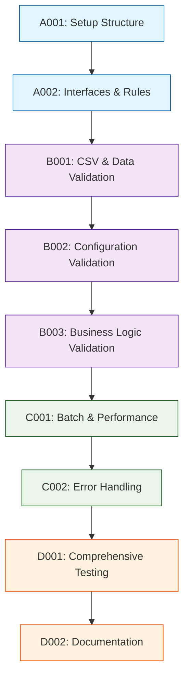

# Development Tasks

## 1. Task Overview
- **Component:** Validation-Engine
- **Technical Spec:** [Link to technical-spec.md](technical-spec.md)
- **Total Estimated Effort:** 24 story points
- **Implementation Order:** 4 task groups in sequence

## 2. Task Categories

### Category A: Foundation & Setup
Core infrastructure and basic structure

### Category B: Core Implementation  
Primary business logic and functionality

### Category C: Integration & Testing
External connections and validation

### Category D: Polish & Documentation
Final touches and documentation

## 3. Detailed Task Breakdown

### 📋 Foundation & Setup

**TASK-A001: Set up Validation-Engine component structure and dependencies**
- **Summary:** Validation-Engine - Setup Structure & Dependencies
- **Issue Type:** Story
- **Epic Link:** Validation-Engine Epic
- **Story Points:** 2
- **Priority:** High
- **Labels:** setup, foundation, validation-engine
- **Components:** Validation-Engine
- **Description:** 
  Create basic project structure, install dependencies, set up development environment for Validation-Engine component.
  
  **Technical Requirements:**
  - Set up folder structure per technical spec
  - Configure TypeScript for validation types and error codes
  - Set up testing framework for validation scenarios
  - Configure validation rule constants and enums
  
- **Acceptance Criteria:**
  - Component folder structure matches technical specification
  - TypeScript configuration works for validation types
  - Basic validation engine class instantiates without errors
  - Error code constants are properly defined
- **Dependencies:** None
- **Jira Sub-tasks:**
  - Create folder structure
  - Configure TypeScript settings
  - Set up testing framework
  - Define error code constants

**TASK-A002: Implement core validation interfaces and rule structures**
- **Summary:** Validation-Engine - Core Interfaces & Rule Structures
- **Issue Type:** Story
- **Epic Link:** Validation-Engine Epic
- **Story Points:** 3
- **Priority:** High
- **Labels:** interfaces, rules, validation-engine
- **Components:** Validation-Engine
- **Description:**
  Create validation interfaces and rule structures as defined in technical specification.
  
  **Technical Requirements:**
  - Implement validation interfaces from technical spec section 3.1
  - Add TypeScript interfaces for ValidationResult, ValidationRules, etc.
  - Set up configurable validation rule structures
  - Create constraint interfaces for numeric and string validation
  
- **Acceptance Criteria:**
  - All validation interfaces implemented with correct types
  - Validation rule structures support configuration
  - Constraint interfaces provide type safety
  - Error and warning structures are properly defined
- **Dependencies:** TASK-A001
- **Jira Sub-tasks:**
  - Define validation interfaces
  - Implement rule structures
  - Create constraint interfaces
  - Write unit tests for interfaces

### 🔧 Core Implementation

**TASK-B001: Implement CSV and data structure validation**
- **Summary:** Validation-Engine - CSV & Data Structure Validation
- **Issue Type:** Story
- **Epic Link:** Validation-Engine Epic
- **Story Points:** 5
- **Priority:** High
- **Labels:** csv, data-validation, validation-engine
- **Components:** Validation-Engine
- **Description:**
  Build CSV structure and data validation functionality for rate card processing.
  
  **Technical Requirements:**
  - Implement CSV structure validation (headers, format)
  - Add role data validation (names, rates, types)
  - Create business rule validation for rate cards
  - Handle validation error collection and reporting
  
- **Acceptance Criteria:**
  - CSV structures are validated correctly
  - Role data validation catches all specified error types
  - Business rules are enforced (rate ranges, name patterns)
  - Validation errors provide specific row/column information
  - Performance meets requirements for large CSV files
- **Dependencies:** TASK-A002
- **Jira Sub-tasks:**
  - Implement CSV structure validation
  - Add role data validation
  - Create business rule validation
  - Implement error collection
  - Write comprehensive validation tests

**TASK-B002: Implement configuration and input validation**
- **Summary:** Validation-Engine - Configuration & Input Validation
- **Issue Type:** Story
- **Epic Link:** Validation-Engine Epic
- **Story Points:** 6
- **Priority:** High
- **Labels:** configuration, input-validation, validation-engine
- **Components:** Validation-Engine
- **Description:**
  Build comprehensive validation for team configurations and user inputs.
  
  **Technical Requirements:**
  - Implement team configuration validation
  - Add team member validation with role reference checks
  - Create hours allocation validation with business constraints
  - Handle numeric and string input validation utilities
  
- **Acceptance Criteria:**
  - Team configurations are validated against business rules
  - Team member validation ensures referential integrity
  - Hours allocation validation enforces reasonable limits
  - Input validation utilities handle all common data types
  - Validation suggestions help users correct errors
- **Dependencies:** TASK-B001
- **Jira Sub-tasks:**
  - Implement configuration validation
  - Add team member validation
  - Create hours allocation validation
  - Build input validation utilities
  - Write integration tests

**TASK-B003: Implement business logic and financial validation**
- **Summary:** Validation-Engine - Business Logic & Financial Validation
- **Issue Type:** Story
- **Epic Link:** Validation-Engine Epic
- **Story Points:** 5
- **Priority:** High
- **Labels:** business-logic, financial, validation-engine
- **Components:** Validation-Engine
- **Description:**
  Build business logic validation for quotes, discounts, and EBITDA calculations.
  
  **Technical Requirements:**
  - Implement quote amount validation with reasonableness checks
  - Add discount validation with profit impact analysis
  - Create EBITDA margin validation against thresholds
  - Handle complex business rule validation scenarios
  
- **Acceptance Criteria:**
  - Quote amounts are validated for reasonableness
  - Discount validation prevents excessive profit loss
  - EBITDA margins are validated against business thresholds
  - Complex business rules are properly enforced
  - Financial validation provides clear feedback
- **Dependencies:** TASK-B002
- **Jira Sub-tasks:**
  - Implement quote validation
  - Add discount validation
  - Create EBITDA validation
  - Handle complex business rules
  - Write financial validation tests

### 🔗 Integration & Testing

**TASK-C001: Implement batch validation and performance optimization**
- **Summary:** Validation-Engine - Batch Validation & Performance
- **Issue Type:** Story
- **Epic Link:** Validation-Engine Epic
- **Story Points:** 4
- **Priority:** Medium
- **Labels:** batch, performance, validation-engine
- **Components:** Validation-Engine
- **Description:**
  Implement batch validation capabilities and performance optimizations.
  
  **Technical Requirements:**
  - Add batch validation for multiple items
  - Implement validation result caching
  - Create performance monitoring and optimization
  - Handle early exit strategies for efficiency
  
- **Acceptance Criteria:**
  - Batch validation processes multiple items efficiently
  - Validation results are cached and reused appropriately
  - Performance meets requirements (10ms individual, 100ms batch)
  - Memory usage scales linearly with validation complexity
  - Early exit strategies improve performance
- **Dependencies:** TASK-B003
- **Jira Sub-tasks:**
  - Implement batch validation
  - Add result caching
  - Create performance monitoring
  - Implement early exit strategies
  - Write performance tests

**TASK-C002: Add error handling and suggestion generation**
- **Summary:** Validation-Engine - Error Handling & Suggestions
- **Issue Type:** Story
- **Epic Link:** Validation-Engine Epic
- **Story Points:** 3
- **Priority:** Medium
- **Labels:** error-handling, suggestions, validation-engine
- **Components:** Validation-Engine
- **Description:**
  Build comprehensive error handling and user-friendly suggestion generation.
  
  **Technical Requirements:**
  - Implement detailed error message generation
  - Add actionable suggestion creation for common errors
  - Create error severity classification and handling
  - Handle edge cases and boundary conditions gracefully
  
- **Acceptance Criteria:**
  - Error messages are clear and user-friendly
  - Suggestions provide actionable guidance for fixing errors
  - Error severity helps prioritize user attention
  - Edge cases are handled without system crashes
  - Error handling maintains system stability
- **Dependencies:** TASK-C001
- **Jira Sub-tasks:**
  - Implement error message generation
  - Add suggestion creation logic
  - Create severity classification
  - Handle edge cases
  - Write error handling tests

### ✨ Polish & Documentation

**TASK-D001: Comprehensive testing and quality assurance**
- **Summary:** Validation-Engine - Comprehensive Testing Suite
- **Issue Type:** Story
- **Epic Link:** Validation-Engine Epic
- **Story Points:** 4
- **Priority:** High
- **Labels:** testing, quality, validation-engine
- **Components:** Validation-Engine
- **Description:**
  Build comprehensive testing suite to ensure quality and reliability of validation functionality.
  
  **Technical Requirements:**
  - Achieve 100% test coverage for validation logic
  - Test all validation rules and edge cases
  - Performance testing for large datasets
  - Integration testing with real data scenarios
  
- **Acceptance Criteria:**
  - Test coverage reaches 100% for validation logic
  - All validation rules are thoroughly tested
  - Edge cases and boundary conditions are covered
  - Performance tests validate response time requirements
  - Integration tests cover real-world scenarios
- **Dependencies:** TASK-A002, TASK-B001, TASK-B002, TASK-B003, TASK-C001, TASK-C002
- **Jira Sub-tasks:**
  - Write unit tests for all validation functions
  - Create integration tests for validation flows
  - Add performance tests for large datasets
  - Test edge cases and error scenarios
  - Set up automated test execution

**TASK-D002: Documentation and validation rule management**
- **Summary:** Validation-Engine - Documentation & Rule Management
- **Issue Type:** Story
- **Epic Link:** Validation-Engine Epic
- **Story Points:** 2
- **Priority:** Medium
- **Labels:** documentation, rules, validation-engine
- **Components:** Validation-Engine
- **Description:**
  Create comprehensive documentation and validation rule management system.
  
  **Technical Requirements:**
  - Document all validation rules and error codes
  - Create validation rule configuration guides
  - Finalize TypeScript type definitions
  - Document integration patterns and best practices
  
- **Acceptance Criteria:**
  - All validation rules are documented with examples
  - Error codes are documented with resolution guidance
  - TypeScript definitions are complete and accurate
  - Integration patterns are clearly documented
  - Component is ready for integration with all dependent components
- **Dependencies:** TASK-D001
- **Jira Sub-tasks:**
  - Document validation rules and error codes
  - Create configuration guides
  - Finalize TypeScript definitions
  - Document integration patterns
  - Conduct final validation review

## 4. Task Dependencies & Sequencing

## 5. Parallel Development Opportunities

### What Can Be Built Simultaneously:
- **After A002:** B001 can start immediately
- **After B001:** B002 and B003 can begin in parallel with some coordination
- **After B003:** C001 and C002 can be developed in parallel

### Critical Path:
A001 → A002 → B001 → B002 → B003 → C001 → D001 → D002

## 6. Risk Mitigation Tasks

### Technical Risks:
- **Validation Complexity:** Addressed through comprehensive testing in D001
- **Performance Issues:** Dedicated optimization in C001 with caching
- **Error Handling:** Comprehensive error management in C002

## 7. Definition of Done

### Task Completion Criteria:
- ✅ All acceptance criteria met
- ✅ Unit tests written and passing
- ✅ Code review completed
- ✅ Integration tests passing (where applicable)
- ✅ Documentation updated

### Component Completion Criteria:
- ✅ All tasks completed per definition of done
- ✅ Technical specification requirements met
- ✅ Performance targets achieved (10ms individual validations)
- ✅ 100% test coverage achieved
- ✅ Ready for integration with all dependent components

## 8. Estimation Summary

| Category | Task Count | Total Effort | Duration (days) |
|----------|-----------|--------------|-----------------|
| Foundation & Setup | 2 | 5 points | 2-3 days |
| Core Implementation | 3 | 16 points | 7-8 days |
| Integration & Testing | 2 | 7 points | 3-4 days |
| Polish & Documentation | 2 | 6 points | 3-4 days |
| **TOTAL** | **9** | **34 points** | **15-19 days** |

## 9. Traceability Matrix

| Task ID | Technical Spec Section | Functional Requirements | Business Value |
|---------|------------------------|-------------------------|----------------|
| A001 | Section 5.1 | Setup/Infrastructure | Development efficiency |
| A002 | Section 4.1 | FR-015, FR-018 | Validation framework |
| B001 | Section 3.1, 4.2 | FR-015, FR-016 | Data quality assurance |
| B002 | Section 3.1, 4.3 | FR-017, FR-021 | Configuration validation |
| B003 | Section 3.1, 6.1 | FR-019, FR-020 | Business rule enforcement |
| C001 | Section 7.1, 7.2 | Performance requirements | User experience |
| C002 | Section 3.3, 8.1 | FR-018 | Error handling reliability |
| D001 | Section 10.1 | Quality assurance | System reliability |
| D002 | Section 11.1 | Documentation | Developer experience |

## 10. Implementation Notes

### Development Best Practices:
- Follow test-driven development (TDD) approach
- Use TypeScript strict mode for type safety
- Create comprehensive test cases for all validation scenarios
- Regular performance testing with large datasets

### Quality Gates:
- Automated testing pipeline must pass
- Code coverage minimum 100% for validation logic
- Performance benchmarks must meet timing requirements
- All error codes must be documented

### Communication Plan:
- Daily standup updates on task progress
- Demo validation functionality after each category
- Escalate blockers immediately to technical lead