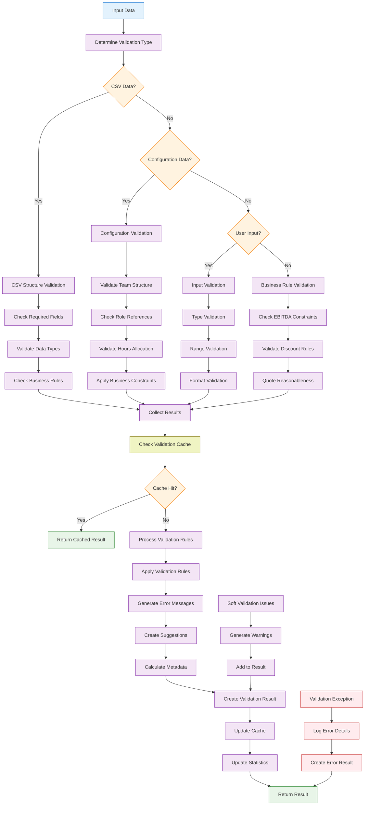

# Validation-Engine Technical Specification

## 1. Component Overview
- **Purpose:** Comprehensive validation for CSV structure, role data, configuration inputs, and business rules
- **Scope:** Validates data integrity, business constraints, and user inputs across the application
- **Dependencies:** CSV-Parser (for parsed data validation)
- **Dependents:** Basic-UI, Team-Configuration-Builder, State-Manager

## 2. Functional Requirements
List of functional requirements this component must fulfill:
- **FR-015:** System must validate CSV file structure and content before processing
- **FR-016:** System must validate role data meets business requirements
- **FR-017:** System must validate user inputs for team configurations
- **FR-018:** System must provide clear, actionable error messages
- **FR-019:** System must validate business rules for cost calculations
- **FR-020:** System must validate quote amounts and discount applications
- **FR-021:** System must prevent invalid state transitions

## 3. Component Interface

### 3.1 Public API
Define the external interface this component exposes:

```typescript
interface ValidationEngineAPI {
  // CSV and data validation
  validateCSVStructure(headers: string[]): ValidationResult;
  validateRateCardData(data: RoleRateData[]): ValidationResult;
  validateRoleData(role: RoleRateData): ValidationResult;
  
  // Configuration validation
  validateTeamConfiguration(config: TeamConfiguration): ValidationResult;
  validateTeamMember(member: TeamMember, rateCard: RateCardData): ValidationResult;
  validateHoursAllocation(hours: number, role: RoleRateData): ValidationResult;
  
  // Business logic validation
  validateQuoteAmount(amount: number, totalCost: number): ValidationResult;
  validateDiscount(discount: Discount, totalCost: number): ValidationResult;
  validateEBITDAMargin(margin: number, minThreshold: number): ValidationResult;
  
  // Input validation utilities
  validateNumericInput(value: any, constraints: NumericConstraints): ValidationResult;
  validateStringInput(value: any, constraints: StringConstraints): ValidationResult;
  validateEmailInput(email: string): ValidationResult; // For future sharing features
  
  // Batch validation
  validateMultiple(validations: ValidationRequest[]): BatchValidationResult;
  
  // Configuration management
  getValidationRules(): ValidationRules;
  updateValidationRules(rules: Partial<ValidationRules>): void;
}

interface ValidationResult {
  isValid: boolean;
  errors: ValidationError[];
  warnings: ValidationWarning[];
  suggestions: ValidationSuggestion[];
  metadata: ValidationMetadata;
}

interface ValidationError {
  code: string;                    // Error code for programmatic handling
  message: string;                 // Human-readable error message
  field?: string;                  // Field that caused the error
  value?: any;                     // Invalid value
  severity: 'error' | 'warning';   // Error severity level
  suggestion?: string;             // How to fix the error
}

interface ValidationRules {
  rateCard: {
    maxRoles: number;              // Maximum number of roles allowed
    minRate: number;               // Minimum hourly rate
    maxRate: number;               // Maximum hourly rate
    requiredFields: string[];      // Required CSV columns
    roleNamePattern: RegExp;       // Pattern for valid role names
  };
  configuration: {
    maxTeamMembers: number;        // Maximum team size
    maxHoursPerRole: number;       // Maximum hours per role
    minHoursPerRole: number;       // Minimum hours per role
    maxTotalHours: number;         // Maximum total project hours
    namePattern: RegExp;           // Pattern for configuration names
  };
  business: {
    minEBITDAMargin: number;       // Minimum acceptable EBITDA margin
    maxDiscountPercent: number;    // Maximum discount percentage
    maxQuoteMultiplier: number;    // Maximum quote vs cost ratio
    reasonableRateRange: { min: number; max: number; };
  };
}

interface NumericConstraints {
  min?: number;
  max?: number;
  integer?: boolean;
  positive?: boolean;
  precision?: number;               // Decimal places
}

interface StringConstraints {
  minLength?: number;
  maxLength?: number;
  pattern?: RegExp;
  required?: boolean;
  allowEmpty?: boolean;
}
```

### 3.2 Input/Output Contracts
- **Inputs:** 
  - Raw data from CSV-Parser
  - User inputs from UI components
  - Configuration data from State-Manager
  - Business rule parameters
- **Outputs:** 
  - Detailed validation results with errors and warnings
  - Suggestions for fixing validation issues
  - Metadata about validation performance
- **Data Formats:** 
  - Standardized ValidationResult objects
  - Error codes for programmatic handling
  - Human-readable messages for UI display

### 3.3 Error Handling
- **Error Types:** 
  - Data type validation errors
  - Business rule violations
  - Input format errors
  - Range and constraint violations
- **Error Responses:** 
  - Structured error objects with specific codes
  - Multiple error collection for batch validation
  - Severity levels for error prioritization
- **Recovery Strategies:** 
  - Provide suggestions for fixing common errors
  - Allow partial validation success with warnings
  - Graceful handling of edge cases

## 4. Data Model

### 4.1 Data Storage
- **Storage Type:** Configuration-based validation rules with no persistent data
- **Data Schema:** Validation rule configurations and temporary validation state

```typescript
// Internal validation state
interface ValidationState {
  rules: ValidationRules;
  cache: Map<string, ValidationResult>;
  statistics: ValidationStatistics;
}

interface ValidationStatistics {
  totalValidations: number;
  errorsByType: Map<string, number>;
  averageValidationTime: number;
  cacheHitRate: number;
}

// Error code constants
const ValidationErrorCodes = {
  // CSV/Data errors
  MISSING_REQUIRED_FIELD: 'E001',
  INVALID_DATA_TYPE: 'E002',
  DUPLICATE_ROLE_NAME: 'E003',
  RATE_OUT_OF_RANGE: 'E004',
  
  // Configuration errors
  TEAM_SIZE_EXCEEDED: 'E101',
  HOURS_OUT_OF_RANGE: 'E102',
  INVALID_ROLE_REFERENCE: 'E103',
  CONFIGURATION_NAME_INVALID: 'E104',
  
  // Business rule errors
  MARGIN_TOO_LOW: 'E201',
  DISCOUNT_TOO_HIGH: 'E202',
  QUOTE_UNREASONABLE: 'E203',
  TOTAL_HOURS_EXCEEDED: 'E204',
  
  // Input validation errors
  INVALID_NUMBER_FORMAT: 'E301',
  STRING_TOO_LONG: 'E302',
  REQUIRED_FIELD_EMPTY: 'E303',
  PATTERN_MISMATCH: 'E304'
} as const;
```

### 4.2 Data Flow


### 4.3 Data Validation
- **Input Validation:** 
  - Type checking for all input parameters
  - Null and undefined checks
  - Array and object structure validation
- **Business Rules:** 
  - Rate ranges must be economically reasonable
  - Team configurations must meet practical constraints
  - Profit margins must meet business thresholds
- **Data Integrity:** 
  - Referential integrity between roles and configurations
  - Consistency between calculated and entered values
  - Validation rule consistency and conflict detection

## 5. Technology Stack

### 5.1 Core Technologies
- **Programming Language:** JavaScript/TypeScript (ES2020+)
- **Framework:** Vanilla JavaScript with functional validation approach
- **Database:** None (rule-based validation only)
- **Additional Libraries:** 
  - Regular expression utilities (built-in)
  - Date validation utilities (built-in Date API)

### 5.2 Technology Rationale
- **Why These Choices:** 
  - Pure JavaScript ensures no external dependencies
  - Functional approach makes validation rules testable and composable
  - Built-in type system with TypeScript provides compile-time validation
  - Rule-based system allows easy modification and extension
- **Alternatives Considered:** 
  - Schema validation libraries (Joi, Yup) - adds complexity for MVP
  - Built-in HTML5 validation - insufficient for complex business rules
  - Server-side validation - conflicts with offline-first approach
- **Trade-offs:** 
  - Benefits: No dependencies, fast, customizable, type-safe
  - Limitations: Manual validation rule maintenance, no standard schema format

## 6. Integration Design

### 6.1 Dependency Integration
- **CSV-Parser Integration:** 
  - Validates parsed CSV data structure and content
  - Provides feedback for parsing error improvement
  - Ensures data quality before storage in State-Manager

### 6.2 Service Integration
- **Error Reporting:** Integration with application logging system
- **Performance Monitoring:** Tracks validation performance and bottlenecks
- **User Feedback:** Provides structured error messages for UI display

## 7. Performance Considerations

### 7.1 Performance Requirements
- **Response Time:** Individual validations must complete within 10ms
- **Throughput:** Support batch validation of 200+ items within 100ms
- **Scalability:** Memory usage scales linearly with validation complexity

### 7.2 Performance Strategies
- **Caching:** 
  - Cache validation results for repeated identical inputs
  - Cache compiled regular expressions
  - Cache expensive business rule calculations
- **Optimization:** 
  - Early exit for obviously invalid inputs
  - Lazy evaluation of complex validation rules
  - Batch processing for multiple validations
- **Memory Management:** 
  - Limit cache size to prevent memory growth
  - Use object pooling for validation result objects
  - Clean up temporary validation state

## 8. Security Design

### 8.1 Security Requirements
- **Input Sanitization:** Prevent injection attacks through validation inputs
- **Data Protection:** Ensure validation doesn't expose sensitive data
- **Rule Security:** Prevent malicious modification of validation rules

### 8.2 Security Implementation
- **Input Sanitization:** 
  - Escape all user inputs before validation
  - Validate regular expressions to prevent ReDoS attacks
  - Limit input string lengths to prevent memory exhaustion
- **Error Security:** 
  - Never include sensitive data in error messages
  - Prevent information leakage through validation responses
  - Rate limiting for validation requests if needed

## 9. Monitoring & Observability

### 9.1 Logging
- **Log Levels:** 
  - ERROR: Validation system failures, invalid rule configurations
  - WARN: Frequent validation failures, performance issues
  - INFO: Validation rule changes, statistics summaries
  - DEBUG: Individual validation details, cache operations
- **Log Format:** Structured JSON with validation context
- **Sensitive Data:** Never log actual business data or personal information

### 9.2 Metrics
- **Performance Metrics:** 
  - Validation response times by type
  - Cache hit/miss ratios
  - Memory usage during validation
- **Business Metrics:** 
  - Most common validation errors
  - Validation success rates by category
  - User error patterns
- **Alerting:** 
  - High validation failure rates
  - Performance degradation
  - Unusual error patterns indicating issues

## 10. Testing Strategy

### 10.1 Unit Testing
- **Test Coverage:** Target 100% code coverage for validation logic
- **Key Test Cases:** 
  - Valid and invalid inputs for each validation rule
  - Edge cases and boundary conditions
  - Error message accuracy and helpfulness
  - Performance benchmarks for validation speed
- **Mock Dependencies:** Mock external data sources for isolated testing

### 10.2 Integration Testing
- **Integration Points:** Test with real CSV-Parser output and UI interactions
- **Test Data:** 
  - Comprehensive test datasets covering all validation scenarios
  - Edge cases and malformed data
  - Performance test datasets (large configurations)
- **Environment Requirements:** Browser environment with sufficient memory

## 11. Deployment Considerations

### 11.1 Environment Requirements
- **Infrastructure:** Client-side only (no server requirements)
- **Browser Support:** Modern browsers with RegExp support (all modern browsers)
- **Configuration:** Validation rules configurable through JavaScript constants

### 11.2 Deployment Strategy
- **Build Process:** 
  - TypeScript compilation with strict type checking
  - Validation rule compilation and optimization
  - Bundle with main application
- **Deployment Steps:** Include compiled validation engine in application bundle
- **Rollback Plan:** Version control allows rollback to previous validation rules

## 12. Risk Mitigation
Address specific risks identified in the risk assessment:
- **Data Quality Issues:** Comprehensive validation prevents bad data from entering system
- **User Input Errors:** Clear error messages and suggestions help users correct issues
- **Business Rule Violations:** Automated checking prevents financially damaging configurations
- **Performance Issues:** Caching and optimization ensure validation doesn't slow user experience

## 13. Future Considerations
- **Extensibility:** 
  - Plugin architecture for custom validation rules
  - Configuration-driven validation rule management
  - Integration with external validation services
- **Migration Path:** 
  - Gradual migration to schema-based validation (JSON Schema)
  - Addition of machine learning for validation suggestions
  - Real-time validation rule updates
- **Deprecation Strategy:** 
  - Maintain backwards compatibility for validation API
  - Clear migration path for validation rule format changes
  - Graceful handling of deprecated validation rules